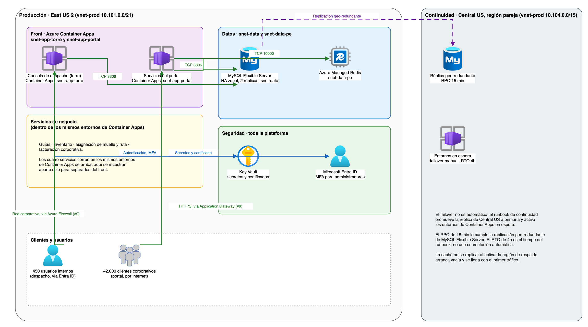

# Arquitectura de la plataforma de operación logística (Carga A)

Este documento diseña el front, los servicios de negocio, los datos, la seguridad y la continuidad de la consola de despacho y el portal de rastreo, que reemplazan el núcleo actual sobre virtualización local. Parte de la red ya diseñada (`red-topologia-subnetting.md` y `red-firewall-y-publicacion.md`), de la gobernanza (`gobierno-landing-zone.md`) y de los límites de datos personales (`seguridad-datos-personales-perimetro.md`), y usa sus mismos nombres y decisiones.

## Contenido

1. Contexto y alcance
2. Front: consola de despacho y portal
3. Servicios de negocio
4. Datos
5. Seguridad
6. Continuidad: RPO y RTO
7. Diagrama
8. Supuestos y confirmaciones pendientes de FríoAndes
9. Validación y cierre

## 1. Contexto y alcance

Hoy la consola de despacho y el portal de rastreo corren sobre virtualización local, con desarrollo, pruebas y producción compartiendo el mismo clúster de aplicación. La operación tiene 450 usuarios internos y unos 2.000 clientes corporativos habilitados en el portal, con un pico ordinario de 800 solicitudes por minuto y de 2.000 en campaña. El negocio exige un RPO de 15 minutos y un RTO de 4 horas.

Este documento cubre la arquitectura de esa plataforma: front, los cuatro servicios de negocio que hoy corren en el núcleo, los datos que necesita y cómo se recupera ante una falla regional. No cubre la ingesta de telemetría (`carga-b-telemetria.md`, issue #13, ya resuelta), ni la migración desde Cali ni el escenario completo de campaña (issue #14), ni la estrategia de Fabric (issues #17 y #18), que dependen de las decisiones de este documento.

## 2. Front: consola de despacho y portal

Se confirma **Azure Container Apps** como plataforma de contenedores, la propuesta de la red (`red-topologia-subnetting.md`, sección 7.2). Cada ambiente tiene dos entornos de Container Apps con perfiles de carga, cada uno en su propia subred:

- **Entorno de la torre**, en `snet-app-torre`. Interno: solo lo alcanzan Cali y los centros a través del Azure Firewall (issue #9). Aquí corre la consola de despacho que usan los 450 usuarios internos.
- **Entorno del portal**, en `snet-app-portal`. Interno también: recibe tráfico únicamente desde el Application Gateway v2 con WAF de `snet-ingress` (issue #9), que es la cara pública para los clientes corporativos.

El tamaño de cada entorno (hasta 20 nodos dedicados y 200 réplicas de consumo) ya está dimensionado en la red con margen para la campaña. Cómo se reparte el +40% de cómputo de campaña entre torre y portal lo detalla el issue #14, sin tocar los rangos de red.

## 3. Servicios de negocio

Los cuatro servicios corren como aplicaciones separadas dentro de los mismos dos entornos de Container Apps de la sección anterior; no tienen subred propia.

| Servicio | Qué hace | Quién lo usa |
|---|---|---|
| Guías | Crea y da seguimiento a las guías de despacho | Escribe la torre. El portal expone de forma exclusiva las guías del cliente corporativo que consulta, identificado, como ya definió `seguridad-datos-personales-perimetro.md` |
| Inventario | Capacidad y estado de cuartos fríos y camiones | Solo la torre. No se expone en el portal |
| Asignación de muelle y ruta | Decide qué camión sale por qué muelle y con qué ruta | Solo la torre. Cuando exista, la ETA de IA del issue #18 es una entrada adicional, no un reemplazo de esta decisión |
| Facturación corporativa | Genera y consulta la facturación de cada cliente | Escribe la torre. El portal expone solo la facturación del cliente que consulta. No hay datos de pago con tarjeta, como ya fijó `seguridad-datos-personales-perimetro.md` |

## 4. Datos

**Base relacional.** Azure Database for MySQL Flexible Server, siguiendo el motor actual. La versión propuesta es **MySQL 8.4 (LTS)**: la versión 8.0 ya no tiene soporte de la comunidad desde octubre de 2023, y 8.4 es la serie de soporte extendido vigente que ofrece Azure Database for MySQL Flexible Server. Alta disponibilidad zonal, con 2 réplicas y 1 servidor temporal, ya reservada en `snet-data` por la red (`red-topologia-subnetting.md`, sección 5.1).

**Caché.** Azure Managed Redis, en `snet-data-pe`, puerto 10000 con TLS, como ya la nombra la tabla de políticas del firewall (issue #9). No se usa el nombre anterior "Azure Cache for Redis": ese servicio tiene retiro anunciado por Microsoft, y la red y el firewall ya se diseñaron sobre Azure Managed Redis.

**Secretos y certificados.** Azure Key Vault, con endpoint privado en `snet-data-pe`, igual que lo reservó la red.

## 5. Seguridad

**Autenticación interna.** Los 450 usuarios internos se autentican con Microsoft Entra ID, con los grupos ya definidos en la gobernanza (`gobierno-landing-zone.md`): `grp-fa-ops-prod` para operación de producción, `grp-fa-dev` y `grp-fa-qa` para desarrollo y pruebas. MFA y elevación temporal por PIM para administradores, como ya decidió ese documento.

**Portal.** Protegido por el Application Gateway v2 con WAF del issue #9, y por los límites de solicitudes del issue #10: 300 por minuto por IP en el WAF, dimensionado para el pico de 2.000, más el límite por cuenta y por cliente de la aplicación.

**Secretos.** Cada servicio lee sus credenciales de Key Vault con identidad administrada; ninguna credencial queda en el código ni en variables de entorno sin cifrar.

La matriz detallada de roles por aplicación, con el principio de mínimo privilegio, es responsabilidad del issue #7 y no se repite aquí: esta sección usa los grupos generales que ya existen.

## 6. Continuidad: RPO y RTO

El negocio exige un RPO de 15 minutos y un RTO de 4 horas. La región pareja de East US 2 es Central US, y la red ya reservó `10.104.0.0/15` para el hub y la producción de recuperación de esta continuidad (`red-topologia-subnetting.md`, sección 4, fila de reservas).

**Base de datos.** MySQL Flexible Server replica de forma continua hacia una réplica de solo lectura en Central US. El RPO de 15 minutos se cumple con esa réplica: el retraso de replicación se monitorea (issue #16) y genera alerta si supera el umbral. El RTO de 4 horas es el tiempo del runbook de continuidad, que promueve la réplica a primaria; no es una conmutación automática.

**Front.** Los entornos de Container Apps de Central US se activan con el mismo módulo de Terraform que produce los de East US 2 (issues #20 a #24), cambiando solo la región. No quedan encendidos todo el tiempo: se activan como parte del runbook, lo que pesa en el RTO de 4 horas y se detalla en el costo de campaña (issue #26).

**Caché.** Azure Managed Redis no se replica entre regiones. Al activar Central US, la caché arranca vacía y se llena con el primer tráfico; no afecta el RPO porque no guarda datos que no estén también en la base.

**Fuera de alcance de este documento.** Cómo se redirige el tráfico del portal durante el failover (DNS, Front Door o Traffic Manager) y quién ejecuta el runbook no están decididos todavía; quedan como confirmación pendiente en la sección 8.

## 7. Diagrama

El diagrama muestra dos zonas: producción en East US 2, con el front (torre y portal en Container Apps), los servicios de negocio, los datos (MySQL Flexible Server y Azure Managed Redis) y la seguridad (Key Vault y Entra ID); y la continuidad en Central US, con la réplica de la base y los entornos de Container Apps en espera.

## 8. Supuestos y confirmaciones pendientes de FríoAndes

### 8.1 Confirmaciones que necesita el diseño

| Tema | Pregunta para FríoAndes | Qué pasa si la respuesta cambia |
|---|---|---|
| Redirección del tráfico en el failover | ¿FríoAndes usa o quiere Azure Front Door o Traffic Manager, o prefiere un cambio manual de DNS? | Cambia cómo se cumple el RTO de 4 horas y si hace falta un servicio adicional en la red |
| Responsable del runbook | ¿Quién ejecuta la promoción de la réplica y la activación de Central US: la torre, un equipo de guardia de DevOps? | Define a quién capacitar y a quién alertar cuando falle la región principal |
| Costo de la réplica en espera | ¿Los entornos de Central US se mantienen apagados hasta el runbook, o encendidos en el mínimo para bajar el RTO? | Cambia el costo mensual de continuidad (issue #26) y el tiempo real del RTO |

### 8.2 Supuestos del diseño

| Supuesto | Por qué se asume |
|---|---|
| MySQL 8.4 (LTS) es la versión de la base relacional | Es la serie con soporte extendido vigente de Azure Database for MySQL Flexible Server; MySQL 8.0 ya no tiene soporte de la comunidad |
| El +40 % de cómputo de campaña se aplica solo a los entornos de Container Apps de torre y portal | Es lo que define el issue #14; los datos y la seguridad ya están dimensionados con margen para ese pico |
| La asignación de muelle y ruta sigue siendo una decisión de la torre, no de un modelo de IA | Es la misma decisión que ya fija el issue #18 para toda la plataforma: ningún modelo de IA decide el despacho por sí solo |

## 9. Validación y cierre

| Criterio de aceptación | Evidencia en este documento |
|---|---|
| El diagrama separa explícitamente front, servicios, datos, seguridad y continuidad | Diagrama de la sección 7, con las cinco zonas marcadas |
| La base relacional se diseña con alta disponibilidad que permita cumplir RPO 15 min, y el failover indica cómo se cumple el RTO de 4h | Sección 6: réplica geo-redundante de MySQL Flexible Server para el RPO, runbook de continuidad para el RTO |
