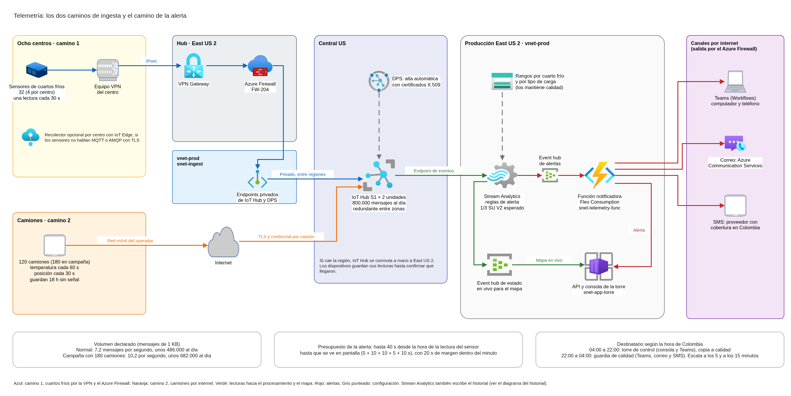
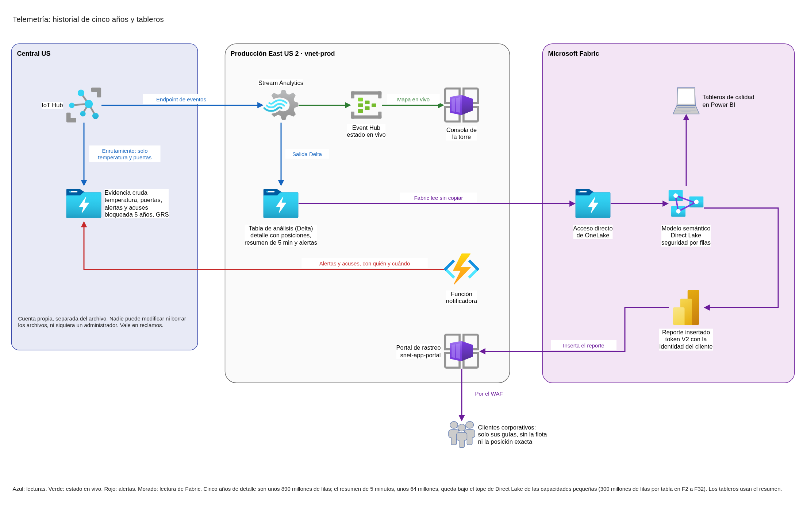

# Telemetría de cadena de frío: ingesta, alerta e historial

Este documento define cómo llegan a la nube las lecturas de los cuartos fríos y de los camiones de FríoAndes, cómo se genera la alerta de temperatura en menos de un minuto, a quién le llega según la hora, dónde se guarda el historial para reclamos y qué tableros ven calidad, la torre de control y el cliente corporativo. Parte de la red y del firewall ya diseñados (`red-topologia-subnetting.md` y `red-firewall-y-publicacion.md`) y usa sus mismos nombres.

## Contenido

1. Contexto y alcance
2. Ingesta
3. Alerta en menos de un minuto
4. Historial y reclamos
5. Tableros
6. Operación, objetivo de servicio y costo
7. Supuestos y confirmaciones pendientes de FríoAndes

### Términos usados

| Término | Significado en este documento |
|---|---|
| Lectura | Un mensaje de un sensor: temperatura, posición o apertura de puerta, con la hora en que se midió |
| Excursión de temperatura | Una lectura fuera del rango permitido para la carga o el cuarto frío |
| Sensor sin señal | Un sensor del que dejan de llegar lecturas en el tiempo esperado |
| IoT Hub | Servicio de Azure que recibe los mensajes de los dispositivos, con una identidad por dispositivo |
| Servicio de aprovisionamiento (DPS) | Servicio de Azure que registra cada dispositivo en IoT Hub la primera vez que se conecta, sin configurarlo a mano |
| Unidad de IoT Hub | Bloque de capacidad que se compra por mes. Cada unidad del nivel 1 recibe hasta 400.000 mensajes al día |
| Camino 1 | Cuartos fríos: red local del centro, VPN, Azure Firewall y endpoint privado de IoT Hub |
| Camino 2 | Camiones: red móvil del operador de flota, internet y endpoint público de IoT Hub |
| Turno de guardia de calidad | Quien recibe las alertas de 22:00 a 04:00, cuando la torre de control no opera |

---

## 1. Contexto y alcance

### 1.1 Qué resuelve la telemetría

La telemetría tiene que alertar cuando un camión o un cuarto frío sale del rango de temperatura y conservar el historial para reclamos. Son cuatro piezas:

| Pieza | Qué necesita FríoAndes | Dónde se responde |
|---|---|---|
| Ingesta | Temperatura, apertura de puerta y posición de la flota | Sección 2 |
| Procesamiento de baja latencia | Alerta visible en menos de un minuto desde el evento, en condiciones normales de red. De 04:00 a 22:00 la recibe la torre; de noche, el turno de guardia de calidad | Sección 3 |
| Almacenamiento analítico | Historial, reclamos y reportes a clientes, con la trazabilidad de temperatura guardada cinco años | Sección 4 |
| Tableros | Para calidad y una vista reducida para el cliente corporativo, que no ve la flota completa | Sección 5 |

### 1.2 Qué toma del diseño de red y del firewall

| Ya definido | Dónde |
|---|---|
| Los cuartos fríos llegan por la VPN de su centro, pasan por el Azure Firewall (regla FW-204: MQTT 8883, AMQP 5671 y HTTPS 443) y entran por un endpoint privado en `snet-ingest` | Red, sección 6.1; firewall, sección 4.3 |
| Los camiones llegan por internet al endpoint público de IoT Hub, con TLS y una credencial por camión | Red, sección 6.1; firewall, sección 4.5 |
| `snet-ingest` tiene espacio para 10 endpoints privados, y `10.10X.3.0/24` queda libre para el cómputo de la telemetría | Red, sección 6.1 |
| Pruebas y desarrollo no reciben sensores reales: usan datos simulados | Firewall, sección 4.3 |
| La regla temporal FW-402 (envío por FTP de los históricos de cada hora a Cali) se retira cuando la telemetría en línea reemplaza esa carga | Firewall, sección 5.5 |

### 1.3 Volumen

| Fuente | Cantidad | Frecuencia | Mensajes por segundo | Mensajes por día |
|---|---|---|---|---|
| Temperatura de los camiones | 120 | Una cada 60 s, jornada de 18 h | 2,0 | 129.600 |
| Posición de los camiones | 120 | Una cada 30 s, jornada de 18 h | 4,0 | 259.200 |
| Cuartos fríos | 32 (8 centros × 4) | Una cada 30 s, 24 h | 1,07 | 92.160 |
| Aperturas de puerta (supuesto) | Cuartos fríos y camiones | Al abrir y al cerrar | Menos de 0,1 | Unas 5.500 |
| **Total normal** | | | **7,2** | **unos 486.000** |
| **Total en campaña (180 camiones)** | | | **10,2** | **unos 682.000** |

No hay una cifra de aperturas de puerta. Se suponen dos aperturas por hora en cada cuarto frío y diez paradas al día por camión, con un mensaje al abrir y otro al cerrar. Aunque la cifra real fuera diez veces mayor, seguiría siendo una parte menor del total.

Con mensajes de 1 KB, el volumen es de unos 0,5 GB al día, unos 15 GB al mes y menos de 1 TB en cinco años. El volumen es bajo. Lo que exige diseño es la latencia de la alerta, los dos caminos de entrada, el destinatario según la hora y la detección de sensores sin señal.

---

## 2. Ingesta

### 2.1 Los dos caminos



- **Camino 1, cuartos fríos:** sensor, recolector del centro si existe, VPN del centro, VPN Gateway, Azure Firewall (regla FW-204), endpoint privado en `snet-ingest` e IoT Hub.
- **Camino 2, camiones:** equipo del camión, red móvil del operador, internet y endpoint público de IoT Hub.

Los dos caminos terminan en el mismo IoT Hub. Desde ahí, el procesamiento no distingue de dónde vino cada lectura: cada dispositivo tiene su identidad, y esa identidad dice si es un cuarto frío o un camión.

IoT Hub admite al mismo tiempo el endpoint privado y el público. Microsoft desaconseja cerrar el acceso público cuando los dispositivos están en una red amplia, como la red móvil de los camiones. Por eso el endpoint público queda abierto, protegido con TLS y con la identidad de cada camión. Si los datos de los camiones terminan llegando desde la plataforma del operador de flota, con direcciones fijas, el endpoint público se limita a esas direcciones con el filtro de IP de IoT Hub (sección 2.9).

### 2.2 Servicio de ingesta: IoT Hub

| | IoT Hub (elegido) | Event Hubs | Broker MQTT de Event Grid |
|---|---|---|---|
| Identidad por dispositivo | Sí, con registro de dispositivos | No: identifica aplicaciones, no dispositivos | Sí, con registro de clientes |
| Alta automática de dispositivos | Sí, con el servicio de aprovisionamiento (DPS) | No | No hay un servicio equivalente |
| Configuración remota de cada dispositivo | Sí (gemelos de dispositivo, nivel Standard) | No | Por mensajes entre clientes |
| Recolector local en los centros | Sí, con IoT Edge (nivel Standard) | No | Con Azure IoT Operations, que corre sobre Kubernetes en el borde |
| Endpoint privado | Sí, ya previsto en `snet-ingest` | Sí | No se evaluó |
| Costo base para este volumen | USD 50 al mes (2 unidades S1) | USD 21,90 al mes (una unidad de rendimiento) más ingresos | USD 29,20 al mes (una unidad de rendimiento) más operaciones |

**Por qué IoT Hub:** es el único de los tres que da a la vez identidad por dispositivo, alta automática y configuración remota, y el diseño de red ya lo dejó previsto con su endpoint privado. Event Hubs sirve para recibir datos de aplicaciones, no de dispositivos, y solo conviene si la plataforma del operador de flota es la que envía los datos de los camiones (sección 2.9). El broker MQTT de Event Grid es una buena opción para comunicación entre dispositivos y la nube en los dos sentidos, pero el caso no la necesita.

### 2.3 Nivel y unidades

| Nivel | Qué incluye | Costo por unidad al mes |
|---|---|---|
| B1 (básico) | Telemetría desde el dispositivo, identidad por dispositivo, enrutamiento, DPS | USD 10 |
| **S1 (estándar, elegido)** | Lo anterior, más mensajes de la nube al dispositivo, gemelos de dispositivo para configuración remota e IoT Edge | USD 25 |

Cada unidad del nivel 1 (B1 o S1) recibe hasta 400.000 mensajes al día, contados en bloques de 4 KB: un mensaje de 1 KB cuenta como uno.

| | Mensajes al día | Unidades S1 necesarias |
|---|---|---|
| Día normal | Unos 486.000 | 2 (capacidad de 800.000) |
| Día de campaña | Unos 682.000 | 2 (capacidad de 800.000) |

**Producción usa dos unidades S1, USD 50 al mes.** Cubren la campaña con un 15 % de margen sin tocar la configuración, lo que importa porque durante una campaña no se hacen cambios. Si la flota crece, se agrega una unidad sin interrumpir el servicio. El límite de envíos por segundo (al menos 100 con S1) está muy por encima de los 10 por segundo del caso.

**Por qué S1 y no B1:** el nivel estándar permite cambiar el rango de temperatura de un dispositivo o su frecuencia de lectura desde la nube, y es el que admite un recolector con IoT Edge en los centros (sección 2.8). La diferencia es de USD 30 al mes. Azure permite pasar de B1 a S1 sin interrumpir el servicio, pero no al revés.

### 2.4 Región y resiliencia

Microsoft publica en qué regiones IoT Hub tiene redundancia entre zonas de disponibilidad. **East US 2 no está en la lista. Central US, la región pareja, sí, para datos y para cómputo.** En una región sin esa redundancia, una falla de zona puede dejar sin ingesta, y por lo tanto sin alertas, hasta que Microsoft la resuelva.

| | IoT Hub en Central US (propuesta) | IoT Hub en East US 2 |
|---|---|---|
| Falla de una zona | Sin pérdida de datos ni interrupción: IoT Hub cambia de zona solo | La ingesta puede detenerse hasta que la zona se recupere |
| Falla de la región | Conmutación manual a East US 2, la región pareja, entre 10 minutos y 2 horas | Conmutación manual a Central US, entre 10 minutos y 2 horas |
| Latencia desde Cali (medición del diseño de red) | Mediana de 105 a 111 ms | Mediana de 86 a 97 ms |
| Endpoint privado de los cuartos fríos | En `snet-ingest` de East US 2: Azure permite que el endpoint esté en otra región que el servicio | En `snet-ingest`, misma región |
| Costo adicional | Transferencia entre regiones: unos 15 GB al mes a USD 0,02, unos USD 0,30 | Ninguno |
| Ubicación de los datos | Estados Unidos, igual que el resto de la plataforma | Estados Unidos |

**Propuesta: IoT Hub en Central US.** La alerta es una de las dos capacidades críticas de la plataforma y depende de que la ingesta no se detenga. La diferencia de latencia (unos 15 ms) es despreciable frente al minuto de la alerta, y el costo extra es de centavos. El procesamiento de la alerta y el historial quedan en East US 2, junto al resto de la plataforma, y leen de IoT Hub entre regiones.

En los dos casos, la conmutación a la región pareja hace perder los mensajes que IoT Hub todavía no había entregado. Por eso los dispositivos guardan sus lecturas hasta confirmar que llegaron (sección 2.7).

### 2.5 Identidad de cada dispositivo

Cada sensor de cuarto frío y cada equipo de camión tiene su propia identidad en IoT Hub. Así se puede bloquear un dispositivo robado o dañado sin afectar a los demás, y cada lectura queda atribuida a su origen.

| | Certificados X.509 con DPS (propuesta) | Claves simétricas con DPS |
|---|---|---|
| Cómo se identifica el dispositivo | Con un certificado propio, firmado por una autoridad de certificación de FríoAndes | Con una clave derivada de una clave de grupo |
| Si se compromete un dispositivo | Se revoca su certificado; los demás siguen | Se cambia su clave; si se filtra la clave del grupo, quedan expuestos todos |
| Requisito en el equipo | Soportar certificados; Microsoft recomienda guardar el secreto en un módulo de hardware seguro | Ninguno especial |
| Alta | Automática: el dispositivo se presenta a DPS y queda registrado en IoT Hub | Automática |

**Propuesta: certificados X.509 con grupos de inscripción en DPS**, uno para los cuartos fríos y otro para los camiones. Si los equipos que FríoAndes tiene o compre no soportan certificados, se usan claves simétricas con un grupo por centro y uno para la flota, para limitar el alcance de una clave filtrada.

DPS va en Central US, junto a IoT Hub. Los cuartos fríos se dan de alta por un endpoint privado de DPS en `snet-ingest`, al lado del de IoT Hub: Azure permite que el endpoint esté en otra región que el servicio. Para eso, los equipos de los cuartos fríos se configuran con el endpoint propio del DPS de FríoAndes y no con el endpoint global de Microsoft. Los camiones usan el endpoint público.

DPS cobra USD 0,10 por cada 1.000 operaciones. Con unos 150 dispositivos que se registran una vez y se vuelven a registrar de vez en cuando, el costo es de centavos al mes. Microsoft recomienda usar DPS desde el inicio aunque la flota sea pequeña, para que crecer no obligue a cambiar el firmware de los equipos.

### 2.6 Qué lleva cada mensaje

Todos los dispositivos envían el mismo formato, en JSON:

| Campo | Contenido |
|---|---|
| Identidad | La del dispositivo en IoT Hub (la agrega IoT Hub, no la envía el dispositivo) |
| Tipo | Temperatura, posición o puerta |
| Hora de la medición | La hora del sensor en UTC, sincronizada por GPS en los camiones y por la red del centro en los cuartos fríos |
| Número de secuencia | Correlativo por dispositivo, para detectar lecturas perdidas o repetidas |
| Valor | Grados Celsius, coordenadas, o puerta abierta o cerrada |
| Guía o viaje | En los camiones, la guía o el viaje en curso, para cruzar la lectura con la carga y con el cliente |

Cada mensaje se marca como JSON en UTF-8 (propiedades `contentType` y `contentEncoding` del mensaje). Sin esa marca, IoT Hub guarda el contenido codificado en base64 al enviarlo al almacenamiento (sección 4).

La hora de la medición es la que cuenta para la alerta y para los reclamos, no la hora de llegada. Así, una lectura que llega tarde porque el camión estuvo sin señal queda en su lugar correcto del historial.

### 2.7 Camiones sin señal

La alerta tiene que verse en menos de un minuto en condiciones normales de red. Cuando un camión pierde la señal celular:

- El equipo del camión guarda las lecturas con su hora y su número de secuencia, al menos durante una jornada completa (18 horas).
- Al recuperar la señal, las envía en orden. IoT Hub las recibe como cualquier otra lectura.
- El procesamiento usa la hora de la medición: si una lectura atrasada muestra una excursión, genera una alerta marcada como tardía, con la hora real del evento, para que calidad sepa que el problema ocurrió mientras no había señal (sección 3).
- La falta de lecturas de un camión en ruta dispara la alerta de sensor sin señal (sección 3).

Esto es un requisito para los equipos de los camiones, que FríoAndes debe confirmar con su proveedor.

### 2.8 Recolector en los centros

Todavía no está definido si los sensores de los cuartos fríos se conectan uno por uno o a través de un equipo del centro. El diseño admite las dos formas:

| | Sensores directos | Recolector por centro con IoT Edge |
|---|---|---|
| Qué se conecta a IoT Hub | Cada sensor, con su identidad | Un equipo por centro, que reúne las lecturas de sus cuatro cuartos fríos |
| Si cae la VPN del centro | Cada sensor guarda sus lecturas, si puede | El recolector guarda las lecturas y las envía al volver la conexión |
| Requisito | Que el sensor hable MQTT o AMQP con TLS y soporte su identidad | Un equipo por centro y el nivel S1 de IoT Hub |
| Cuándo conviene | Sensores modernos con conexión IP | Sensores antiguos o que solo hablan protocolos industriales locales |

En los dos casos la red es la misma: el tráfico sale por la red de sensores del centro y usa el camino 1.

### 2.9 Si la plataforma del operador de flota reenvía los datos

Si los equipos de los camiones no envían directo a la nube y es la plataforma del operador de flota la que reenvía los datos, el camino 2 cambia:

- La plataforma del operador envía a un Event Hub (nivel Standard) con su propia identidad de aplicación, desde direcciones fijas permitidas con filtro de IP.
- Cada mensaje trae la identidad del camión en el contenido, porque Event Hubs no identifica dispositivos.
- El procesamiento de la alerta lee de IoT Hub (cuartos fríos) y del Event Hub (camiones) con la misma lógica.

Es la pregunta 3 de la sesión de aclaraciones. Hasta tener la respuesta, el diseño supone que los camiones envían directo.

### 2.10 Pruebas y desarrollo

| Ambiente | IoT Hub | Qué recibe |
|---|---|---|
| Producción | S1, 2 unidades | Los sensores reales |
| Pruebas | S1, 1 unidad (USD 25 al mes) | Un simulador que reproduce el volumen normal, y durante las pruebas de carga el de campaña con una unidad extra temporal |
| Desarrollo | Gratuito (8.000 mensajes al día) | Un simulador con pocos dispositivos |

Los ambientes que no son de producción nunca reciben sensores reales: el firewall solo permite los sensores de los centros hacia la ingesta de producción.

---

## 3. Alerta en menos de un minuto

### 3.1 Qué cuenta como "un minuto"

La alerta debe poder verse en menos de un minuto desde el evento, en condiciones normales de red. Un camión mide la temperatura cada 60 segundos: si el evento fuera el momento exacto en que la temperatura real cruza el límite, la espera hasta la siguiente lectura podría consumir el minuto entero y ninguna arquitectura lo cumpliría.

**El diseño mide el minuto desde la hora de la lectura que marca el sensor hasta que la alerta se ve en la pantalla de quien la recibe.** Es un supuesto que se confirma en la sesión de aclaraciones (sección 7). Con esa definición, el presupuesto de tiempo queda así:

| Tramo | Presupuesto | Cómo se cumple |
|---|---|---|
| Del sensor a IoT Hub | Hasta 5 s | Conexión persistente con MQTT o AMQP sobre TLS; el dispositivo envía en cuanto mide |
| De IoT Hub al procesamiento | Hasta 10 s | Stream Analytics lee continuamente el endpoint de eventos de IoT Hub |
| Procesamiento de la regla | Hasta 10 s | Reglas por lectura, sin esperar ventanas de tiempo; orden por hora de llegada (sección 3.3) |
| Del procesamiento al notificador | Hasta 5 s | Stream Analytics escribe la alerta en un event hub que la función lee por la red privada (sección 3.2) |
| Del notificador a la pantalla y al teléfono | Hasta 10 s | Aviso a la consola de la torre y a Teams (sección 3.6) |
| **Total** | **Hasta 40 s** | Deja 20 s de margen dentro del minuto |

Los valores de cada tramo son el presupuesto del diseño, no una garantía de Azure. Microsoft indica que IoT Hub no garantiza una latencia máxima, por eso el objetivo de servicio de la alerta se mide de punta a punta en producción (sección 6) y el presupuesto se valida con la prueba de carga antes de salir.

### 3.2 Cómo se procesa

```
IoT Hub (Central US)
  → Stream Analytics (East US 2): reglas de excursión, puerta abierta y sensor sin señal
      → event hub de alertas → función notificadora (East US 2): destinatario según la hora, canales y escalamiento
          → consola de la torre, Teams, correo, SMS
      → event hub de estado en vivo → mapa de la torre (sección 5.2)
      → historial (sección 4)
```

| Componente | Qué hace | Por qué este servicio |
|---|---|---|
| Stream Analytics | Evalúa cada lectura contra el rango de su cuarto frío o de su carga, detecta puertas abiertas demasiado tiempo y sensores sin señal | Reglas en un lenguaje parecido a SQL, cruce con datos de referencia (los rangos), procesamiento exactamente una vez, SLA del 99,9 % y redundancia de zonas automática en East US 2. Sin servidores que mantener |
| Función notificadora (Azure Functions, plan Flex Consumption) | Recibe solo las alertas, descarta las repetidas, decide a quién avisar según la hora, envía por cada canal, registra el acuse y escala si nadie responde | La lógica de destinatarios y canales es código de negocio que cambia; una función la aísla del motor de reglas. Se integra con la red del ambiente para llegar a la torre |

La alerta vive en Azure, junto a la plataforma. Fabric lee las mismas lecturas para el aviso temprano predictivo y los análisis de la torre, pero no está en el camino de la alerta: así la alerta no depende de que una capacidad de Fabric esté encendida de noche.

**Por qué las alertas pasan por un event hub.** Microsoft indica que Stream Analytics, en su clúster compartido, no puede llamar a una función que está dentro de una red virtual, y la función notificadora lo está para llegar a la torre. Por eso Stream Analytics escribe cada alerta en un event hub del mismo namespace que alimenta el mapa de la torre (sección 5.2), y la función la lee por el endpoint privado. Así la función no tiene ninguna entrada pública, y si se detiene un momento las alertas esperan en el event hub, que las guarda hasta 7 días, en vez de perderse. El namespace Standard admite hasta 10 event hubs, así que el de alertas no suma un costo fijo.

**Alternativa descartada: todo en funciones.** Una función podría leer cada lectura y evaluar las reglas. Es más barata en cómputo, pero obliga a programar a mano lo que Stream Analytics ya resuelve: el estado de cada sensor, las lecturas repetidas, la detección de silencio y la recuperación sin perder alertas.

### 3.3 Reglas de alerta

| Alerta | Cuándo se dispara | Severidad |
|---|---|---|
| Posible excursión | La primera lectura fuera del rango del cuarto frío o de la carga | Alta: se avisa de inmediato |
| Excursión confirmada | La segunda lectura seguida fuera de rango | Crítica: se escala si nadie respondió |
| Vuelta al rango | La primera lectura dentro del rango después de una excursión | Informativa: cierra la alerta y registra la duración |
| Puerta abierta | Una puerta lleva abierta más del tiempo permitido (supuesto: 5 minutos en cuartos fríos, 15 en camiones) | Alta |
| Sensor sin señal | No llega ninguna lectura de un sensor en el tiempo de tres lecturas: 90 s en los cuartos fríos y en los camiones con viaje activo (por la posición, que llega cada 30 s) | Alta |
| Excursión tardía | Una lectura atrasada (por falta de señal) muestra una excursión que ya ocurrió | Alta, marcada con la hora real del evento |

**Por qué se avisa con la primera lectura.** Esperar una segunda lectura para descartar ruido del sensor costaría 60 segundos en los camiones y rompería el minuto. Por eso la primera lectura fuera de rango ya avisa, como posible excursión, y la segunda la confirma y la escala. Calidad puede ajustar esta regla por tipo de carga si un sensor resulta ruidoso.

**Rangos por cuarto frío y por carga.** Los rangos permitidos viven en una tabla de referencia que mantiene el equipo de calidad: un rango por cuarto frío y uno por tipo de carga, que se asigna al camión con la guía o el viaje. Stream Analytics recarga esa tabla sin detenerse.

**Orden por hora de llegada.** Stream Analytics solo emite resultados cuando avanza su reloj interno. Si ordenara las lecturas por la hora del sensor, tendría que esperar la tolerancia a lecturas tardías antes de emitir; Microsoft sugiere empezar con 5 minutos para dispositivos de campo, lo que rompería el minuto. Por eso las reglas ordenan por la hora en que IoT Hub recibió la lectura, y usan la hora del sensor como dato: la alerta muestra cuándo ocurrió el evento, y si la diferencia entre las dos horas es grande, la marca como tardía. Los cuartos fríos envían las 24 horas, así que el reloj del procesamiento siempre avanza, también de noche.

### 3.4 Destinatario según la hora

| Hora de Colombia | Quién recibe | Por qué canal | Si nadie responde |
|---|---|---|---|
| 04:00 a 22:00 | La torre de control | Consola de la torre y canal de Teams de la torre. Copia al canal de calidad | A los 5 minutos, al supervisor de turno de la torre y al responsable de calidad |
| 22:00 a 04:00 | El turno de guardia de calidad | Teams en el teléfono, correo y SMS | A los 5 minutos, al responsable de calidad. A los 15, al gerente de operaciones |

- La hora de corte se calcula en el código con la hora de Colombia (UTC-5, sin horario de verano). El plan Flex Consumption no admite configurar la zona horaria del sistema, así que no se depende de ella.
- El turno de guardia y sus teléfonos viven en una tabla que mantiene calidad, para cambiar quién está de guardia sin tocar el código.
- Cada alerta tiene un estado: abierta, reconocida, cerrada. El acuse se registra desde la consola de la torre o desde la tarjeta de Teams, con la identidad de quien respondió. Ese registro sirve para los reclamos y para auditar quién vio qué.

### 3.5 Canales

| Canal | Para qué | Cómo se envía | Nota |
|---|---|---|---|
| Consola de la torre | Ver la alerta en la pantalla de despacho, sobre el mapa | La función notificadora llama a la API interna de la torre, que la muestra en vivo a los usuarios conectados | Mostrar la alerta en pantalla es parte de la aplicación de la torre |
| Microsoft Teams | Aviso en el computador y en el teléfono, con notificación | Webhook de Workflows de Teams hacia el canal o el chat del turno | Los conectores de Office 365 en Teams se retiraron en mayo de 2026; Workflows es su reemplazo. Requiere que FríoAndes use Microsoft 365 |
| Correo | Constancia y respaldo | Azure Communication Services, servicio de correo | |
| SMS | Respaldo para el turno de noche si el teléfono no tiene datos | Un proveedor de SMS con cobertura en Colombia | Azure Communication Services no envía SMS directo a Colombia: sus números gratuitos solo llegan a Estados Unidos, Canadá y Puerto Rico, y para otros países Microsoft remite a proveedores asociados (Messaging Connect). El proveedor lo confirma FríoAndes |

El cliente corporativo no recibe alertas en tiempo real: ve el estado de sus cargas en su vista del portal (sección 5).

### 3.6 Dónde corre la función notificadora

- **Plan Flex Consumption con dos instancias siempre listas**, de 512 MB, asignadas a la función que lee el event hub de alertas. Las instancias siempre listas evitan el arranque en frío, que podría sumar segundos a la primera alerta de la noche. Con dos instancias, Azure permite repartirlas entre zonas de disponibilidad.
- **El primer aviso sale apenas llega la alerta**, desde esa misma función. El estado de cada alerta (abierta, reconocida, cerrada) y el escalamiento a los 5 y a los 15 minutos los lleva una orquestación de Durable Functions, que espera con temporizadores y se cierra cuando alguien reconoce la alerta. La orquestación usa el identificador de la alerta como nombre: antes de abrir una, la función revisa si ya existe, y así descarta las alertas repetidas que Stream Analytics puede entregar más de una vez.
- **Cuenta de almacenamiento propia.** Toda función necesita una, y Durable Functions guarda ahí el estado y los temporizadores. Es ZRS, porque con redundancia de zonas Azure solo admite cuentas ZRS, y tiene el acceso público desactivado, con endpoints privados de blob, queue y table en `snet-data-pe`.
- **Integrada a la red del ambiente**, para llamar a la API interna de la torre y leer el event hub sin salir a internet. Necesita una subred propia: Microsoft pide al menos un `/27`, reservada para el plan (delegación `Microsoft.App/environments`), y no permite compartirla con un entorno de Container Apps ni poner en ella endpoints privados. Se crea `snet-telemetry-func` en `10.10X.3.0/27` de cada ambiente, dentro del espacio que el plan de direcciones dejó libre para el cómputo de la telemetría.
- **Salida a internet por el Azure Firewall**, solo hacia los canales y los servicios que la función necesita:

| Destino | Dominios | Regla del firewall |
|---|---|---|
| Webhook de Workflows de Teams | `*.api.powerplatform.com` y `*.logic.azure.com`, los que Microsoft indica para el disparador HTTP de Workflows | FW-319, FW-320 y FW-321 (uno por ambiente) |
| Correo de Azure Communication Services | `<recurso>.communication.azure.com` | Las mismas |
| Proveedor de SMS | Los que indique el proveedor que elija FríoAndes | Las mismas |
| Entra ID e identidades administradas | Los mismos de las demás aplicaciones | FW-302, FW-308 y FW-314 |
| Azure Monitor | Etiqueta de servicio `AzureMonitor` | FW-304, FW-310 y FW-316 |

### 3.7 Capacidad y campaña

- **Stream Analytics: se espera 1/3 de unidad de streaming (V2) en producción.** Microsoft recomienda empezar con 1 unidad y ajustar con la métrica de uso, e indica que 1/3 suele bastar para entradas pequeñas; el caso tiene unos 10 mensajes por segundo en campaña. La memoria que usa el estado de las reglas depende de la cantidad de sensores (unos 210 en campaña), no del volumen. La prueba de carga de campaña en pruebas arranca con 1 unidad, mide el uso y fija el tamaño de producción. Se alerta si el uso pasa del 80 %, y el tamaño se puede cambiar sin detener el trabajo.
- **IoT Hub con dos unidades** cubre la campaña (sección 2.3).
- **La función notificadora** solo procesa alertas, no lecturas: decenas al día en operación normal.

Ninguna pieza del camino de la alerta necesita un cambio para la campaña. Eso importa porque durante una campaña no se hacen cambios en producción.

### 3.8 Pruebas y desarrollo

El mismo trabajo de Stream Analytics y la misma función se despliegan en pruebas y desarrollo, conectados al simulador de cada ambiente. En pruebas se valida el presupuesto de la sección 3.1 con la prueba de carga de campaña. Los trabajos de Stream Analytics de pruebas y desarrollo se detienen cuando no se usan, y un trabajo detenido no se cobra.

---

## 4. Historial y reclamos

### 4.1 Qué se guarda y para qué

| Uso | Qué necesita | Por cuánto tiempo |
|---|---|---|
| Reclamo de un cliente | Todas las lecturas de la carga o del cuarto frío en el período del reclamo, las alertas que se generaron y quién las reconoció, sin posibilidad de alteración | Cinco años, por contrato con los clientes de alimentos |
| Reportes a clientes y tableros de calidad | Lecturas con el contexto de negocio: cuarto frío, camión, guía y cliente | Cinco años |
| Aviso temprano y estimación de llegada en Fabric | Historial de lecturas y posiciones para los modelos | Lo que defina la estrategia de Fabric |

Con unos 15 GB al mes, el historial completo de cinco años es de unos 900 GB. El tamaño es pequeño. Lo que importa es que la evidencia no se pueda alterar, que no se pague dos veces por guardarla y analizarla, y que Fabric la lea sin copiarla.

### 4.2 Dónde se guarda: el historial vive en el lago de datos de Azure

| | Lago de datos en Azure (propuesta) | Azure Data Explorer | Eventhouse de Fabric con los cinco años |
|---|---|---|---|
| Qué es | Archivos en Azure Data Lake Storage Gen2: una copia de evidencia inmutable y una tabla Delta para análisis | Un clúster de base de datos de series de tiempo en Azure | La base de series de tiempo de Fabric, con el mismo motor de consultas que Data Explorer |
| Costo de guardar 5 años | Menos de USD 40 al mes al final del quinto año, sumando las dos copias | El clúster de producción más pequeño tiene al menos dos nodos: solo el recargo del motor son unos USD 321 al mes, más las máquinas | El consumo de la capacidad de Fabric, que debe quedar encendida para recibir datos día y noche |
| Evidencia inalterable | Sí: contenedor con retención bloqueada por cinco años | No es su función | No es su función |
| Cómo lo usa Fabric | Lo lee en su lugar, con un acceso directo de OneLake, sin copiar | Con un acceso directo de base de datos | Es Fabric |
| Pagar dos veces | No: Fabric lee lo que ya está en Azure | Sí, si Fabric también guarda la telemetría | No, pero la evidencia queda dentro de la capacidad de Fabric |

**Por qué el lago.** Guardar cinco años de telemetría en archivos cuesta centavos por GB y no exige un motor encendido. La consulta rápida y los tableros los hace Fabric, que la plataforma usa de todos modos para la inteligencia artificial de la torre, leyendo los mismos archivos. Así hay un solo lugar donde vive el historial y un solo motor que lo analiza.

**La opción "Synapse" de la tarjeta ya no aplica.** Microsoft retiró Synapse Data Explorer el 7 de octubre de 2025 y remite a Eventhouse de Fabric.

### 4.3 Las dos copias del lago



| | Evidencia cruda | Tabla de análisis |
|---|---|---|
| Qué contiene | Cada mensaje de temperatura y de puerta tal como llegó a IoT Hub, con la identidad del dispositivo y la hora de llegada. Además, cada alerta y cada acuse con quién y cuándo. Las posiciones de los camiones no van aquí | Cada lectura con su contexto: cuarto frío o camión, guía, cliente, rango aplicado y si generó alerta. También las posiciones de los camiones, ligadas a la guía y al viaje |
| Quién la escribe | IoT Hub, con su enrutamiento a almacenamiento, en JSON. La ruta filtra por el tipo de mensaje (`$body.tipo`), que IoT Hub puede leer porque cada mensaje va marcado como JSON. La función notificadora agrega las alertas y los acuses | Stream Analytics, con su salida nativa a tablas Delta |
| Formato | Archivos JSON por lote, con la ruta de IoT Hub (hub, partición, año, mes, día, hora y minuto) | Tabla Delta (archivos Parquet con su registro de transacciones), que Fabric reconoce como tabla |
| Protección | Contenedor con política de retención por tiempo, bloqueada, de cinco años: nadie puede modificar ni borrar los archivos, ni siquiera un administrador | Contenedor normal: la tabla necesita mantenimiento periódico (compactar archivos y limpiar los viejos), que no se puede hacer en un contenedor inmutable |
| Región | Central US, junto a IoT Hub. Con redundancia geográfica, la copia secundaria queda en East US 2 | East US 2, junto al resto de la plataforma |
| Uso | Reclamos y auditoría. Es la fuente que vale si hay disputa | Tableros, reportes y Fabric |

**Por qué la evidencia la escribe IoT Hub y no Stream Analytics.** Si el procesamiento de la alerta falla o tiene un error de lógica, la evidencia igual queda completa, porque la escribe el servicio de ingesta sin transformar nada. Al crear esa ruta se crea también una ruta al endpoint de eventos de IoT Hub: Microsoft indica que, en cuanto existe una ruta, los mensajes dejan de llegar al endpoint de eventos si no hay una ruta hacia él, y de ese endpoint lee Stream Analytics.

**Por qué dos copias no es pagar dos veces.** Las dos son archivos en almacenamiento de bajo costo y suman menos de USD 40 al mes al final de los cinco años. Lo que se evita es mantener un segundo motor de base de datos encendido.

### 4.4 Retención y borrado

- **Política bloqueada.** El contenedor de evidencia usa una política de retención por tiempo a nivel de contenedor, que es la que Azure admite en cuentas de Data Lake. Se prueba sin bloquear (incluido que el enrutamiento de IoT Hub escriba sin errores en el contenedor protegido) y se bloquea antes de recibir datos reales; Microsoft recomienda bloquearla en menos de 24 horas. Una política bloqueada se puede alargar, pero no acortar ni borrar.
- **Cuenta separada del archivo.** Azure no admite políticas de inmutabilidad en cuentas con NFS 3.0, y las cuentas del archivo histórico lo usan para la copia desde Cali. Por eso la telemetría tiene su propia cuenta.
- **Niveles de acceso.** Los archivos pasan de Hot a Cool a los 30 días y a Cold a los 180, con la política de ciclo de vida de la cuenta. Azure permite cambiar el nivel de acceso de archivos inmutables.
- **Borrado.** Al vencer los cinco años, el ciclo de vida borra los archivos. Antes de eso, nadie puede borrarlos.
- **Datos personales.** La posición de un camión identifica al conductor. Si estuviera en la copia inmutable, nadie podría borrarla en cinco años, ni siquiera por orden de la SIC. Por eso las posiciones van solo a la tabla de análisis, que se puede corregir y borrar, y la copia inmutable guarda la temperatura, las puertas, las alertas y los acuses. El contrato con los clientes de alimentos obliga a conservar las evidencias y la trazabilidad de temperatura; la posición no forma parte de esa obligación. El diseño de datos personales y perímetro (`seguridad-datos-personales-perimetro.md`, sección 3.5) concilia la retención contractual con los derechos del titular bajo la Ley 1581.

### 4.5 Acceso privado

- **Solo dos servicios escriben por el endpoint público.** El acceso público de las dos cuentas queda "habilitado desde redes seleccionadas", sin redes ni direcciones IP permitidas, con una regla de instancia para el IoT Hub (cuenta de evidencia) y otra para el trabajo de Stream Analytics (cuenta de análisis). Los dos escriben con su identidad administrada: Microsoft los incluye entre los servicios que pueden entrar así. Azure no admite estas reglas si el acceso público se desactiva del todo: en ese caso solo entra tráfico por endpoint privado, y ni IoT Hub ni Stream Analytics podrían escribir.
- **Todo lo demás entra por endpoints privados** (blob y dfs) en `snet-archive` de producción: la función notificadora, que agrega alertas y acuses a la evidencia, y los equipos de operación. Son 4 endpoints que se suman a los del archivo y las evidencias, dentro de los 10 de la subred. Azure permite que el endpoint privado esté en otra región que la cuenta, como ocurre con la evidencia en Central US.
- La tabla de rangos que lee Stream Analytics (sección 3.3) vive en la cuenta de análisis, con el mismo acceso.
- Microsoft Fabric también puede recibir una regla de instancia. Cómo llega Fabric a estas cuentas lo define la estrategia de Fabric.

### 4.6 Los 40 TB de históricos de temperatura

Hoy los centros envían archivos de temperatura cada hora a Cali, y el archivo guarda 40 TB de esos históricos. La telemetría en línea no llega a 1 TB en cinco años, así que esos 40 TB deben tener otro contenido o formato. Es la pregunta 8 de la sesión de aclaraciones.

- **Viajan con el resto del archivo** en la siembra del archivo histórico. No se copian a la tabla de análisis por defecto.
- **Si un reclamo o un reporte necesita los años anteriores**, se convierte una sola vez la parte que siga dentro de los cinco años de retención al formato de la tabla de análisis. Lo que tenga más de cinco años depende de lo que FríoAndes responda sobre la retención (pregunta 1).
- **El envío por FTP de cada centro se apaga** cuando sus cuartos fríos ya envían en línea a IoT Hub. Ese es el momento de retirar la regla temporal FW-402 de ese centro.

### 4.7 Costo del historial

| Copia | Cálculo al final del quinto año (unos 900 GB cada una) | USD al mes |
|---|---|---|
| Evidencia (Central US, redundancia geográfica) | 900 GB en Cool GRS a USD 0,02 (la mayor parte estará en Cold, a 0,008) | Hasta 18 |
| Tabla de análisis (East US 2, redundancia local) | 900 GB en Hot LRS a USD 0,0184 | Hasta 17 |
| **Total** | | **Hasta unos 35** |

El primer año cuesta mucho menos, porque el historial crece de a 15 GB por mes. Las operaciones de escritura y lectura se suman en el cálculo de costos de la plataforma.

---

## 5. Tableros

### 5.1 Quién ve qué

| Quién | Qué necesita | Dónde lo ve | Frescura |
|---|---|---|---|
| Torre de control | Alertas en el momento y mapa de la flota en ruta | En la consola de la torre | Segundos |
| Equipo de calidad | Estado de cuartos fríos y camiones, excursiones y su duración, alertas y tiempos de respuesta, sensores sin señal, reportes por cliente y material para reclamos | Tableros de Power BI en Fabric | Unos minutos |
| Cliente corporativo | El estado y la temperatura de sus propias guías, sin ver la flota | Vista dentro del portal de rastreo | Unos minutos |

La alerta en el momento no depende de ningún tablero: llega por la consola y por Teams (sección 3). Los tableros sirven para seguir, analizar y responder reclamos.

### 5.2 La torre: alertas y mapa en vivo

La consola de la torre es parte de la plataforma logística. La telemetría le entrega dos cosas:

- **Las alertas**, por la API interna de la torre, desde la función notificadora (sección 3.5).
- **El estado en vivo de la flota y de los cuartos fríos** (última posición, última temperatura y estado de cada sensor), por un Event Hub que alimenta Stream Analytics y que el servicio de la torre lee para actualizar el mapa. Un Event Hub Standard con una unidad de rendimiento cuesta USD 21,90 al mes, más unos USD 0,40 por los unos 14,6 millones de eventos mensuales. El namespace tiene el acceso público desactivado: Stream Analytics escribe como servicio de confianza, con su identidad administrada, y la torre y la función notificadora leen por un endpoint privado en `snet-data-pe`. El mismo namespace tiene el event hub de alertas (sección 3.2).

El mapa de la torre no se construye sobre un reporte de Fabric: necesita frescura de segundos y no debe depender de que una capacidad de Fabric esté encendida. La estimación de hora de llegada que la torre muestre la define la estrategia de Fabric.

### 5.3 Los datos de los tableros: una tabla resumida

Los tableros de Fabric leen la tabla de análisis con Direct Lake, que toma los archivos del lago sin copiarlos y se actualiza solo cuando llegan datos nuevos. Pero Microsoft fija topes por tabla según el tamaño de la capacidad:

| Capacidad de Fabric | Filas por tabla | Archivos Parquet por tabla |
|---|---|---|
| F2 a F32 | 300 millones | 1.000 |
| F64 | 1.500 millones | 5.000 |

Cinco años de lecturas son unos 890 millones de filas, por encima del tope de las capacidades pequeñas. Por eso Stream Analytics escribe, además del detalle, una **tabla resumida**:

| Tabla | Qué contiene | Filas en cinco años | Quién la usa |
|---|---|---|---|
| Detalle | Cada lectura con su contexto (sección 4.3) | Unos 890 millones | Reclamos y análisis puntual, consultados por guía o por cuarto frío y por fecha, con el endpoint SQL de Fabric |
| Resumen de 5 minutos | Por sensor y por intervalo de 5 minutos: temperatura mínima, máxima y promedio, minutos fuera de rango, puertas abiertas y lecturas recibidas | Unos 64 millones | Todos los tableros |
| Alertas | Cada alerta con su ciclo: cuándo se abrió, quién la reconoció, cuándo se cerró | Miles | Tableros de calidad y reportes de tiempos de respuesta |

El resumen queda muy por debajo del tope incluso en la capacidad más pequeña. Stream Analytics escribe archivos pequeños con frecuencia, así que las tablas necesitan una compactación diaria para no pasar el tope de archivos. Esa tarea la programa la estrategia de Fabric.

### 5.4 Tableros de calidad

| Tablero | Contenido |
|---|---|
| Estado actual | Cada cuarto frío y cada camión en ruta con su última temperatura, su rango y su estado (normal, advertencia, excursión, sin señal), con los colores de estado del sistema de diseño |
| Excursiones | Excursiones por centro, por cliente y por tipo de carga, con su duración y temperatura máxima |
| Respuesta a alertas | Tiempo hasta el reconocimiento por turno (torre de día, guardia de noche), alertas escaladas y alertas sin reconocer |
| Salud de los sensores | Sensores sin señal, lecturas perdidas por número de secuencia y lecturas tardías por falta de señal |
| Reportes por cliente | El historial de temperatura de las guías de un cliente en un período, listo para enviar o para un reclamo |

**Licencias.** Los usuarios internos que ven reportes de Power BI necesitan licencia Pro si la capacidad de Fabric es menor que F64; con F64 o más, basta la licencia gratuita con rol de lector. El tamaño de la capacidad lo decide la estrategia de Fabric con esta regla a la vista.

### 5.5 Vista del cliente corporativo

- **Qué ve.** Solo sus guías: estado, temperatura a lo largo del viaje o de la permanencia en bodega, excursiones y cuándo se resolvieron. No ve la flota, otros clientes, ni la posición exacta del camión; el avance del viaje se muestra con la hora estimada de llegada que calcula la estrategia de Fabric.
- **Dónde lo ve.** Dentro del portal de rastreo, con un reporte de Power BI insertado en modo "la aplicación es dueña de los datos": el portal autentica al cliente con su propio inicio de sesión y pide a Power BI un token de inserción. Los clientes no necesitan licencia de Power BI.
- **Cómo se limita a sus datos.** El modelo semántico tiene seguridad por filas por cliente, y el portal pone la identidad del cliente en el token de inserción. Así, aunque los 2.000 clientes usan el mismo reporte, cada uno solo ve sus filas. Con Direct Lake, Microsoft pide un token de inserción V2 y una conexión con identidad fija.
- **Disponibilidad.** Los reportes insertados funcionan mientras la capacidad de Fabric está encendida. Si la estrategia de Fabric apaga o reduce la capacidad de noche, la vista del cliente se ve afectada en esas horas; esa decisión se toma allí con este efecto a la vista.

---

## 6. Operación, objetivo de servicio y costo

### 6.1 Cómo se mide el objetivo de la alerta

La plataforma tiene dos objetivos de servicio, y uno es la oportunidad de la alerta de temperatura. El diseño de observabilidad fija el objetivo; esta sección define cómo se mide.

| Elemento | Definición |
|---|---|
| Indicador | Porcentaje de alertas de excursión cuya diferencia entre la hora de la lectura del sensor y la hora en que la alerta queda visible es de 60 segundos o menos |
| "Visible" | La API de la torre confirma que recibió la alerta (de día) o Teams acepta el mensaje (de noche). La función notificadora registra esa hora |
| Exclusiones | Las alertas tardías: lecturas que llegaron atrasadas por falta de señal, porque el minuto aplica en condiciones normales de red. Se identifican por la diferencia entre la hora del sensor y la hora de llegada a IoT Hub |
| Propuesta de objetivo | 99 % de las alertas en 28 días |

Cada alerta guarda cinco marcas de tiempo: lectura en el sensor, llegada a IoT Hub, salida de Stream Analytics, envío del notificador y confirmación del canal. Así, si el objetivo se incumple, se sabe en qué tramo del presupuesto (sección 3.1) se perdió el tiempo.

**Alerta sintética.** Las excursiones reales deberían ser pocas, y un objetivo medido solo con ellas puede pasar semanas sin datos. Por eso un sensor de prueba, registrado en IoT Hub de producción como un dispositivo más, envía cada 15 minutos una lectura fuera de rango marcada como sintética. Recorre el mismo camino que una alerta real, pero el notificador la envía a un canal de monitoreo y no a la torre ni a la guardia. Si una alerta sintética no llega en un minuto, operación recibe un aviso. Son 96 mensajes al día, sin costo apreciable.

### 6.2 Señales de salud del camino de la alerta

| Componente | Señal | Por qué |
|---|---|---|
| IoT Hub | Dispositivos conectados, errores por límite de envío, salud y latencia de las rutas | Una caída de dispositivos conectados es el primer síntoma de un problema de red en un centro o en el operador de flota |
| Stream Analytics | Retraso de la marca de agua, eventos acumulados sin procesar y uso de la unidad de streaming | El retraso de la marca de agua es el retraso del procesamiento: si sube, la alerta llega tarde |
| Event hub de alertas | Alertas acumuladas sin leer | Si crece, la función no está leyendo y las alertas no salen |
| Función notificadora | Ejecuciones fallidas y fallas de envío por canal | Una alerta que no sale por ningún canal es una alerta perdida |
| Alerta sintética | Llegada en menos de un minuto | Mide el camino completo, de punta a punta |

Estas señales se integran al diseño de observabilidad de la plataforma, que define dónde se ven y a quién avisan.

### 6.3 Campaña

| Elemento | Operación normal | Campaña (180 camiones) | Cambio necesario |
|---|---|---|---|
| Mensajes al día | Unos 486.000 | Unos 682.000 | Ninguno: dos unidades S1 reciben 800.000 |
| Stream Analytics | 1/3 de unidad (a confirmar con la prueba de carga) | El mismo tamaño, validado en la prueba de carga de campaña | Ninguno |
| Función notificadora | Decenas de alertas al día | Proporcional a la flota | Ninguno: escala sola |
| Historial | Unos 15 GB al mes | Unos 20 GB al mes durante la campaña | Ninguno |

La telemetría de campaña se dimensiona con los 180 camiones; el 40 % adicional aplica solo a la capa de aplicación. Ningún componente de la telemetría cambia de tamaño en campaña, así que el mes de campaña cuesta prácticamente lo mismo que uno normal. Esto importa porque durante una campaña no se hacen cambios en producción.

### 6.4 Costo mensual de producción

Precios de lista en East US 2 y Central US, con 730 horas al mes.

| Componente | Cálculo | USD al mes |
|---|---|---|
| IoT Hub S1, 2 unidades (Central US) | 2 × 25 | 50,00 |
| Servicio de aprovisionamiento de dispositivos | USD 0,10 por 1.000 operaciones, unos cientos al mes | Menos de 0,10 |
| Stream Analytics, 1/3 de unidad V2 | 243,3 horas-unidad × 0,33 | 80,30 |
| Función notificadora, 2 instancias siempre listas de 512 MB | 2 × 0,5 GB × 2.628.000 s × 0,000004 | 10,51 |
| Event Hub del estado en vivo y de las alertas | 21,90 + 14,6 millones de eventos × 0,028 por millón (las alertas son decenas al día) | 22,31 |
| Cuenta de almacenamiento de la función (ZRS) | Pocos GB a USD 0,023; operaciones de Durable Functions a USD 0,004 por 10.000 en queue y USD 0,0625 por 10.000 escrituras en blob | Se mide en pruebas |
| Transferencia entre Central US y East US 2 | Unos 15 GB × 0,02 | 0,30 |
| Historial (las dos copias) | Sección 4.7 | De unos 3,50 el primer año hasta unos 35 al quinto |
| **Total** | | **De unos 167 a unos 199, más la cuenta de la función** |

No incluye la capacidad de Fabric ni las licencias de Power BI, que van aparte en el costo de Fabric, ni el proveedor de SMS, que depende de la cotización. Correo y Teams tienen costo despreciable para este volumen.

**Pruebas y desarrollo.** IoT Hub S1 de una unidad en pruebas (USD 25) y gratuito en desarrollo. Stream Analytics y la función se pagan solo mientras corren las pruebas.

### 6.5 Decisiones que bajan o evitan gasto

| Decisión | Alternativa descartada | Ahorro al mes |
|---|---|---|
| Historial en el lago de datos, leído por Fabric sin copiar | Un clúster de Azure Data Explorer de producción | Más de USD 321 (solo el recargo del motor, sin contar las máquinas) |
| Stream Analytics de 1/3 de unidad, validado con la prueba de carga | Una unidad completa fija | USD 160,60 |
| Tabla resumida para los tableros | Tableros sobre el detalle completo, que en menos de dos años exigiría una capacidad de Fabric F64 por los topes de Direct Lake | La diferencia entre una capacidad pequeña y una F64, que calcula el costo de Fabric |
| IoT Hub gratuito en desarrollo y Stream Analytics detenido fuera de las pruebas | Los mismos recursos encendidos todo el mes | USD 25 de IoT Hub y el costo de Stream Analytics fuera de las horas de prueba |

---

## 7. Supuestos y confirmaciones pendientes de FríoAndes

### 7.1 Confirmaciones que necesita el diseño

| Tema | Pregunta para FríoAndes | Qué pasa si la respuesta cambia |
|---|---|---|
| El minuto de la alerta | ¿El minuto se cuenta desde que el sensor mide o desde que la temperatura real pasa el límite? | El diseño lo cuenta desde la hora de la lectura (sección 3.1). Si fuera desde el cruce real del límite, con lecturas cada 60 s en los camiones ninguna arquitectura lo cumple, y habría que medir más seguido |
| Envío de los camiones | ¿Los equipos de los camiones envían directo a la nube o la plataforma del operador de flota reenvía los datos? | Si reenvía el operador, los camiones entran por un Event Hub con las direcciones del operador (sección 2.9) |
| Equipos de los camiones | ¿Los equipos hablan MQTT o AMQP con TLS, soportan certificados y pueden guardar al menos 18 horas de lecturas sin señal? | Sin certificados se usan claves simétricas por grupo (sección 2.5). Sin memoria suficiente, las lecturas de un corte largo se pierden |
| Equipos de los centros | ¿Los sensores de los cuartos fríos se conectan uno por uno o hay un equipo que los reúne? ¿Cómo se reportan las aperturas de puerta? | Con sensores antiguos se agrega un recolector con IoT Edge por centro (sección 2.8). El volumen de puertas cambia poco el total |
| Tiempos de puerta abierta | ¿Cuánto tiempo puede estar abierta una puerta antes de alertar? | El diseño usa 5 minutos en cuartos fríos y 15 en camiones. Calidad lo cambia en la tabla de referencia, sin tocar el código |
| Cadena de escalamiento | ¿Quién es el supervisor de turno de la torre, el responsable de calidad y el gerente de operaciones que reciben las alertas escaladas? | Cambian los destinatarios de la sección 3.4, que viven en una tabla que mantiene calidad |
| Microsoft 365 | ¿FríoAndes usa Microsoft 365 y Teams? | Sin Teams, el aviso de noche se apoya en correo y SMS, y la torre en su consola |
| Proveedor de SMS | ¿Qué proveedor de SMS con cobertura en Colombia usará FríoAndes y con qué dominios? | Sus dominios completan FW-319, FW-320 y FW-321 |
| Históricos de temperatura | ¿Qué contienen los 40 TB de históricos, si la telemetría en línea no llega a 1 TB en cinco años? ¿Se conserva lo que pasa de cinco años? | Define si una parte se convierte al formato de la tabla de análisis (sección 4.6) |
| Ubicación de los datos | ¿Se acepta que la telemetría, incluida la posición de los camiones, quede en Estados Unidos (Central US y East US 2)? | Si no, cambian la región de IoT Hub y del historial |

### 7.2 Supuestos del diseño

| Supuesto | Por qué se asume |
|---|---|
| Cada cuarto frío registra unas dos aperturas de puerta por hora y cada camión unas diez paradas al día, con un mensaje al abrir y otro al cerrar | No hay una cifra conocida. Aunque fuera diez veces mayor, seguiría siendo una parte menor del total (sección 1.3) |
| Cada mensaje pesa alrededor de 1 KB | El mismo valor del diseño de red. Un mensaje de hasta 4 KB cuenta como uno en IoT Hub |
| Los camiones operan una jornada de 18 horas | Define el volumen de los camiones y el tiempo mínimo que el equipo guarda lecturas sin señal |
| Un equipo por camión envía temperatura, posición y puerta | Una identidad por camión en IoT Hub. Si hubiera un equipo por sensor, aumenta la cantidad de identidades pero no el volumen |
| La torre de control opera de 04:00 a 22:00, hora de Colombia (UTC-5, sin horario de verano), y de noche recibe la guardia de calidad | Es el horario de operación de la torre. La función calcula la hora en su código |
| El objetivo de la alerta es el 99 % de las alertas visibles en 60 segundos o menos, medido en 28 días | Es la propuesta de la sección 6.1. El diseño de observabilidad fija el valor definitivo |
| Stream Analytics trabaja con 1/3 de unidad de streaming en producción | Lo confirma la prueba de carga de campaña en pruebas, que arranca con 1 unidad (sección 3.7) |
| Las operaciones de la cuenta de la función se miden en pruebas | Dependen de cómo trabaja Durable Functions con el volumen real de alertas. Con el dato se completa el costo de la sección 6.4 |
| Pruebas y desarrollo usan sensores simulados | No se llevan datos reales a ambientes con menos controles |
| Los costos son precios de lista en East US 2 y Central US, con 730 horas al mes, sin descuentos ni reservas | Es la base común del cálculo de costos de la plataforma |
| La plataforma de contenedores es Container Apps con perfiles de carga | Lo mismo que el diseño de red. La función notificadora no puede compartir subred con un entorno de Container Apps, por eso tiene la suya |
