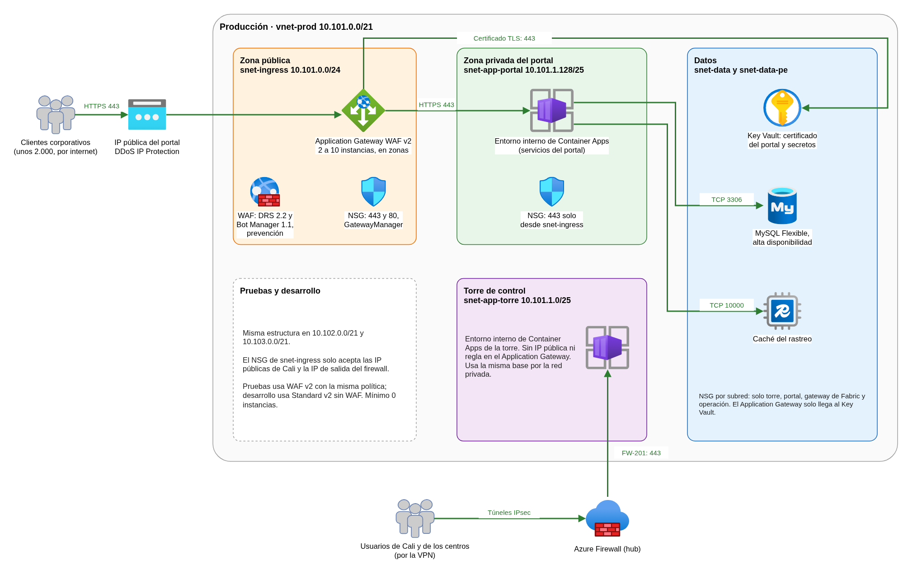
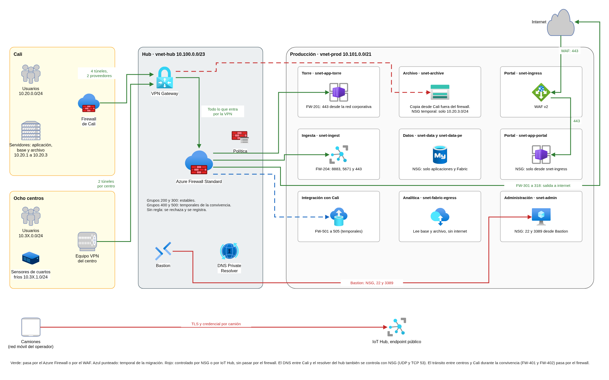
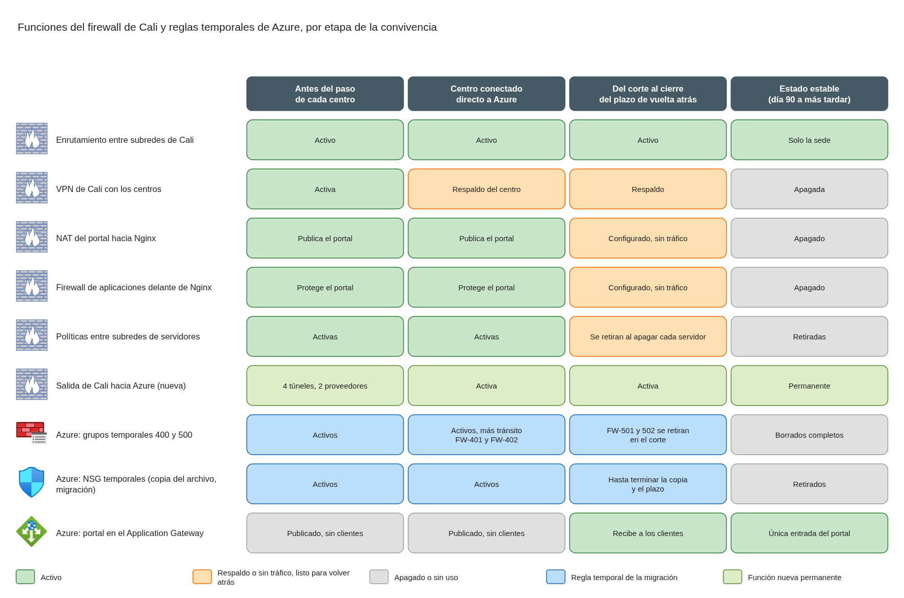

# Firewall de nube, transición del firewall de Cali y publicación del portal de rastreo

Este documento define el firewall de la nube de FríoAndes en Azure, la tabla de políticas que aplica, la forma de publicar el portal de rastreo en internet y qué pasa con cada función del firewall actual de Cali durante la convivencia y después de ella. Parte de la red descrita en el documento de red híbrida y subnetting (`red-topologia-subnetting.md`) y usa sus mismos nombres de subredes y rangos.

Los diagramas están en draw.io. Cada imagen PNG de la carpeta `diagramas/` lleva el diagrama incrustado y se abre como diagrama editable en draw.io. Los archivos `.drawio` de la misma carpeta son su fuente.

Los archivos de apoyo están en la carpeta `red/`, junto al plan de direcciones:

| Archivo | Qué contiene |
|---|---|
| `red/data/firewall-policy.csv` | La tabla de políticas completa, regla por regla y ambiente por ambiente: la única fuente para el código de infraestructura |
| `red/data/firewall-settings.csv` | La configuración general del Azure Firewall |
| `red/tools/verify_firewall_policy.py` | Verifica la tabla contra el plan de direcciones y las reglas del diseño (sección 4.9) |
| `red/verification/reporte-firewall-policy.md` | Resultado de la verificación |
| `red/tools/build_drawio_diagrams.py` | Genera los diagramas de draw.io de este documento |

## Contenido

1. Contexto y alcance
2. Decisiones de servicio
3. Publicación del portal de rastreo
4. Tabla de políticas del firewall de nube
5. Transición del firewall de Cali
6. Registro y detección de actividad anómala
7. Costo
8. Supuestos y confirmaciones pendientes de FríoAndes

### Términos usados

| Término | Significado en este documento |
|---|---|
| Azure Firewall | Firewall administrado de Azure. Vive en el hub y controla el tráfico entre las sedes y la nube, entre ambientes y hacia internet |
| Política del firewall | Conjunto de reglas del Azure Firewall, organizado en grupos con prioridad. Se administra como código |
| WAF | Firewall de aplicaciones web. Revisa cada solicitud HTTP o HTTPS y bloquea ataques web conocidos antes de que lleguen a la aplicación |
| Application Gateway | Balanceador web regional de Azure. Recibe las conexiones del portal, aplica el WAF y las reparte entre los servicios del portal |
| NSG | Grupo de seguridad de red. Lista de reglas por subred que permite o rechaza tráfico según origen, destino y puerto |
| UDR | Ruta definida por el usuario. Obliga al tráfico de una subred a pasar por el Azure Firewall |
| Zona | Grupo de subredes con el mismo nivel de confianza: torre de control, portal, ingesta de telemetría, analítica y compartida |
| Convivencia | Periodo de como máximo 90 días en que el datacenter de Cali y Azure funcionan al mismo tiempo |
| Corte | Ventana de hasta 2 horas, en la madrugada de un domingo, en que la base transaccional y el tráfico de despacho y rastreo pasan a Azure |
| Estado estable | La operación después del día 90, con la plataforma ya en Azure |

---

## 1. Contexto y alcance

### 1.1 Situación actual

Hoy un firewall de próxima generación en Cali concentra cinco funciones:

| Función | Qué hace hoy |
|---|---|
| Enrutamiento | Enruta entre las 7 subredes de Cali y las 16 de los centros |
| VPN sitio a sitio | Mantiene un túnel con cada uno de los ocho centros |
| NAT del rastreo | Publica el portal de rastreo en internet hacia los servidores Nginx de `10.20.5.0/24` |
| Políticas entre subredes | Decide qué subred de Cali o de los centros puede hablar con cuál |
| Firewall de aplicaciones | Delante de Nginx, protege la zona publicada y la zona interna del rastreo |

Durante la convivencia este firewall sigue en pie. FríoAndes necesita un firewall de nube adicional, con su tabla de políticas y con el firewall de aplicaciones del rastreo, y saber qué políticas del firewall de Cali se conservan, cuáles se trasladan y cuándo se apaga cada función.

### 1.2 Qué resuelve este documento

| Necesidad | Dónde se responde |
|---|---|
| Firewall de nube a implementar, además del de Cali | Secciones 2 y 4 |
| Tabla de políticas: origen, destino, puerto, acción y si la regla es temporal de la migración o queda en estado estable | Sección 4 |
| El firewall de aplicaciones del rastreo forma parte del diseño | Secciones 3 y 4 |
| Publicar el rastreo de forma controlada | Sección 3 |
| Mantener el despacho fuera de internet público | Secciones 3 y 4 |
| Qué políticas del firewall de Cali se conservan, cuáles se trasladan y cuándo se apaga cada función | Sección 5 |
| Separación de red entre la torre de control, el portal público, la ingesta de sensores y los datos analíticos | Sección 4 |
| Protección del perímetro público y detección de actividad anómala | Secciones 3 y 6 |

### 1.3 Qué toma del diseño de red

El diseño de red ya fijó lo siguiente, y este documento lo usa sin cambios:

- **Topología hub y spoke.** El hub (`vnet-hub`, `10.100.0.0/23`) tiene el VPN Gateway, el Azure Firewall, Azure Bastion y el DNS Private Resolver. Producción, pruebas y desarrollo son spokes conectados por peering (`10.101.0.0/21`, `10.102.0.0/21` y `10.103.0.0/21`).
- **Todo pasa por el firewall.** El tráfico entre las sedes y los ambientes, entre ambientes y hacia internet pasa por el Azure Firewall, obligado por rutas definidas por el usuario. La única excepción es la copia continua del archivo histórico, que va directo al almacenamiento y se controla con un NSG.
- **Las mismas zonas en cada ambiente.** Torre de control (`snet-app-torre`), portal (`snet-ingress` y `snet-app-portal`), ingesta (`snet-ingest`), analítica (`snet-fabric-egress`) y una zona compartida con datos, archivo, administración e integración con Cali.
- **Una sola entrada pública de aplicación por ambiente**, `snet-ingress`, reservada para el portal.
- **Los centros llegan directo a Azure** con su propia VPN, centro por centro durante la convivencia.

---

## 2. Decisiones de servicio

Esta sección fija tres decisiones de las que depende el resto del documento: cómo se combinan el Azure Firewall y el WAF, qué versión del Azure Firewall se usa y qué servicio publica el portal.

### 2.1 Cómo se combinan el firewall y el WAF

Azure ofrece dos piezas que se complementan. El Azure Firewall controla cualquier protocolo y es el único que filtra el tráfico de salida. El WAF del Application Gateway revisa el contenido de las solicitudes web de entrada, cosa que el Azure Firewall no hace. Microsoft describe cuatro formas de combinarlos:

| Diseño | Cómo viaja la entrada del portal | Cuándo lo recomienda Microsoft |
|---|---|---|
| Solo Azure Firewall | Internet, firewall, aplicación | Cuando no hay aplicaciones web publicadas |
| Firewall y Application Gateway en paralelo (elegido) | Internet, Application Gateway con WAF, aplicación. El firewall controla todo lo demás y toda la salida | Es el diseño común cuando hay cargas web y no web. Es el recomendado para clústeres de Kubernetes |
| Application Gateway delante del firewall | Internet, Application Gateway con WAF, firewall, aplicación | Cuando el firewall tiene que inspeccionar el tráfico entre el Application Gateway y la aplicación, por ejemplo con detección de intrusiones |
| Firewall delante del Application Gateway | Internet, firewall, Application Gateway, aplicación | Casos poco comunes. El firewall solo ve tráfico cifrado y la aplicación pierde la IP real del cliente |

**Por qué en paralelo:**

- El portal es la única carga web pública. El WAF la protege y el Azure Firewall se ocupa del resto: torre, sensores, migración, administración y toda la salida a internet.
- El Application Gateway conserva la IP real de cada cliente en el encabezado `X-Forwarded-For`, así que los límites de solicitudes por cliente y la detección de abuso del portal funcionan sin pasar por el firewall.
- La otra opción con sentido, poner el Application Gateway delante del firewall, solo aporta si el firewall inspecciona con detección de intrusiones, que es una función de la versión Premium (sección 2.2). Con la versión Standard ese firewall vería el mismo tráfico que ya filtró el WAF, y cobraría por procesarlo.
- El tráfico del portal no pasa por el firewall, así que no suma a su costo de procesamiento ni compite con el tráfico de las sedes.

**Qué exige este diseño en las rutas:**

- `snet-ingress` no lleva una ruta `0.0.0.0/0` hacia el firewall. Microsoft solo admite esa ruta en un Application Gateway sin IP pública, y en este diseño la rompería: el Application Gateway necesita salir a internet para que Azure lo administre.
- `snet-app-portal` sí manda su salida a internet al firewall. Las respuestas al Application Gateway viajan dentro de la misma red virtual y no pasan por el firewall.
- En los spokes, las rutas hacia el hub no incluyen el rango de `AzureFirewallSubnet`. Si lo incluyeran, la respuesta podría volver por una instancia del firewall distinta de la que recibió la conexión, y esta se cortaría.

### 2.2 Versión del Azure Firewall: Standard

El diseño de red supuso Azure Firewall Standard. Esta sección lo confirma frente a las otras dos versiones.

| | Basic | Standard (elegida) | Premium |
|---|---|---|---|
| Rendimiento máximo | 250 Mbps | 30 Gbps | 100 Gbps |
| Filtrado por nombre de dominio en reglas de red | No | Sí | Sí |
| Proxy DNS | No | Sí | Sí |
| Inteligencia de amenazas (IP y dominios maliciosos conocidos) | Solo alerta | Alerta y bloqueo | Alerta y bloqueo |
| Detección y prevención de intrusiones (IDPS) | No | No | Sí |
| Inspección de TLS de salida y filtrado por URL completa | No | No | Sí |
| Costo fijo al mes en East US 2 | USD 288,35 | USD 912,50 | USD 1.277,50 |
| Costo por GB procesado | USD 0,065 | USD 0,016 | USD 0,016 |

**Por qué Standard:**

- **Cubre todas las reglas del diseño.** La tabla de políticas usa direcciones, puertos, etiquetas de servicio de Azure y nombres de dominio para la salida a internet. Todo eso está en Standard.
- **Bloquea el tráfico hacia destinos maliciosos conocidos.** La inteligencia de amenazas de Microsoft se configura en modo de alerta y bloqueo. Es la primera capa de detección de actividad anómala en la red (sección 6).
- **Tiene margen de sobra.** El tráfico que procesa el firewall está muy por debajo de su límite: los usuarios internos suman a lo sumo unos 135 Mbps (450 personas a unos 300 Kbps) y la telemetría de los cuartos fríos menos de 1 Mbps.
- **Se puede subir a Premium sin cortar el servicio.** Azure permite cambiar de Standard a Premium con el cambio de versión del recurso, sin tiempo de inactividad, y en el código de infraestructura es un solo atributo (`sku_tier`). No hace falta pagar Premium desde el día uno para tenerlo disponible.

**Por qué no Basic:** cobra menos de costo fijo y cuatro veces más por GB, así que resulta más barata mientras el firewall procese menos de unos 12.700 GB al mes. El tráfico estimado sin la copia del archivo está por debajo de esa cifra, pero el ahorro sería de menos de USD 200 al mes, y Basic tiene tres límites que el diseño no acepta. Su techo de 250 Mbps queda por debajo del enlace de 400 Mbps de Cali. Solo alerta sobre destinos maliciosos y no los bloquea. Y Azure no permite pasar de Basic a Standard: subir de versión obligaría a reemplazar el firewall.

**Por qué no Premium desde el inicio:** sus funciones adicionales sirven para inspeccionar tráfico cifrado y detectar intrusiones dentro de la red. Este diseño ya cubre el tráfico web público con el WAF, no maneja datos de tarjetas de pago y deja la detección de comportamientos anómalos en Defender for Cloud (sección 6). Premium cuesta USD 365 más al mes. Si FríoAndes decide inspeccionar el tráfico interno, el cambio se hace sin rediseño: se sube la versión y el Application Gateway pasa a ubicarse delante del firewall (sección 2.1).

### 2.3 Entrada del portal: Application Gateway con WAF

Azure tiene dos servicios para publicar una aplicación web con WAF:

| | Application Gateway WAF v2 (elegido) | Front Door Premium |
|---|---|---|
| Alcance | Regional. Vive dentro de la red virtual, en `snet-ingress` | Global. Recibe las conexiones en el punto de presencia de Microsoft más cercano al cliente, que para Colombia es Bogotá |
| Cómo llega a los servicios del portal | Por la red privada del ambiente | Por un endpoint privado que Front Door crea en su propia red y que FríoAndes aprueba |
| Separación de zona pública y privada | Por subredes y NSG dentro de la red de FríoAndes | La zona pública queda fuera de la red de FríoAndes |
| Conmutación entre regiones | Necesita un Application Gateway en la otra región y un cambio de DNS | La hace sola, entre orígenes de distintas regiones |
| Costo fijo por ambiente | USD 262,80 al mes, más la capacidad usada | USD 330 al mes por perfil, más solicitudes y transferencia |

**Por qué Application Gateway:**

- **El portal es regional.** Unos 2.000 clientes corporativos, casi todos en Colombia, con un pico de 2.000 solicitudes por minuto. No hace falta una red global para ese volumen.
- **Mantiene la separación dentro de la red de FríoAndes.** La zona pública (`snet-ingress`) y la privada (`snet-app-portal`) son subredes con NSG propios, con las reglas a la vista en el mismo código que el resto de la red. El plan de direcciones ya reservó `snet-ingress` para este servicio.
- **Sirve con cualquier plataforma de contenedores.** Funciona igual con Container Apps y con la variante con Kubernetes (sección 2.4).
- **Los cambios no dependen de una distribución global.** En Front Door cada cambio, incluidas las reglas del WAF, se distribuye a todos los puntos de presencia y puede tardar hasta unos 15 minutos en aplicarse, y lo mismo para revertirlo. En una ventana de cambio de 22:00 a 04:00 conviene que aplicar y volver atrás sea lo más directo posible.

**Cuándo convendría Front Door Premium:** si el diseño de continuidad de la plataforma logística elige un segundo despliegue activo del portal en Central US con conmutación automática, o si FríoAndes quiere absorber ataques de denegación de servicio en el borde de la red de Microsoft. En ese caso Front Door se pone delante del Application Gateway o directo delante de los servicios del portal. Los dos se conectan por endpoint privado y las subredes no cambian.

### 2.4 La plataforma de contenedores

La plataforma propuesta para la torre y los servicios del portal es Azure Container Apps; Kubernetes (AKS) es la alternativa. Las decisiones de esta sección valen para las dos. La plataforma solo cambia tres puntos de este documento:

| Punto | Container Apps | Kubernetes (AKS) |
|---|---|---|
| Reglas de salida a internet | Las que necesita Container Apps para descargar imágenes y operar | Las que necesita AKS, con la etiqueta `AzureKubernetesService`, y más direcciones públicas de salida en el firewall |
| Cómo el Application Gateway llega al portal | Al entorno interno de Container Apps | Al balanceador interno del clúster del portal, o con Application Gateway for Containers |
| Separación entre torre y portal | Entornos en subredes distintas: el firewall y los NSG filtran entre ellos | En producción, dos clústeres en subredes distintas: igual que con Container Apps. En pruebas y desarrollo, un clúster con políticas de red de Kubernetes |

Las secciones 3 y 4 tratan cada punto en su propio apartado. El resto del documento es común a las dos plataformas.

---

## 3. Publicación del portal de rastreo

El portal de rastreo es la única aplicación de FríoAndes que se publica en internet. Lo usan unos 2.000 clientes corporativos, con un pico ordinario de unas 800 solicitudes por minuto y de 2.000 en campaña, durante unas cuatro horas.

### 3.1 Recorrido de una solicitud

```
Cliente en internet
  → DNS público del portal: apunta a la IP pública del Application Gateway
  → Application Gateway WAF v2 en snet-ingress (zona pública)
      · termina HTTPS con el certificado del portal
      · el WAF revisa la solicitud y bloquea los ataques conocidos
      · agrega la IP del cliente en el encabezado X-Forwarded-For
  → HTTPS por la red privada del ambiente
  → servicios del portal en snet-app-portal (zona privada, sin dirección pública)
  → base de datos y caché del rastreo, por la red privada
```



La torre de control no tiene ningún camino desde esta entrada. El Application Gateway solo tiene configurado el portal: no hay regla, nombre ni servidor de la torre en él. La torre se alcanza únicamente desde la red corporativa, a través del Azure Firewall (sección 4).

### 3.2 Separación entre la zona pública y la privada

La zona pública es `snet-ingress` y la privada es `snet-app-portal`. Cada capa agrega un control independiente:

| Capa | Control | Qué impide |
|---|---|---|
| Subred `snet-ingress` | Exclusiva del Application Gateway. Azure no permite otros recursos en ella | Que otro servicio quede expuesto por compartir la subred pública |
| NSG de `snet-ingress` | Entrada permitida solo a 443 y 80 (80 solo redirige a 443), más el tráfico de administración de Azure (etiqueta `GatewayManager`, puertos 65200 a 65535) y las sondas del balanceador de Azure. Todo lo demás se rechaza. La salida a internet no se bloquea, porque Azure la necesita para administrar el servicio | Que se llegue a cualquier otro puerto de la subred pública |
| Tabla de rutas de `snet-ingress` | `0.0.0.0/0` directo a internet y sin propagar las rutas aprendidas de las sedes | Que una ruta anunciada desde una sede rompa la administración del Application Gateway. Azure no admite enviar la salida de esta subred a un firewall |
| Servicios del portal | Entorno interno: solo tienen dirección privada | Que se llegue a los servicios del portal sin pasar por el WAF |
| NSG de `snet-app-portal` | Entrada a 443 solo desde `snet-ingress`. Se rechaza el resto, incluida la torre | Que otra subred del ambiente llegue a los servicios del portal |
| Tabla de rutas de `snet-app-portal` | La salida a internet y hacia las sedes va al Azure Firewall. El rango de `snet-ingress` queda fuera de esas rutas | Que los servicios del portal salgan a internet sin control. La respuesta al Application Gateway vuelve directo por la red virtual, sin desviarse al firewall |

### 3.3 Capacidad para 800 y 2.000 solicitudes por minuto

El Application Gateway v2 se mide en unidades de capacidad. Una unidad es lo que más se use entre tres medidas: cómputo, conexiones y volumen de datos. Microsoft da estas equivalencias para la versión con WAF:

| Medida | Una unidad de capacidad equivale a |
|---|---|
| Cómputo | Unas 10 solicitudes por segundo revisadas por el WAF |
| Conexiones | 2.500 conexiones persistentes |
| Volumen | 2,22 Mbps |

Con un tamaño medio de respuesta de 150 KB (página de rastreo, consulta y mapa; es un supuesto):

| | Pico ordinario | Pico de campaña |
|---|---|---|
| Solicitudes por segundo | 800 / 60 = 13,3 | 2.000 / 60 = 33,3 |
| Unidades por cómputo | 13,3 / 10 = 1,3 | 33,3 / 10 = 3,3 |
| Volumen | 13,3 × 150 KB = 16 Mbps | 33,3 × 150 KB = 40 Mbps |
| Unidades por volumen | 16 / 2,22 = 7,2 | 40 / 2,22 = 18 |
| Unidades necesarias (la mayor) | 7,2 | 18 |

El volumen de datos manda. Cada instancia del Application Gateway reserva 10 unidades de capacidad.

**Configuración de producción:**

- **Autoescalado con un mínimo de 2 instancias.** Las 20 unidades reservadas cubren el pico de campaña (18) sin depender del autoescalado, que tarda entre tres y cinco minutos en agregar instancias. Esto importa porque durante una campaña no se hacen cambios en producción: la capacidad tiene que estar lista antes.
- **Máximo de 10 instancias.** Alcanza para más de cinco veces el pico de campaña. La subred `/24` admite hasta 125 instancias, así que el máximo se puede subir sin tocar la red.
- **Zonas de disponibilidad.** El Application Gateway de producción se configura con zonas de disponibilidad, como recomienda Microsoft para producción.

La cifra de 10 solicitudes por segundo por unidad depende del tamaño de las solicitudes y del trabajo del WAF. Se confirma con una prueba de carga en el ambiente de pruebas antes del corte. Después de la salida a producción se revisan las métricas de unidades de capacidad del primer mes y se ajusta el mínimo. Microsoft recomienda alertar cuando el uso supere el 75 % de lo habitual.

### 3.4 El WAF del portal

Cada ambiente tiene su propia política de WAF, administrada como código:

| Elemento | Configuración | Para qué |
|---|---|---|
| Reglas administradas | Default Rule Set 2.2, el conjunto que Microsoft recomienda hoy, basado en OWASP Core Rule Set 3.3.4 | Bloquear inyección de SQL, scripts entre sitios, inclusión de archivos y los demás ataques web comunes |
| Protección contra bots | Bot Manager 1.1 | Bloquear las IP de bots maliciosos conocidos según la inteligencia de amenazas de Microsoft, que se actualiza varias veces al día |
| Modo | Prevención: bloquea. El modo detección solo registra y se usa mientras se ajustan las reglas | |
| Inspección del cuerpo de la solicitud | Activada | Revisar también los datos enviados en formularios y consultas |
| Exclusiones | Solo las que salgan del ajuste en pruebas, cada una documentada con su motivo | Evitar falsos positivos sin abrir huecos generales |

**Cómo se llega al modo prevención sin bloquear a clientes legítimos:**

1. En pruebas, la política arranca en modo detección mientras se ejecutan las pruebas funcionales y de carga del portal.
2. Se revisan los registros del WAF, se agregan las exclusiones necesarias y se pasa a prevención en pruebas.
3. Producción arranca en modo prevención desde el corte, con la misma política ya ajustada.

**Límites de solicitudes y detección de anomalías.** El diseño de datos personales y perímetro (`seguridad-datos-personales-perimetro.md`, secciones 4 y 5) agrega a esta misma política cuatro reglas de límite dimensionadas para el pico de 2.000 solicitudes por minuto: límite general por IP, consulta de guías, inicio de sesión y registro del tráfico desde fuera de Colombia (WAF-prod-02 a 05 y WAF-test-02 a 05). También define la detección con Defender for Cloud. Las reglas usan la IP real de cada cliente, que el Application Gateway entrega.

### 3.5 Certificados y cifrado

- **HTTPS de punta a punta.** El cliente se conecta por HTTPS al Application Gateway, y el Application Gateway se conecta por HTTPS a los servicios del portal. La conexión por el puerto 80 solo redirige a 443.
- **Versión mínima TLS 1.2.** Se usa la política TLS predefinida `AppGwSslPolicy20220101` o una más reciente. Desde agosto de 2025 Azure ya no acepta TLS 1.0 ni 1.1 en el Application Gateway.
- **El certificado público vive en el Key Vault del ambiente.** El Application Gateway lo lee con una identidad administrada que tiene el rol de lectura de secretos (`Key Vault Secrets User`), sin contraseñas en el código. La referencia al certificado no lleva versión, así que cuando se renueva en Key Vault el Application Gateway toma la nueva versión sola (revisa cada cuatro horas).
- **Acceso privado al Key Vault.** El Key Vault tiene endpoint privado en `snet-data-pe`. Para que el Application Gateway lo encuentre, la zona DNS privada de Key Vault (`privatelink.vaultcore.azure.net`) se enlaza también a la red del ambiente, además de al hub. Si el Application Gateway pierde acceso al certificado, Azure deshabilita el listener; por eso la falta de acceso genera una alerta (sección 6).

### 3.6 Protección contra denegación de servicio

| Opción | Qué da | Costo al mes |
|---|---|---|
| Protección de infraestructura (incluida) | Mitigación automática de ataques de red sobre todas las IP públicas de Azure, sin configuración | Sin costo |
| DDoS IP Protection sobre la IP del portal de producción (propuesta) | Lo anterior, más políticas ajustadas al tráfico del portal, métricas, alertas e informes de cada mitigación | USD 199 por IP |
| DDoS Network Protection | Lo anterior para todas las IP de la red, más soporte de respuesta rápida, protección del costo durante un ataque y el WAF cobrado a la tarifa sin WAF | Unos USD 2.944 por plan |

**Propuesta:** DDoS IP Protection solo para la IP pública del Application Gateway de producción. Es la única entrada pública de la que dependen los clientes y su disponibilidad es uno de los objetivos de servicio de la plataforma. Con las alertas e informes, el equipo de operación sabe cuándo hubo un ataque y qué se mitigó. Los ataques de aplicación, como el exceso de solicitudes, los detiene el WAF.

Network Protection no se justifica: su costo es unas quince veces el de proteger la IP del portal, y el descuento del WAF que incluye no compensa la diferencia.

### 3.7 Pruebas y desarrollo

- **Misma estructura que producción**, con su propio Application Gateway en `snet-ingress`.
- **Solo orígenes autorizados.** El NSG de `snet-ingress` acepta 443 únicamente desde:
  - las IP públicas de los dos proveedores de internet de Cali;
  - la IP de salida del Azure Firewall, que usan las pruebas automáticas que corren en `snet-admin`.

  El acceso de las personas que trabajan fuera de la sede sigue el diseño de acceso remoto.
- **Pruebas usa WAF v2** con la misma política que producción, porque ahí se ajusta el WAF antes de cada cambio.
- **Desarrollo usa Application Gateway Standard v2, sin WAF.** No tiene datos reales ni usuarios externos, y las reglas del WAF ya se validan en pruebas. El código es el mismo módulo con otra versión del servicio.
- **Autoescalado con mínimo 0 instancias** en los dos ambientes, porque su tráfico es bajo y no hay campañas.

### 3.8 Durante la convivencia

Hasta el corte, el portal sigue publicado desde Cali por NAT, Nginx y el firewall de aplicaciones actual. El portal nuevo se publica antes del corte con su propia IP y se prueba sin tráfico de clientes.

- **Unos días antes del corte** se baja el tiempo de vida (TTL) del registro DNS público del portal, para que el cambio y una eventual vuelta atrás se propaguen en minutos.
- **En el corte** el registro DNS pasa de la IP de Cali a la IP del Application Gateway.
- **Para volver atrás**, el registro vuelve a la IP de Cali, que sigue configurada hasta que se cierra el plazo de vuelta atrás.

La sección 5 detalla cuándo se apaga cada pieza de Cali.

### 3.9 Variante con Kubernetes (AKS): qué cambia en la publicación

Con Container Apps, el Application Gateway envía el tráfico al nombre de la aplicación dentro del entorno interno. Para resolver ese nombre, la zona DNS privada del entorno se enlaza a la red del ambiente y al hub. Con AKS hay dos formas de conectar el Application Gateway con el clúster del portal:

| | Application Gateway WAF v2 con su controlador para AKS (propuesta para la variante) | Application Gateway for Containers |
|---|---|---|
| WAF | La misma política que con Container Apps (Default Rule Set 2.2 y Bot Manager 1.1) | Solo Default Rule Set 2.1. Sin desafíos de JavaScript ni captcha para bots, sin respuesta de bloqueo personalizada y sin usar `X-Forwarded-For` en reglas personalizadas |
| Subred | `snet-ingress` igual, con una diferencia: con Azure CNI Overlay debe estar reservada para el Application Gateway (delegación `Microsoft.Network/applicationGateways`), ser `/24` o menor y estar en la misma red virtual que los nodos. El diseño ya cumple las dos últimas condiciones | `snet-ingress` reservada para este servicio, con su propia tabla de rutas |
| Quién configura las rutas web | El controlador, desde los recursos de Kubernetes. Toma el control de toda la configuración del Application Gateway, así que el código de infraestructura solo crea el recurso y la política del WAF | El controlador, desde los recursos de Kubernetes |
| Dirección | Microsoft lo mantiene y sugiere evaluar Application Gateway for Containers para soluciones nuevas | Es la evolución que Microsoft propone para Kubernetes |

Se propone el controlador del Application Gateway porque conserva el mismo WAF en las dos plataformas, con el conjunto de reglas más reciente. Si se eligiera Application Gateway for Containers, el WAF quedaría con menos funciones y con un conjunto de reglas anterior.

---

## 4. Tabla de políticas del firewall de nube

Esta sección es la tabla de políticas del firewall de nube: origen, destino, puerto, acción y si cada regla es temporal de la migración o queda en estado estable. La versión completa, regla por regla y ambiente por ambiente, está en `red/data/firewall-policy.csv`. Es la única fuente para el código de infraestructura, y un script la verifica contra el plan de direcciones (sección 4.9).

### 4.1 Dónde se controla cada flujo

No todo el tráfico pasa por el Azure Firewall. Cada flujo tiene un punto de control, elegido según por dónde viaja:

| Punto de control | Qué controla | Por qué ahí |
|---|---|---|
| Azure Firewall | Todo lo que va de las sedes a la nube, de la nube a las sedes, entre sedes durante la convivencia, entre ambientes y hacia internet | Es el paso obligado del hub y registra cada conexión en un solo lugar |
| WAF del Application Gateway | La entrada del portal desde internet | Revisa el contenido de cada solicitud web, que el firewall no lee (sección 2.1) |
| NSG de cada subred | El tráfico dentro de un mismo ambiente, entre zonas. Es además una segunda capa detrás del firewall | El tráfico entre subredes de una misma red virtual no pasa por el hub |
| IoT Hub y DPS | Los camiones, que llegan desde internet | No están en la red corporativa: la protección es TLS y una credencial por camión |



En el diagrama, las líneas verdes pasan por el Azure Firewall o por el WAF, las azules punteadas son temporales de la migración y las rojas se controlan con NSG o en IoT Hub, sin pasar por el firewall. La función notificadora de la telemetría (`snet-telemetry-func`) sale a internet por el firewall y llega a la torre por el NSG de la torre.

### 4.2 Cómo se organiza la política del firewall

- **Una sola política**, administrada como código, con cuatro grupos de reglas por prioridad:

  | Prioridad | Grupo | Vigencia |
  |---|---|---|
  | 200 | Sedes a la nube | Estable |
  | 300 | Salida a internet | Estable |
  | 400 | Tránsito entre sedes durante la convivencia | Temporal |
  | 500 | Migración | Temporal |

  Las reglas temporales viven solo en los grupos 400 y 500. Al cerrar la convivencia se borran los dos grupos completos, sin revisar regla por regla.
- **Todo lo que no está permitido se rechaza.** Es el comportamiento del Azure Firewall cuando ninguna regla coincide, y cada rechazo queda registrado. Así se bloquea, sin reglas adicionales, el tráfico entre producción, pruebas y desarrollo.
- **Inteligencia de amenazas en modo alerta y bloqueo.** Se rechaza y registra el tráfico hacia y desde IP y dominios maliciosos conocidos, antes de evaluar las reglas.
- **Traducción de origen solo hacia los endpoints privados.** Por defecto, el firewall conserva la IP de origen del tráfico interno. Microsoft exige traducirla cuando el destino es un endpoint privado y la regla es de red: el endpoint privado responde directo al origen y no por el firewall, y la conexión se rompería. Por eso la lista de destinos sin traducción incluye las sedes y las subredes de la nube que no tienen endpoints privados, y deja fuera `snet-ingest`, `snet-data-pe` y `snet-archive`. En la práctica, la torre ve la IP real de cada usuario y la ingesta ve la del firewall. El registro del firewall conserva la IP original del sensor.
- **Sin proxy DNS.** Las reglas de red usan direcciones y etiquetas de servicio, y las de aplicación (nombres de dominio para HTTPS) no lo necesitan.

### 4.3 Reglas del Azure Firewall

La notación `10.10X` indica que la regla se repite en cada ambiente: `X` es 1 en producción, 2 en pruebas y 3 en desarrollo. Los centros son `10.31` a `10.38`.

**Sedes a la nube (estable)**

| Regla | Origen | Destino | Puerto | Acción | Vigencia |
|---|---|---|---|---|---|
| FW-201 | Usuarios de Cali (`10.20.0.0/24`) y de los centros (`10.3X.0.0/24`) | Torre de producción (`10.101.1.0/25`) | TCP 443 | Permitir | Estable |
| FW-202 y FW-203 | Usuarios de Cali (`10.20.0.0/24`) | Torre de pruebas y de desarrollo (`10.102.1.0/25`, `10.103.1.0/25`) | TCP 443 | Permitir | Estable |
| FW-204 | Sensores de los centros (`10.3X.1.0/24`) | Ingesta de producción (`10.101.2.96/27`) | TCP 8883, 5671 y 443 | Permitir | Estable |

Los sensores reales solo llegan a producción. Pruebas y desarrollo trabajan con datos simulados, como pide el tratamiento de datos personales.

**Salida a internet (estable, en cada ambiente)**

| Reglas | Origen | Destino | Puerto | Acción | Vigencia |
|---|---|---|---|---|---|
| FW-301, 307 y 313 | Torre y portal (`10.10X.1.0/24`) | Registro de Microsoft y binarios de Container Apps: `mcr.microsoft.com`, `*.data.mcr.microsoft.com`, `packages.aks.azure.com`, `acs-mirror.azureedge.net` | HTTPS 443 | Permitir | Estable |
| FW-302, 308 y 314 | Torre, portal y función notificadora de la telemetría (`10.10X.3.0/27`) | Entra ID e identidades administradas: `*.identity.azure.net`, `login.microsoftonline.com`, `*.login.microsoftonline.com`, `login.microsoft.com`, `*.login.microsoft.com` | HTTPS 443 | Permitir | Estable |
| FW-303, 309 y 315 | Torre, portal y agentes de despliegue (`10.10X.2.128/27`) | Registro de contenedores de FríoAndes (`<registro>.azurecr.io` y su almacenamiento `*.blob.core.windows.net`) | HTTPS 443 | Permitir | Estable |
| FW-304, 310 y 316 | Torre, portal y función notificadora | Azure Monitor (etiqueta de servicio `AzureMonitor`) | TCP 443 | Permitir | Estable |
| FW-305, 311 y 317 | Torre y portal | Servicios externos de la aplicación, como correo y SMS. Cada dominio se agrega con su propio cambio | HTTPS 443 | Permitir | Estable |
| FW-306, 312 y 318 | Agentes de despliegue y máquinas de operación (`10.10X.2.128/27`) | Azure Resource Manager, Entra ID, los dominios que GitHub publica para sus ejecutores autoalojados y los repositorios de actualizaciones de Ubuntu y Microsoft | HTTPS 443 y HTTP 80 | Permitir | Estable |
| FW-319, 320 y 321 | Función notificadora de la telemetría (`10.10X.3.0/27`) | Canales de las alertas: webhook de Workflows de Teams (`*.api.powerplatform.com` y `*.logic.azure.com`), correo de Azure Communication Services (`<recurso>.communication.azure.com`) y el proveedor de SMS | HTTPS 443 | Permitir | Estable |

El gateway de Fabric (`snet-fabric-egress`) no tiene ninguna regla de salida a internet. Microsoft devuelve sus resultados a Fabric por un canal interno que no pasa por internet ni por el firewall.

**Tránsito entre sedes durante la convivencia (temporal)**

Cuando un centro pasa a la conexión directa con Azure, todo lo que todavía vive en Cali le llega a través del hub, y el Azure Firewall lo controla.

| Regla | Origen | Destino | Puerto | Acción | Se retira |
|---|---|---|---|---|---|
| FW-401 | Usuarios de los centros (`10.3X.0.0/24`) | Torre y portal actuales en Cali (`10.20.1.0/24`) | TCP 443 | Permitir | Al cerrar el plazo de vuelta atrás del corte |
| FW-402 | Equipos de los centros (`10.3X.0.0/24` y `10.3X.1.0/24`) | Servidor de archivo de Cali (`10.20.3.0/24`), FTP de los históricos de temperatura | TCP 21 y el rango pasivo del servidor FTP | Permitir | Cuando la telemetría en línea reemplaza la carga por lote del centro |

**Migración (temporal, producción)**

| Regla | Origen | Destino | Puerto | Acción | Se retira |
|---|---|---|---|---|---|
| FW-501 | Servicio de migración (`10.101.2.160/27`) | Base de datos de Cali (`10.20.2.0/24`) | TCP 3306 | Permitir | En el corte |
| FW-502 | Servicio de migración | Cuenta de almacenamiento de la migración (`<cuenta>.blob.core.windows.net`) | HTTPS 443 | Permitir | En el corte, junto con la cuenta y su token |
| FW-503 | Servidores de aplicación de Cali (`10.20.1.0/24`) | Integración con Cali (`10.101.2.160/27`) | TCP 443 | Permitir | Al cerrar el plazo de vuelta atrás |
| FW-504 | Integración con Cali | Servidores de aplicación de Cali | TCP 443 | Permitir | Al cerrar el plazo de vuelta atrás |
| FW-505 | Base de datos de Cali | Base de datos en Azure (`10.101.2.0/27`) | TCP 3306 | Permitir | Al cerrar el plazo de vuelta atrás. Solo si el plan de vuelta atrás replica de Azure hacia Cali |

En FW-501 el origen es el servicio de migración porque es quien abre la conexión hacia la base de Cali, aunque los datos viajen en el otro sentido. El plazo de vuelta atrás termina, como máximo, el día 90.

**Regla final**

| Regla | Origen | Destino | Puerto | Acción | Vigencia |
|---|---|---|---|---|---|
| FW-999 | Cualquiera | Cualquiera | Cualquiera | Denegar y registrar | Estable |

### 4.4 Reglas de los NSG dentro de cada ambiente

Cada subred tiene su NSG. Todas terminan en una regla que rechaza lo que no esté permitido arriba. Esa regla es la que impide, por ejemplo, que el portal llegue a la torre.

| Subred de destino | Se permite desde | Puerto | Vigencia |
|---|---|---|---|
| `snet-ingress` (portal) | Producción: internet. Pruebas y desarrollo: las IP públicas de Cali y la IP de salida del firewall | TCP 443 y 80 | Estable |
| `snet-ingress` (portal) | Administración de Azure (etiqueta `GatewayManager`) | TCP 65200 a 65535 | Estable |
| `snet-app-portal` | `snet-ingress` | TCP 443 | Estable |
| `snet-app-torre` | Usuarios de Cali y de los centros (en pruebas y desarrollo, solo Cali), que llegan por el firewall con su IP real | TCP 443 | Estable |
| `snet-app-torre` | Función notificadora de la telemetría de su ambiente, que entrega las alertas a la consola | TCP 443 | Estable |
| `snet-data` (MySQL) | Torre, portal, gateway de Fabric y máquinas de operación | TCP 3306 | Estable |
| `snet-data-pe` (caché) | Torre, portal y máquinas de operación | TCP 10000 | Estable |
| `snet-data-pe` (Key Vault) | Torre, portal, Application Gateway y máquinas de operación | TCP 443 | Estable |
| `snet-data-pe` (Event Hubs de la telemetría) | Torre | TCP 5671 y 443 | Estable |
| `snet-data-pe` (event hub de alertas, cuenta de la función y Key Vault) | Función notificadora | TCP 5671 y 443 | Estable |
| `snet-archive` | Torre, portal, gateway de Fabric, máquinas de operación y función notificadora | TCP 443 | Estable |
| `snet-ingest` | Azure Firewall (`10.100.0.64/26`) | TCP 8883, 5671 y 443 | Estable |
| `snet-admin` | Azure Bastion (`10.100.0.192/26`) | TCP 22 y 3389 | Estable |
| `snet-archive` (producción) | Servidor de archivo de Cali (`10.20.3.0/24`) | TCP 111, 2048 y 443 | Temporal: al terminar la copia continua |
| `snet-data` (producción) | Servicio de migración (`10.101.2.160/27`) | TCP 3306 | Temporal: en el corte |
| `snet-data` (producción) | Base de datos de Cali, pareja de FW-505 | TCP 3306 | Temporal: al cerrar el plazo de vuelta atrás |
| `snet-cali-integration` (producción) | Servidores de aplicación de Cali, pareja de FW-503 | TCP 443 | Temporal: al cerrar el plazo de vuelta atrás |
| Resolver DNS, entrada (hub) | DNS de Cali y redes de los tres ambientes | UDP y TCP 53 | Estable |
| Resolver DNS, salida (hub) | Hacia el DNS de Cali | UDP y TCP 53 | Estable |
| Todas | Cualquier otro origen | Cualquiera | Denegar |

### 4.5 Flujos que no pasan por el Azure Firewall

| Flujo | Cómo se controla | Por qué no pasa por el firewall |
|---|---|---|
| Clientes hacia el portal | WAF y NSG de `snet-ingress` | Diseño en paralelo (sección 2.1). Azure no admite desviar la salida del Application Gateway al firewall |
| Camiones hacia IoT Hub y DPS | TLS y una credencial por camión | Llegan desde la red móvil del operador, por internet. Si la plataforma del operador reenvía los datos desde direcciones fijas, el endpoint se limita además a esas direcciones |
| Copia continua del archivo | NSG temporal de `snet-archive` | Ahorra unos USD 194 al mes de procesamiento por un tráfico temporal, conocido y de un solo origen. Decidido en el diseño de red |
| Azure Bastion hacia las máquinas de operación | NSG de `snet-admin` | Azure no admite rutas definidas por el usuario en la subred de Bastion, y Microsoft indica que no hace falta pasar ese tráfico por el firewall porque es privado |
| DNS entre Cali y el resolver del hub | NSG de las subredes del resolver | Es tráfico de un servicio compartido del hub, de un solo puerto y con orígenes conocidos |

### 4.6 Rutas que hacen cumplir la tabla

Una regla solo sirve si el tráfico llega al firewall. Estas tablas de rutas lo garantizan:

| Subred | Rutas | Efecto |
|---|---|---|
| `GatewaySubnet` (hub) | Los tres ambientes (`10.101.0.0/21`, `10.102.0.0/21` y `10.103.0.0/21`) y las redes de las sedes hacia el Azure Firewall | Todo lo que entra por la VPN pasa por el firewall, incluido el tránsito entre un centro y Cali |
| Subredes de los ambientes, salvo `snet-ingress` | `0.0.0.0/0` hacia el Azure Firewall, sin propagar las rutas aprendidas de la VPN | La salida a internet y hacia las sedes pasa por el firewall. Sin el bloqueo de la propagación, las rutas de las sedes, más específicas, saltarían el firewall |
| `snet-ingress` | `0.0.0.0/0` hacia internet, sin propagar las rutas de la VPN | Requisito del Application Gateway (sección 3.2) |
| `AzureBastionSubnet` y subredes del resolver DNS | Sin tabla de rutas | Bastion no la admite; el resolver responde dentro del hub |

**Los endpoints privados necesitan una configuración adicional.** Cada endpoint privado publica una ruta propia, más específica que cualquier ruta del ambiente, que lleva el tráfico directo a él. Azure solo deja que una ruta definida por el usuario la reemplace si la subred del endpoint tiene activadas las políticas de red para rutas. Esa configuración, subred por subred, decide qué pasa por el firewall:

| Subred | Políticas de red | Resultado |
|---|---|---|
| `snet-ingest` | NSG y rutas | Los sensores que entran por la VPN pasan por el firewall (FW-204) y luego por el NSG |
| `snet-data-pe` | NSG y rutas | Solo se usa dentro del ambiente. El NSG controla quién llega a la caché, al Key Vault, a los Event Hubs de la telemetría y a la cuenta de la función notificadora |
| `snet-archive` | Solo NSG | La copia del archivo desde Cali sigue la ruta directa del endpoint y no pasa por el firewall. El NSG la limita al servidor de archivo de Cali |

Por lo mismo, la tabla de rutas de la `GatewaySubnet` y la de `snet-archive` quedan coherentes: ninguna de las dos manda la copia al firewall, así que la ida y la vuelta toman el mismo camino.

### 4.7 Cómo quedan separadas las zonas

La torre de control, el portal público, la ingesta de sensores y los datos analíticos quedan separados en la red así:

| Desde \ Hacia | Torre | Portal | Ingesta | Analítica (gateway de Fabric) |
|---|---|---|---|---|
| Internet | Sin camino: sin IP pública, sin regla | Solo por el WAF | Solo camiones, al endpoint público de IoT Hub | Sin camino |
| Red corporativa | Firewall (FW-201) y NSG, puerto 443 | Por internet, como cualquier cliente | Solo los sensores (FW-204) | Sin camino |
| Torre | | Rechazado por el NSG del portal | Sin regla | Sin regla |
| Portal | Rechazado por el NSG de la torre | | Sin regla | Sin regla |
| Ingesta (función notificadora) | NSG de la torre, puerto 443, solo para entregar las alertas | Sin regla | | Sin regla |
| Analítica | Sin regla | Sin regla | Sin regla | Solo lee la base y el archivo |

La única conexión entre zonas es la de la función notificadora hacia la API de la torre, para entregar las alertas de temperatura. Fuera de ella, ninguna zona puede iniciar una conexión hacia otra: solo comparten la capa de datos, cada una con su regla en el NSG de la base y del archivo.

### 4.8 Variante con Kubernetes (AKS): qué cambia en la tabla

| Elemento | Cambio |
|---|---|
| FW-301, 307 y 313 | Se reemplazan por una regla de aplicación con la etiqueta `AzureKubernetesService`, que Microsoft mantiene con los dominios que necesita AKS |
| Comunicación de los nodos con el plano de control | Sin reglas en el firewall: el clúster es privado y su API vive dentro de la red (`snet-aks-apiserver`). Los puertos UDP 1194 y TCP 9000 no se necesitan en clústeres privados |
| NSG de `snet-aks-apiserver` | TCP 443 y 4443 desde las subredes de nodos, y TCP 9988 desde el balanceador de Azure (definido en el diseño de red) |
| DNS de los nodos | AKS exige UDP y TCP 53 hacia el DNS. El NSG del resolver ya permite los dos |
| IP de salida del firewall | Microsoft recomienda planear al menos 20 en producción con AKS, para no agotar los puertos de salida |
| Tráfico dentro de un clúster | No se puede bloquear con NSG ni con el firewall. En producción, torre y portal están en clústeres distintos y la tabla aplica igual. En pruebas y desarrollo, un solo clúster por ambiente, la separación se hace con políticas de red de Kubernetes |

### 4.9 Tabla legible por máquina y verificación

La tabla completa vive en tres archivos de `red/`, junto al plan de direcciones:

| Archivo | Contenido |
|---|---|
| `data/firewall-policy.csv` | Las 93 reglas, ambiente por ambiente: 33 del Azure Firewall, 48 de NSG, 10 del WAF y 2 de IoT Hub y DPS. Cada una con su flujo, punto de control, origen, destino, puerto, acción, vigencia y momento de retiro |
| `data/firewall-settings.csv` | La configuración general: versión, inteligencia de amenazas, rangos sin traducción de origen, proxy DNS, IP públicas y grupos |
| `tools/verify_firewall_policy.py` | Comprueba la tabla contra `ip-plan.csv` y el inventario on-premises |

El script hace doce comprobaciones. Entre ellas:

- cada rango existe en el plan de direcciones;
- la torre solo recibe tráfico corporativo y, desde la nube, el de la función de alertas de su mismo ambiente;
- ninguna regla une ambientes;
- los sensores reales solo llegan a producción;
- el gateway de Fabric no sale a internet;
- las reglas temporales tienen fecha de retiro y están en los grupos que se borran completos;
- ningún endpoint privado queda en la lista sin traducción de origen.

La tabla actual pasa las doce. Su hash SHA-256 es `dc48052f140a3d61bf5287927a81e544f033098296f96c45df5d0b7fbb6d4a7e` y el reporte está en `verification/reporte-firewall-policy.md`. El código de infraestructura del módulo de seguridad se revisa regla por regla contra este mismo archivo.

Los valores entre `<>` se completan en la implementación: el nombre del registro de contenedores, los dominios de los proveedores externos, el nombre del recurso de Azure Communication Services y del DPS, las IP públicas de Cali, la IP del DNS de Cali y el rango pasivo del servidor FTP.

---

## 5. Transición del firewall de Cali

El firewall de Cali sigue en pie durante la convivencia. Esta sección define qué políticas se conservan, cuáles se trasladan y cuándo se apaga cada función, en tres partes: las funciones del equipo, las políticas que hoy aplica y el orden en que se apagan.

### 5.1 Los hitos que marcan cada cambio

Los cambios del firewall de Cali se atan a hitos de la migración, no a fechas fijas. Así, si el plan de migración mueve una fecha, la transición del firewall se mueve con ella.

| Hito | Qué pasa en la red |
|---|---|
| Inicio de la convivencia (día 0) | Cali ya tiene sus cuatro túneles hacia Azure por los dos proveedores. Se activan las reglas temporales de los dos lados |
| Paso de cada centro a la conexión directa | El centro deja de entrar por Cali. Lo que todavía vive en Cali le llega a través del hub de Azure |
| Corte | La base de datos y el tráfico de despacho y rastreo pasan a Azure. El portal empieza a publicarse desde el Application Gateway |
| Cierre del plazo de vuelta atrás | Ya no se puede volver a Cali. Se retiran las reglas temporales y los caminos de respaldo |
| Día 90 | Límite de la convivencia: se apaga la carga de Cali. Ningún paso de esta tabla puede quedar después |

El plazo de vuelta atrás empieza en el corte y termina, como máximo, el día 90. Su duración exacta la fija el plan de migración y la confirma FríoAndes.

Todos los cambios en el firewall de Cali y en el de Azure se hacen en la ventana de 22:00 a 04:00, fuera de campaña, como cualquier cambio de infraestructura.

### 5.2 Qué pasa con cada función del firewall de Cali

| Función | Durante la convivencia | Qué la reemplaza | Cuándo se apaga |
|---|---|---|---|
| Enrutamiento entre las subredes de Cali | Se mantiene | Nada: Cali sigue siendo una sede | No se apaga. Al final solo enruta lo que queda en la sede: usuarios y enlaces |
| VPN sitio a sitio con los ocho centros | Se mantiene como respaldo de cada centro que pasa a la conexión directa | La VPN de cada centro con el VPN Gateway de Azure | Centro por centro, al cerrar el plazo de vuelta atrás y como máximo el día 90 |
| NAT del portal de rastreo hacia Nginx | Publica el portal actual hasta el corte. Después del corte no recibe tráfico, pero queda configurado como camino de vuelta atrás | La IP pública del Application Gateway (sección 3) | Al cerrar el plazo de vuelta atrás |
| Firewall de aplicaciones delante de Nginx | Protege el portal actual hasta el corte. Después, igual que el NAT | El WAF del Application Gateway | Junto con el NAT |
| Políticas entre subredes | Se mantienen mientras los servidores sigan encendidos (sección 5.3) | El Azure Firewall y los NSG para todo lo que se mudó | Cada política se retira cuando se apaga el servidor que protegía |
| Salida de Cali hacia Azure (función nueva) | Se agrega al inicio: dos proveedores, cuatro túneles, BGP | No aplica | No se apaga: es la conexión permanente de la sede |

Al final de la convivencia, el firewall de Cali queda como firewall de sede: protege la red de usuarios, da salida a internet a la sede y mantiene los túneles hacia Azure. Deja de publicar servicios y de proteger servidores, porque ya no quedan servidores en Cali.

### 5.3 Qué políticas se conservan, cuáles se trasladan y cuáles se retiran

Las reglas actuales del firewall de Cali no están documentadas. Esta tabla las deduce del inventario de redes y de las cargas de la sede. FríoAndes debe exportar la política real para conciliarla regla por regla antes del día 0 (sección 8).

| Política de hoy (deducida) | Destino | Dónde queda | Cuándo se retira en Cali |
|---|---|---|---|
| Usuarios de Cali (`10.20.0.0/24`) hacia la torre (`10.20.1.0/24`), HTTPS | Se traslada | FW-201 y el NSG de `snet-app-torre` | Al cerrar el plazo de vuelta atrás |
| Usuarios de los centros hacia la torre, por la VPN de cada centro | Se traslada | FW-201. Mientras la torre siga en Cali, FW-401 | Al cerrar el plazo de vuelta atrás |
| Internet hacia Nginx (`10.20.5.0/24`) por NAT, con firewall de aplicaciones | Se traslada | WAF y NSG de `snet-ingress` (sección 3) | Al cerrar el plazo de vuelta atrás |
| Nginx hacia los servidores de aplicación | Se traslada | NSG de `snet-app-portal`: solo desde el Application Gateway | Al apagar los servidores Nginx |
| Servidores de aplicación hacia bases y caché (`10.20.2.0/24`) | Se traslada | NSG de `snet-data` y `snet-data-pe` | Al apagar la base de Cali |
| Servidores de aplicación hacia el archivo (`10.20.3.0/24`), NFS y FTP | Se traslada | NSG de `snet-archive`, por HTTPS | Al apagar el servidor de archivo |
| Centros hacia el archivo de Cali, carga de los históricos de temperatura | Se conserva temporalmente | FW-402 para los centros que ya pasaron a la conexión directa | Cuando la telemetría en línea reemplaza la carga por lote |
| Zabbix (`10.20.3.0/24`) hacia los servidores y equipos de Cali | Se conserva | Sin cambios: Zabbix vigila lo que queda en Cali | El día 90, cuando se apaga Zabbix |
| Administración de VMware (`10.20.4.0/24`) | Se conserva | Sin cambios | Al apagar los clústeres de VMware |
| Usuarios de Cali hacia internet | Se conserva | Sin cambios | No se retira |
| Entre ambientes del mismo clúster (desarrollo, pruebas y producción comparten hoy el clúster) | Se reemplaza por un aislamiento más estricto | Cada ambiente en su propia red, sin reglas entre ellos (FW-999) | Al apagar el clúster de aplicación |

### 5.4 Reglas que se agregan en el firewall de Cali

Para que la convivencia funcione, el firewall de Cali también necesita reglas nuevas. Son la contraparte de las reglas de Azure: si un lado permite y el otro no, la conexión no se establece.

| Origen | Destino | Puerto | Vigencia | Contraparte en Azure |
|---|---|---|---|---|
| Usuarios de Cali (`10.20.0.0/24`) | Torre en Azure (`10.101.1.0/25`, `10.102.1.0/25` y `10.103.1.0/25`) | TCP 443 | Estable | FW-201 a FW-203 |
| DNS de Cali | Resolver DNS del hub (`10.100.1.0/28`) | UDP y TCP 53 | Estable | NSG del resolver |
| Resolver DNS del hub (`10.100.1.16/28`) | DNS de Cali | UDP y TCP 53 | Estable | NSG del resolver |
| Servicio de migración (`10.101.2.160/27`) | Base de datos de Cali (`10.20.2.0/24`) | TCP 3306 | Temporal, hasta el corte | FW-501 |
| Servidores de aplicación de Cali (`10.20.1.0/24`) | Integración con Cali (`10.101.2.160/27`), y en sentido contrario | TCP 443 | Temporal, hasta el cierre del plazo de vuelta atrás | FW-503 y FW-504 |
| Base de datos de Cali | Base de datos en Azure (`10.101.2.0/27`) | TCP 3306 | Temporal, solo si se usa replicación inversa | FW-505 |
| Servidor de archivo de Cali (`10.20.3.0/24`) | Archivo en Azure (`10.101.2.64/27`) | TCP 111, 2048 y 443 | Temporal, hasta terminar la copia continua | NSG de `snet-archive` |
| Centros que todavía entran por Cali | Torre en Azure | TCP 443 | Temporal, hasta que cada centro pasa a la conexión directa | FW-201 |

### 5.5 Orden de apagado

| Orden | Momento | Qué se apaga o se retira | Dónde |
|---|---|---|---|
| 1 | En el corte | Replicación de la base hacia Azure: FW-501, FW-502 y su pareja en el NSG de `snet-data`. La cuenta de almacenamiento y su token | Azure y Cali |
| 2 | En el corte | El portal deja de publicarse desde Cali: el DNS público apunta al Application Gateway. El NAT y el firewall de aplicaciones quedan configurados, sin tráfico | Cali |
| 3 | Cuando cada centro deja la carga por lote | La regla de FTP de ese centro (FW-402) | Azure |
| 4 | Al terminar la copia continua del archivo | La regla temporal del NSG de `snet-archive` | Azure y Cali |
| 5 | Al cerrar el plazo de vuelta atrás | El NAT del portal y el firewall de aplicaciones. Los grupos temporales del Azure Firewall (400 y 500) completos. Las reglas temporales de los NSG. Las VPN de los centros hacia Cali | Azure y Cali |
| 6 | Al apagar cada servidor de Cali | Las políticas que lo protegían | Cali |
| 7 | Día 90 a más tardar | Revisión final: se quitan de `firewall-policy.csv` las reglas temporales, se vuelve a correr el verificador y su reporte no debe listar ninguna. `snet-cali-integration` se elimina o queda vacía | Azure |

Después del paso 7, la tabla de políticas tiene solo reglas estables, y el firewall de Cali solo protege la red de la sede.



---

## 6. Registro y detección de actividad anómala

El perímetro público tiene que estar protegido y la actividad anómala, detectada. Esta sección define qué registra cada pieza del diseño, qué alertas se generan y a dónde van. La retención de los registros la fija el diseño de auditoría y retención, y la operación diaria de las alertas, el diseño de observabilidad.

### 6.1 Qué se registra

Todos los registros van al espacio de Log Analytics de la plataforma, en tablas propias de cada servicio (modo de recurso específico). Microsoft recomienda ese modo porque las consultas son más simples, se pueden dar permisos por tabla y, en el caso del firewall, el costo de registro puede bajar hasta un 80 %.

| Fuente | Qué guarda | Para qué sirve |
|---|---|---|
| Azure Firewall: reglas de red y de aplicación | Cada conexión permitida o rechazada, con origen, destino, puerto y la regla que decidió | Reconstruir quién habló con quién entre las sedes, los ambientes e internet |
| Azure Firewall: inteligencia de amenazas | Cada conexión hacia o desde una IP o dominio malicioso conocido, y la acción tomada | Detectar equipos comprometidos o intentos de contacto con infraestructura maliciosa |
| Application Gateway: acceso | Cada solicitud al portal, con la IP del cliente, la ruta, el código de respuesta y el tiempo | Disponibilidad del portal y análisis del abuso |
| Application Gateway: WAF | Cada solicitud que activó una regla del WAF, con la IP del cliente, la regla y la acción | Ver qué ataques se bloquearon y ajustar falsos positivos |
| DDoS IP Protection | Métricas, alertas e informes de cada mitigación sobre la IP del portal | Saber cuándo hubo un ataque de red y qué se mitigó |
| Registros de flujo de red virtual | Cada flujo que atraviesa la red del hub y la de producción, con la decisión del NSG que lo evaluó | Auditar los flujos controlados por NSG, incluida la copia del archivo |
| Registro de actividad de Azure | Cada cambio en la política del firewall, los NSG, las rutas y el WAF, con quién lo hizo | Saber quién cambió una regla y cuándo |

**Registros de flujo de red virtual.** Microsoft ya no permite crear registros de flujo de NSG (se retiran en septiembre de 2027) y los reemplaza por registros de flujo de red virtual. Se activan en la red del hub y en la de producción. Tienen dos límites que el diseño considera:

- No registran el tráfico en el endpoint privado, solo en el origen. Para la copia del archivo, el origen está en Cali. El registro queda en la red del hub, porque los registros de flujo incluyen el tráfico que atraviesa el VPN Gateway. A eso se suman los registros del firewall de Cali.
- No cubren Container Apps, MySQL ni el resolver DNS. Para esos servicios, el registro de la conexión lo dan el Azure Firewall (cuando cruza el hub) y los registros propios de cada servicio.

### 6.2 Alertas

| Alerta | Condición | Por qué importa |
|---|---|---|
| Destino malicioso | Cualquier evento de inteligencia de amenazas en el firewall | Un equipo de la red intenta hablar con infraestructura maliciosa conocida |
| Rechazos fuera de lo normal | Aumento de conexiones rechazadas por el firewall desde un mismo origen | Barrido de puertos, equipo mal configurado o intento de moverse entre zonas |
| Ataques al portal | Aumento de solicitudes bloqueadas por el WAF | Ataque en curso contra el portal |
| Ataque de denegación de servicio | Inicio de una mitigación de DDoS IP Protection | El portal está bajo ataque de red |
| Capacidad del portal | Unidades de capacidad del Application Gateway por encima del 75 % de lo habitual | El portal se acerca a su límite reservado |
| Certificado del portal | Pérdida de acceso del Application Gateway al Key Vault | Azure deshabilita el listener y el portal deja de responder |
| Salud del firewall | Estado degradado o no disponible, o métricas que dejan de llegar | Sin firewall, las sedes pierden la plataforma y los ambientes, la salida a internet |
| Cambio en reglas | Cualquier cambio en la política del firewall, los NSG o el WAF. Operación lo contrasta con los cambios aprobados | Detectar un cambio no autorizado en la seguridad de la red |

Las alertas de seguridad van al equipo de operación. La detección de comportamientos anómalos en el uso del portal (por ejemplo, un cliente que consulta guías ajenas) y los planes de Defender for Cloud están en el diseño de datos personales y perímetro (`seguridad-datos-personales-perimetro.md`, sección 5), sobre estos mismos registros.

### 6.3 Costo de los registros

| Concepto | Precio en East US 2 |
|---|---|
| Ingesta en Log Analytics, plan Analytics | Primeros 5 GB al mes sin costo, luego USD 2,76 por GB |
| Registros de flujo de red virtual | Primeros 5 GB al mes por suscripción sin costo, luego USD 0,50 por GB, más el almacenamiento |

El volumen depende del tráfico real y se mide en el primer mes. Para bajar el costo, las tablas del firewall de mayor volumen (reglas de red y de aplicación permitidas) pueden pasar al plan Basic de Log Analytics, que Microsoft estima hasta 80 % más barato. A cambio, esas tablas quedan fuera del análisis de políticas del firewall. Las tablas de inteligencia de amenazas y del WAF se quedan en el plan Analytics porque alimentan las alertas. Azure permite cambiar el plan de una tabla una vez cada siete días. Traffic Analytics, el análisis visual de los registros de flujo (de USD 2,30 a 3,50 por GB procesado), no se activa al inicio: los registros quedan guardados y se puede activar después si operación lo necesita.

---

## 7. Costo

Precios de lista en East US 2, en dólares, con 730 horas al mes. El Azure Firewall y su procesamiento ya están en el costo de la red y no se suman de nuevo.

### 7.1 Costo mensual de este diseño

| Componente | Cálculo | USD al mes | Ya incluido en el costo de la red |
|---|---|---|---|
| Azure Firewall Standard | 1,25 × 730 | 912,50 | Sí |
| Procesamiento del firewall | USD 0,016 por GB | Según tráfico | Sí |
| Application Gateway WAF v2, producción | 0,36 × 730 fijo + 20 unidades reservadas × 0,0144 × 730 | 473,04 | No |
| Application Gateway WAF v2, pruebas | 0,36 × 730 fijo + unas 1 unidad de uso | 273,31 | No |
| Application Gateway Standard v2, desarrollo | 0,20 × 730 fijo + unas 1 unidad × 0,008 × 730 | 151,84 | No |
| IP públicas de los tres Application Gateway | 3 × 0,005 × 730 | 10,95 | No |
| DDoS IP Protection, IP del portal de producción | 0,2726 × 730 | 199,00 | No |
| Registros (sección 6.3) | Según volumen | Se mide en el primer mes | No |
| **Total nuevo de este diseño** | | **1.108,14 más los registros** | |

**Mes de campaña.** El pico de campaña necesita unas 18 unidades de capacidad y producción tiene 20 reservadas, así que el Application Gateway no cuesta más en campaña. El mayor tráfico del portal se paga como transferencia de salida a internet, que está en el costo de la red.

### 7.2 Decisiones que bajan o evitan gasto

| Decisión | Alternativa descartada | Ahorro al mes |
|---|---|---|
| DDoS IP Protection solo para la IP del portal | DDoS Network Protection | USD 2.744,55 (2.943,55 - 199,00) |
| Azure Firewall Standard, con subida a Premium sin corte si se necesita | Premium desde el inicio | USD 365,00 |
| Application Gateway como única entrada del portal | Front Door Premium delante del Application Gateway | Al menos USD 330, la tarifa base de Front Door, más sus cargos por solicitud y transferencia |
| Pruebas y desarrollo con autoescalado desde 0 instancias | Una instancia reservada en cada uno | USD 210,24 (2 × 10 unidades × 0,0144 × 730, a tarifa WAF) |
| Desarrollo sin WAF | WAF v2 en desarrollo | USD 116,80 en el costo fijo (0,16 × 730) |
| Firewall y Application Gateway en paralelo | Application Gateway delante del firewall | USD 16 por cada 1.000 GB de tráfico del portal que el firewall no procesa |

A esto se suma la decisión del diseño de red de llevar la copia del archivo fuera del firewall, que evita unos USD 194 al mes durante la convivencia.

---

## 8. Supuestos y confirmaciones pendientes de FríoAndes

### 8.1 Confirmaciones que necesita el diseño

| Tema | Pregunta para FríoAndes | Qué pasa si la respuesta cambia |
|---|---|---|
| Plazo de vuelta atrás | ¿Cuánto tiempo después del corte debe ser posible volver a Cali? | El diseño lo limita al día 90. Un plazo más corto adelanta el retiro de las reglas temporales, del NAT del portal y de la VPN de los centros hacia Cali (sección 5) |
| Política actual del firewall de Cali | ¿Pueden exportar la política real del firewall de Cali antes del inicio de la convivencia? | Las políticas de la sección 5.3 son deducidas del inventario. La exportación permite conciliarlas regla por regla y agregar a la tabla lo que falte |
| Carga de los históricos de temperatura | ¿Qué equipo de cada centro envía los archivos de cada hora, por qué protocolo y con qué rango de puertos pasivos? | Cambian el origen y los puertos de FW-402 |
| Vuelta atrás de la base | ¿El plan de vuelta atrás replica los datos de Azure hacia la base de Cali después del corte? | Si no la usa, FW-505 y su pareja en el NSG no se crean |
| Integración entre Cali y Azure durante la convivencia | ¿Qué puertos necesita la integración entre los servidores de Cali y la plataforma nueva, además de HTTPS? | Se agregan reglas temporales a los grupos 400 y 500 |
| Direcciones fijas | ¿Cuáles son las IP públicas de los dos proveedores de Cali y la IP de los servidores DNS de Cali? | Se completan el NSG de entrada de pruebas y desarrollo, y los NSG del resolver DNS |
| Servicios externos | ¿Qué servicios externos usa la aplicación (correo, SMS u otros) y con qué dominios? | Cada dominio se agrega a FW-305, 311 y 317 con su propio cambio |
| Envío de los camiones | ¿Los camiones envían directo a la nube o la plataforma del operador de flota reenvía los datos desde direcciones fijas? | Si es la plataforma del operador, el endpoint público de IoT Hub se limita a sus direcciones |

### 8.2 Supuestos del diseño

| Supuesto | Por qué se asume |
|---|---|
| La respuesta media del portal pesa unos 150 KB (página de rastreo, consulta y mapa) | Define la capacidad del Application Gateway, que en este caso se mide por volumen de datos. Se confirma con la prueba de carga antes del corte |
| Cada unidad de cómputo del WAF atiende unas 10 solicitudes por segundo | Es la referencia de Microsoft para WAF v2. Depende del tamaño de las solicitudes y se confirma con la prueba de carga |
| Cada usuario interno genera unos 300 Kbps hacia la plataforma | El mismo valor del diseño de red. Se usa para comparar el tráfico del firewall con los límites de cada versión |
| El equipo que prueba la torre en pruebas y desarrollo trabaja desde Cali o con el acceso remoto definido para FríoAndes | Por eso solo los usuarios de Cali llegan a la torre de esos ambientes |
| Pruebas y desarrollo usan datos de sensores simulados | No se llevan datos reales a ambientes con menos controles |
| Los centros envían los históricos de temperatura por FTP pasivo al servidor de archivo de Cali | Hoy se cargan por lote cada hora, y ese servidor ofrece FTP y NFS |
| Las políticas actuales del firewall de Cali son las deducidas en la sección 5.3 | La política real no está documentada |
| El portal se dimensiona sin campañas de más de 2.000 solicitudes por minuto | Es el pico de campaña previsto. Con más tráfico, el autoescalado agrega instancias hasta 10 sin cambiar la red |
| Los costos son precios de lista en East US 2, con 730 horas al mes, sin descuentos ni reservas | Es la base común del cálculo de costos de la plataforma |
| El volumen de registros se mide en el primer mes de operación | No hay tráfico real para estimarlo. El plan de cada tabla se ajusta con ese dato |
| La plataforma de contenedores es Container Apps con perfiles de carga | Lo mismo que el diseño de red. Si fuera AKS, aplican las secciones 3.9 y 4.8 |
