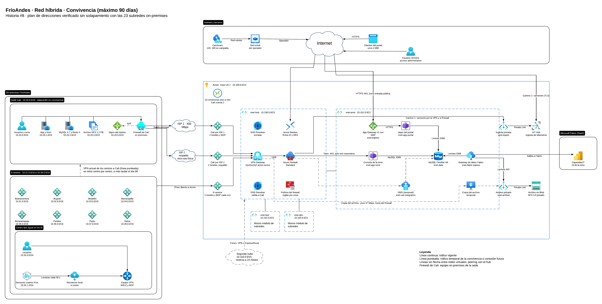
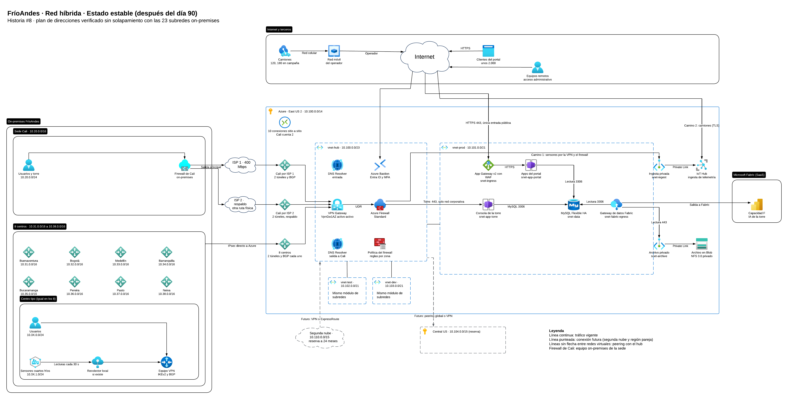
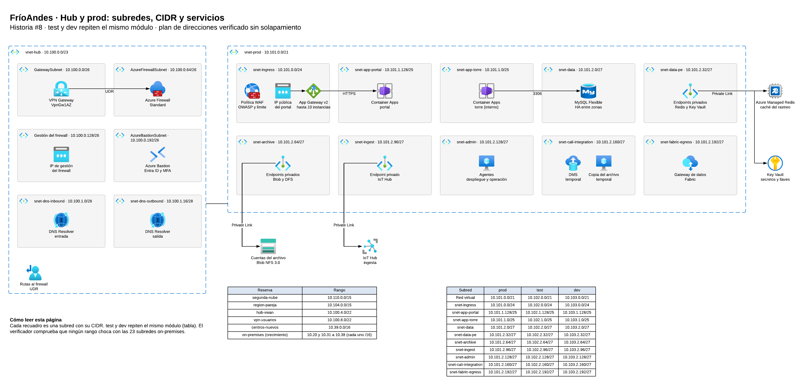
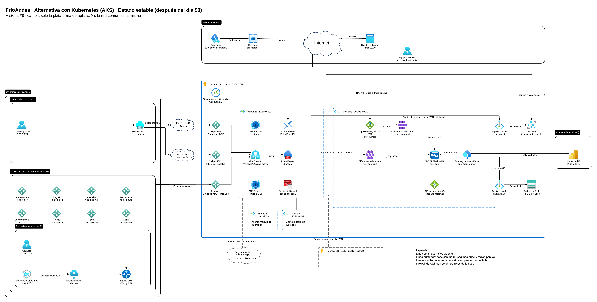
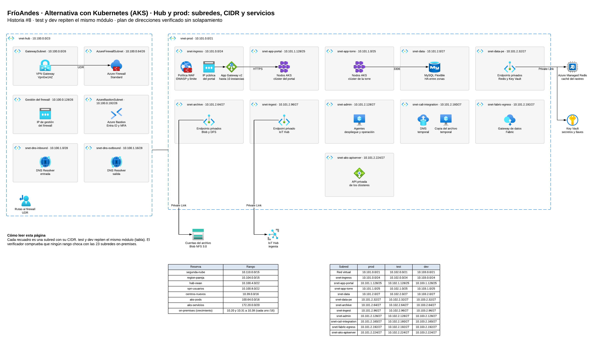

# Red híbrida, subnetting en la nube y verificación de no solapamiento

Este documento describe la red que conecta la sede de Cali, los ocho centros de distribución y la nube de FríoAndes en Azure. Explica cada parte de la solución, por qué se eligió, qué alternativas se descartaron y qué debe confirmar FríoAndes antes de implementarla.

Los diagramas editables están en Lucidchart:

- Solución con Container Apps: https://lucid.app/lucidchart/6fe845f4-d757-4b83-96db-92f094dca717/edit
- Variante con Kubernetes (AKS): https://lucid.app/lucidchart/3acaf69f-deab-4a84-ad80-71ba18f13d42/edit

Los archivos de apoyo están en la carpeta `red/`, junto a este documento:

| Archivo | Qué contiene |
|---|---|
| `red/data/ip-plan.csv` | El plan de direcciones de la solución con Container Apps: la única fuente de los rangos |
| `red/data/ip-plan-aks.csv` | El plan de direcciones de la variante con Kubernetes |
| `red/data/onprem-inventory.csv` | Las 23 subredes on-premises del enunciado |
| `red/data/azure-subnet-constraints.csv` | Los nombres y tamaños mínimos que exige Azure, con su fuente |
| `red/data/latency-targets.csv` | Los servidores usados para medir la latencia por región |
| `red/tools/verify_ip_plan.py` | Verifica el plan contra el inventario on-premises (sección 4.8) |
| `red/tools/compare_tfplan.py` | Compara el plan de Terraform con `ip-plan.csv` (sección 4.8) |
| `red/tools/measure_latency.py` | Mide la latencia hacia cada región (sección 3) |
| `red/tools/build_lucid_diagrams.py` | Genera los diagramas de Lucidchart a partir del plan |
| `red/verification/` | Reportes de la verificación de los dos planes y resultados de la medición de latencia |

## Contenido

1. Contexto y alcance
2. Conexión de Cali, los ocho centros y la nube
3. Región de Azure y latencia medida desde Cali
4. Plan de direcciones y verificación de no solapamiento
5. Exposición a internet, acceso administrativo y segunda nube
6. Telemetría y convivencia con el datacenter de Cali
7. Plataforma de aplicación: Container Apps o Kubernetes
8. Supuestos y confirmaciones pendientes de FríoAndes

### Términos usados

| Término | Significado en este documento |
|---|---|
| Red virtual (VNet) | Red privada dentro de Azure |
| Subred | Parte de una red virtual con su propio rango de direcciones. Cada servicio de Azure vive en una subred |
| CIDR | Forma de escribir un rango de direcciones. `10.101.0.0/21` son 2.048 direcciones; `/24` son 256, `/26` son 64, `/27` son 32 |
| Hub y spoke | Topología con una red central (hub) que concentra la conexión con las sedes, el firewall y el acceso administrativo, y redes de ambiente (spokes) conectadas a ella |
| Peering | Conexión directa y privada entre dos redes virtuales de Azure |
| VPN sitio a sitio | Túnel cifrado con IPsec, por internet, entre el equipo de red de una sede y Azure |
| BGP | Protocolo con el que cada lado de una VPN anuncia sus redes al otro. Permite que el tráfico cambie solo de camino cuando un túnel cae |
| UDR | Ruta definida por el usuario. Se usa para obligar al tráfico a pasar por el firewall |
| Zona de disponibilidad | Datacenter físicamente separado dentro de una misma región de Azure |
| Convivencia | Periodo de como máximo 90 días en que el datacenter de Cali y Azure funcionan al mismo tiempo |
| Estado estable | La operación después del día 90, con la plataforma ya en Azure |

---

## 1. Contexto y alcance

### 1.1 Situación actual

FríoAndes opera desde un único datacenter en Cali. Los ocho centros de distribución llegan a Cali por VPN sitio a sitio. Un solo firewall de nueva generación en Cali enruta entre todas las redes, termina las VPN de los centros, publica el portal de rastreo por NAT y aplica las políticas entre subredes. La sede tiene un internet de 400 Mbps simétricos, compartido con el resto de la operación, y no hay enlace dedicado hacia ninguna nube.

El diseño de red tiene que respetar estas condiciones del negocio:

| Condición | Consecuencia para la red |
|---|---|
| Un solo firewall y un solo proveedor de internet en Cali | Son puntos únicos de falla. La sede necesita una ruta redundante hacia la nube |
| Cada centro llega a Cali por VPN | Hay que decidir si los centros siguen pasando por Cali o se conectan directo a la nube |
| La torre de control solo se usa desde la red corporativa, porque muestra ubicación de carga y datos de clientes | La consola de despacho no puede tener exposición a internet |
| Los sensores de los cuartos fríos están en la red local de cada centro, y los de los camiones salen por la red móvil del operador | La telemetría llega por dos caminos distintos |
| El portal de rastreo se publica por NAT con Nginx y un firewall de aplicaciones | El portal necesita una entrada pública controlada en la nube |
| Desarrolladores y operadores trabajan parte de la semana fuera de la sede | Se necesita acceso administrativo remoto sin abrir la red de despacho |
| Hay 23 subredes on-premises en uso (7 en Cali y 2 en cada centro) | Ningún rango de la nube puede repetir esas direcciones |

### 1.2 Qué resuelve este documento

| Necesidad | Cómo se cubre aquí |
|---|---|
| Conectividad entre el datacenter, los ocho centros y la nube, con ruta redundante para Cali | Sección 2: topología, conexión de Cali con dos proveedores y conexión de los centros |
| Tabla de subnetting de la nube sin solapar el inventario on-premises, con ingreso, aplicación, datos, archivo, ingesta de telemetría, administración, integración con Cali y salida a Fabric, y con desarrollo, pruebas y producción en rangos distintos | Sección 4: plan de direcciones y verificación rango por rango |
| Confirmar con una medición real desde Cali si East US 2 es la región adecuada | Sección 3 |
| Mantener el despacho fuera de internet y publicar el rastreo de forma controlada | Sección 5: subred de la torre sin exposición y una sola entrada pública de aplicación |
| Acceso administrativo para equipos distribuidos | Sección 5: subred para Azure Bastion y reserva para VPN de usuario |
| Preparar la interconexión con una segunda nube en 24 meses | Secciones 4 y 5: rango reservado y DNS privado en el hub |

Este documento define la red sobre la que se apoyan otros diseños de la plataforma. Las reglas del firewall de nube, el firewall de aplicaciones del portal, el diseño del acceso remoto y la identidad para la segunda nube se detallan en sus propios documentos. Aquí se dejan las subredes, las zonas y los flujos que esos diseños necesitan.

---

## 2. Conexión de Cali, los ocho centros y la nube

Esta sección responde tres preguntas:

1. Con qué se conecta la nube a las sedes (la topología).
2. Cómo se evita que Cali quede sin nube si algo falla (la redundancia).
3. Si los centros siguen pasando por Cali o se conectan directo a la nube (la ruta de los centros).

### 2.1 Topología: hub y spoke con VPN Gateway

#### La idea

En Azure se crea una red central, el hub (`vnet-hub`), que es la única puerta entre la nube y las sedes. Las redes de los ambientes (producción, pruebas y desarrollo) son los spokes y se conectan al hub por peering. Así, la conexión con las sedes, el firewall y el acceso administrativo existen una sola vez y los usan los tres ambientes. Cada ambiente queda aislado de los otros: para que dos ambientes se hablen, el tráfico tiene que pasar por el firewall del hub.

#### Qué hay en el hub

| Componente | Qué hace |
|---|---|
| VPN Gateway VpnGw1AZ, activo-activo | Recibe los túneles IPsec de Cali y de los centros. Activo-activo significa que tiene dos instancias, cada una con su IP pública: si una cae o entra en mantenimiento, la otra sigue y la conexión no se corta. El modelo "AZ" reparte esas instancias en zonas de disponibilidad distintas |
| BGP en el VPN Gateway | Cada sede anuncia sus redes y Azure anuncia las suyas. Cuando un túnel cae, BGP retira esas rutas y el tráfico sigue por los túneles que quedan, sin cambios manuales |
| Azure Firewall Standard | Todo el tráfico entre las sedes y los ambientes, y toda la salida a internet de los ambientes, pasa por aquí. Registra cada conexión y aplica las reglas del diseño de firewall de nube |
| Rutas definidas por el usuario (UDR) | Están en la subred del VPN Gateway y en las subredes de los ambientes. Mandan el tráfico al firewall: ningún paquete llega de una sede a un ambiente sin pasar por él |
| Azure Bastion | Acceso administrativo remoto con Entra ID y MFA (sección 5) |
| DNS Private Resolver | Permite que las sedes resuelvan los nombres privados de Azure y que Azure resuelva los nombres de Cali (sección 5) |

#### Cómo viaja el tráfico

Un usuario de Cali que abre la consola de despacho:

```
Usuario en Cali
  → firewall de Cali
  → internet (proveedor 1)
  → túnel IPsec cifrado
  → VPN Gateway (hub)
  → Azure Firewall (hub)
  → peering
  → subred de la torre (producción)
```

Un servicio de producción que necesita salir a internet:

```
Servicio en producción → UDR → Azure Firewall → internet
```

En los dos casos el Azure Firewall es el punto de control. Esa es la razón principal del hub: un solo lugar donde se definen, aplican y registran las reglas.

#### VPN Gateway frente a Virtual WAN

Azure ofrece dos formas de armar este hub. Las dos cumplen el requisito; la diferencia está en el tamaño para el que están pensadas y en el costo.

| | VPN Gateway con hub propio (elegido) | Virtual WAN Standard |
|---|---|---|
| Quién administra el hub | FríoAndes, con su propia red virtual | Microsoft, como servicio administrado |
| Para cuántos sitios está pensado | Decenas de túneles. Este modelo admite 30 y el diseño usa 20 | Decenas o cientos de sitios, con enrutamiento automático entre ellos |
| Costo de la red completa | Unos USD 4.300 al mes, incluido el segundo proveedor de Cali | Entre USD 562 y 672 más al mes |
| Condiciones | Ninguna especial para este caso | Exige un bloque `/22` propio para el hub con firewall, y Bastion y el DNS tienen que salir del hub a otra red |

Con diez conexiones, la ventaja de Virtual WAN (enrutar automáticamente entre muchos sitios) no compensa el costo adicional. Si FríoAndes crece a muchas más sedes o a varias regiones, el plan de direcciones ya reserva el bloque `10.100.4.0/22` para pasar a Virtual WAN sin renumerar ninguna red.

#### Por qué el modelo VpnGw1AZ

Es el modelo más pequeño que reparte sus instancias en zonas de disponibilidad. Soporta unos 650 Mbps en total, por encima de los 400 Mbps del enlace de Cali. Azure ya no permite crear modelos sin zonas. Si el tráfico real se acerca a ese límite (por ejemplo, si la copia del archivo histórico se hace por la red), se sube a VpnGw2AZ por unos USD 241 más al mes, sin cambiar el diseño ni las direcciones.

#### Qué haría cambiar esta topología

- Agregar un enlace dedicado ExpressRoute para Cali mientras los centros siguen por VPN.
- Tener hubs en más de una región de Azure.
- Conectar la segunda nube con equipos SD-WAN o un appliance de red virtual.
- Superar unos 73.000 a 83.000 GB al mes de tráfico por el firewall.

En cualquiera de esos casos se evalúa Virtual WAN, que ya tiene su rango reservado.

### 2.2 Redundancia de Cali: dos proveedores de internet

#### El riesgo

Hoy Cali tiene un solo proveedor de internet. Si ese enlace cae, la sede pierde la conexión con la nube y, con ella, la torre de control.

#### La solución

Cali contrata un segundo proveedor de internet que llegue por una ruta física distinta: otra fibra, otro ducto y otro nodo del proveedor. Si los dos enlaces comparten el mismo poste o la misma canalización, un solo daño los tumba a la vez y la redundancia deja de existir.

```
                   +-- Proveedor 1 (400 Mbps, principal) -- 2 túneles --+
Firewall de Cali --+                                                    +-- VPN Gateway
                   +-- Proveedor 2 (respaldo, otra ruta) -- 2 túneles --+   (2 instancias)
```

- En Azure se registran dos "local network gateways", uno por cada IP pública de Cali.
- Cada proveedor lleva dos túneles, uno hacia cada instancia del VPN Gateway. En total son cuatro túneles.
- Los cuatro usan BGP.

#### Activo-pasivo

El proveedor 1 lleva todo el tráfico. El proveedor 2 solo entra si el 1 cae. Para lograrlo, Cali anuncia sus redes por el proveedor 2 con una ruta artificialmente más larga (AS-path prepending): BGP siempre prefiere el camino más corto, así que usa el proveedor 2 solo cuando el 1 desaparece. Cuando el proveedor 1 vuelve, el tráfico regresa solo.

Se eligió activo-pasivo porque los dos enlaces pueden tener capacidades distintas. Si se repartiera el tráfico en paralelo, el enlace menor podría saturarse.

En este diseño hay dos niveles de redundancia que funcionan distinto. El VPN Gateway de Azure trabaja en activo-activo: sus dos instancias están siempre activas. La salida de Cali trabaja en activo-pasivo: un proveedor principal y uno de respaldo. Los dos niveles se combinan: Cali tiene dos túneles activos por el proveedor principal y dos de reserva por el de respaldo.

#### Lo que esta solución no cubre

El firewall de Cali sigue siendo un solo equipo. Dos proveedores protegen contra la caída de un proveedor. Si el firewall de Cali falla, la sede pierde la conexión igual. Hay tres caminos y la decisión es de FríoAndes:

1. Instalar un segundo firewall y operarlos como par en alta disponibilidad.
2. Usar una VPN de usuario como contingencia, si FríoAndes acepta que una VPN con Entra ID y MFA cuenta como "red corporativa" para usar la torre de control. El plan de direcciones ya reserva el rango para esa VPN.
3. Aceptar el riesgo y dejarlo registrado.

#### Alternativa descartada: ExpressRoute

Un enlace dedicado ExpressRoute desde Bogotá daría más capacidad y una conexión privada, pero tarda semanas o meses en instalarse, la convivencia dura como máximo 90 días, y cuesta unos USD 1.272 más al mes que la VPN con segundo proveedor. Queda como mejora posterior si FríoAndes necesita un enlace dedicado.

Tampoco sirve poner los dos túneles sobre el mismo proveedor: comparten el punto de falla.

#### Costo

El segundo proveedor es un supuesto sin cotización: COP 3.000.000 al mes (rango de COP 1,5 a 6 millones), unos USD 906, para 200 Mbps. La cifra final depende de la cotización del proveedor.

### 2.3 Conexión de los ocho centros

#### Por qué los centros van directo a la nube

Hoy cada centro llega a Cali por VPN y desde Cali al resto. Si los centros siguieran pasando por Cali después de la migración:

- una caída de Cali dejaría a los ocho centros sin la torre de control, aunque la plataforma ya esté en Azure;
- el enlace de Cali cargaría con el tráfico de todos los centros. Con un supuesto de 300 Kbps por usuario, su uso de entrada pasaría de 17 % a 35 %.

Por eso, cada centro se conecta directamente al VPN Gateway de Azure con dos túneles IPsec (IKEv2) y BGP. Cali deja de ser el punto de paso obligado.

#### Durante la convivencia: centro por centro, con vuelta atrás

El cambio no se hace a todos los centros a la vez. Cada centro pasa por tres fases:

| Fase | Qué pasa | Si algo falla |
|---|---|---|
| A | El centro sigue conectado por Cali, como hoy | No aplica |
| B | Se crea el túnel directo a Azure, pero sin tráfico: el centro sigue prefiriendo la ruta por Cali. Se prueba en la ventana de 22:00 a 04:00 | Se borra el túnel y la operación no se entera |
| C | Se cambia la preferencia y el tráfico pasa por el túnel directo a Azure. La VPN hacia Cali queda como respaldo para lo que todavía viva en Cali | Se devuelve la preferencia a Cali, sin tocar túneles |

El orden propuesto es un centro piloto de bajo volumen primero y después uno o dos centros por noche. La VPN de cada centro hacia Cali se apaga a más tardar el día 90.

#### En estado estable

Cada centro tiene dos túneles directos a Azure, uno hacia cada instancia del VPN Gateway, y anuncia por BGP sus dos redes (usuarios y sensores). Si un centro necesita comunicarse con Cali, el tráfico pasa por Azure: el VPN Gateway hace el tránsito y el Azure Firewall lo controla.

#### Números de BGP propuestos

Cada sede necesita un número de sistema autónomo (ASN) para BGP:

| Sitio | ASN |
|---|---|
| Azure | 65515 (el valor por defecto de Azure) |
| Cali | 65020 |
| Centros | 65031 a 65038 (el número imita el segundo octeto de la red de cada centro: Buenaventura 10.31 usa 65031) |

Las direcciones BGP de Cali salen de `10.20.10.0/24`, el rango que hoy usa para sus enlaces VPN.

#### Cuenta de conexiones y túneles

| Concepto | Cantidad |
|---|---|
| Conexiones sitio a sitio | 10: Cali cuenta 2 (una por proveedor) y cada centro 1 |
| Túneles | 20: 4 de Cali y 2 por cada uno de los 8 centros |
| Límite del modelo VpnGw1AZ | 30 túneles |
| Segunda nube, cuando llegue | Sería la conexión número 11 |

#### Condición

Los equipos de red de los centros tienen que soportar IKEv2, dos túneles simultáneos y BGP. Si alguno no lo soporta, ese centro queda con un túnel activo y otro de respaldo con rutas fijas. La conexión funciona igual, pero el cambio al respaldo es más lento y la fase B se resuelve con métricas fijas.

### 2.4 Qué pasa con cada función del firewall de Cali

Durante la convivencia el firewall de Cali sigue en pie. Esta tabla dice qué pasa con cada una de sus funciones de red y cuándo. Las reglas de seguridad que se conservan o se trasladan al firewall de nube se detallan en el diseño del firewall de nube.

| Función actual del firewall de Cali | Durante la convivencia | En estado estable |
|---|---|---|
| VPN sitio a sitio con los ocho centros | Se mantiene como respaldo y se retira centro por centro (fases A, B y C) | Apagada a más tardar el día 90. Los centros llegan directo a Azure |
| NAT del portal de rastreo hacia Nginx | Sigue publicando el portal actual | Se apaga en el corte del portal, cuando el portal nuevo queda publicado en Azure |
| Firewall de aplicaciones delante de Nginx | Sigue protegiendo el portal actual | Se apaga junto con el NAT. Su función la toma el firewall de aplicaciones de Azure (sección 5) |
| Enrutamiento entre las subredes de Cali | Se mantiene | Se mantiene para lo que queda en la sede: usuarios y torre de control |
| Políticas entre subredes de servidores de Cali | Se mantienen mientras los servidores sigan encendidos | Se retiran cuando se apaga cada servidor migrado |
| Salida de Cali hacia la nube | Pasa a dos proveedores con cuatro túneles hacia Azure | Se mantiene |

### 2.5 Diagramas de la conexión

#### Convivencia (como máximo 90 días)



Qué mirar en este diagrama:

- A la izquierda, Cali todavía con su datacenter (aplicación, bases, archivo y el Nginx del rastreo), con todos los servidores llegando a su firewall.
- La salida de Cali por los dos proveedores, cada uno hacia su local network gateway en Azure.
- La línea punteada entre los centros y Cali es la VPN actual, que se retira centro por centro.
- La línea "IPsec directo a Azure" es la conexión nueva de los centros.
- Las tres entradas al VPN Gateway: proveedor 1, proveedor 2 y los ocho centros.
- Del VPN Gateway al Azure Firewall, y de ahí a la torre de control en producción.

#### Estado estable (después del día 90)



Qué cambia frente a la convivencia:

- Cali ya no aloja servidores: quedan los usuarios y su firewall.
- Los centros solo tienen la conexión directa a Azure.
- Aparecen en línea punteada las reservas para el futuro: la región pareja (Central US) y la segunda nube.

---

## 3. Región de Azure y latencia medida desde Cali

### 3.1 Qué se decide y por qué importa

La región es el lugar físico donde corre la plataforma. Elegirla afecta cuatro cosas:

| Factor | Qué significa para FríoAndes |
|---|---|
| Latencia | Cuánto tarda cada pedido entre Cali o los centros y la plataforma. Afecta la sensación de rapidez de la torre de control y del portal |
| Servicios disponibles | No todas las regiones tienen todos los servicios ni todas sus variantes (por ejemplo, redundancia entre zonas) |
| Costo | El mismo servicio cuesta distinto según la región |
| Recuperación ante desastres | Cada región de Azure tiene una región pareja. Ahí se reserva espacio para recuperar la plataforma si la región principal falla |

La propuesta inicial era East US 2, con Central US como región pareja. Esta sección confirma esa elección con una medición real desde Cali.

### 3.2 Cómo se midió

Se midió la latencia desde Cali hacia East US 2 y hacia seis alternativas razonables para Colombia: East US, South Central US, Central US, Mexico Central, Brazil South y Chile Central.

- **Qué se mide.** El tiempo que tarda en abrirse una conexión TCP al puerto 443 de un servicio de almacenamiento de Azure ubicado en cada región. Ese tiempo equivale aproximadamente a un viaje de ida y vuelta de un paquete, que es lo que más pesa en la rapidez de una aplicación web.
- **Cuántas veces.** 30 conexiones por región en cada ronda, dos rondas.
- **Qué se reporta.** La mediana, que es el valor del medio: la mitad de las conexiones tardó menos y la otra mitad más. Es más estable que el promedio porque una conexión lenta aislada no la mueve.
- **Herramienta.** Un script reproducible (`measure_latency.py`), incluido con este documento.

### 3.3 Resultados

| Región | Mediana ronda 1 (ms) | Mediana ronda 2 (ms) | Frente a East US 2 |
|---|---|---|---|
| East US 2 | 96,5 | 85,5 | Referencia |
| East US | 89,0 | 95,5 | 8 % menos en la ronda 1, 12 % más en la ronda 2 |
| South Central US | 97,2 | 92,0 | 1 % y 8 % más |
| Central US (región pareja) | 110,8 | 105,2 | 15 % y 23 % más |
| Mexico Central | 114,7 | 120,3 | 19 % y 41 % más |
| Brazil South | 157,9 | 148,7 | 64 % y 74 % más |
| Chile Central | 159,1 | 139,6 | 65 % y 63 % más |

Lectura de los resultados:

- East US 2, East US y South Central US quedan prácticamente empatadas: se alternan entre rondas, dentro de la variación normal de una conexión a internet.
- Brazil South y Chile Central, aunque están en Sudamérica, miden entre 60 % y 75 % más. El tráfico de internet desde Colombia sale por los cables submarinos hacia Miami, así que las regiones del este de Estados Unidos quedan más cerca en la práctica que las del sur del continente.
- Mexico Central queda en un punto intermedio.

### 3.4 Regla de decisión

La regla se fijó antes de medir, para que el resultado no se interpretara a conveniencia:

> Se mantiene East US 2, salvo que otra región tenga una mediana al menos 30 % menor, todos los servicios que necesita la plataforma y un costo comparable.

El umbral es alto a propósito. La plataforma es una consola web, un portal de rastreo y un sistema de alertas con un margen de 60 segundos. Para ese uso, diferencias de 10 a 30 ms no cambian la experiencia de nadie, mientras que cambiar de región sí puede cambiar costos, servicios disponibles y la región pareja.

**Resultado: se mantiene East US 2, con Central US como región pareja.** Ninguna alternativa baja la latencia un 30 %. La mejor queda 8 % por debajo en una ronda y por encima en la otra.

### 3.5 Servicios disponibles en la región

East US 2 y su pareja Central US tienen disponibles todos los servicios que usa este diseño:

| Grupo | Servicios |
|---|---|
| Red | VPN Gateway con zonas, Azure Firewall, Application Gateway v2, Azure Bastion, DNS Private Resolver, Virtual WAN (para el futuro) |
| Aplicación | Container Apps, Azure Kubernetes Service, App Service |
| Datos | MySQL Flexible Server con alta disponibilidad entre zonas, Azure Managed Redis, Key Vault, almacenamiento Blob |
| Telemetría | IoT Hub, Event Hubs, Stream Analytics, Functions, Data Explorer |
| Analítica | Microsoft Fabric |

Hay una diferencia que conviene conocer: **IoT Hub tiene redundancia entre zonas en Central US; en East US 2 funciona sin ella.** La red no cambia por esto, pero el diseño de telemetría puede elegir otra región para ese servicio o compensarlo de otra forma.

East US 2 tiene tres zonas de disponibilidad en servicio general. El diseño se apoya en esas tres.

### 3.6 Costo según la región

Los servicios de red (VPN Gateway y Azure Firewall) cuestan lo mismo en las siete regiones medidas. Donde sí hay diferencias es en datos y almacenamiento, según los precios de lista de Azure sin descuentos:

| Región | Base de datos MySQL (cómputo) | Almacenamiento Blob |
|---|---|---|
| East US 2 | Referencia | Referencia |
| Central US | 13 % más | Igual |
| South Central US | 20 % más | Igual |
| East US | Igual | 13 % más |
| Mexico Central | 10 % más | 24 % más |
| Brazil South | 35 % más | 77 % más |
| Chile Central | 40 % más | 40 % más |

East US 2 es la más barata o empata en los dos rubros. Con un archivo histórico de 1,2 PB que crece 12 TB al mes, el precio del almacenamiento pesa mucho en la factura.

### 3.7 Región pareja y recuperación

Central US es la región pareja de East US 2. Azure coordina el mantenimiento de las dos para que no queden fuera de servicio al mismo tiempo, y algunos servicios replican datos entre ellas. El plan de direcciones reserva el bloque `10.104.0.0/15` para el hub y la producción de recuperación en Central US (sección 4). El diseño de continuidad de la plataforma define qué se replica y cómo se activa.

### 3.8 Ubicación de los datos

Con esta decisión, los datos y el procesamiento de la plataforma quedan en Estados Unidos. FríoAndes maneja datos personales de clientes y conductores, así que debe confirmar que esa ubicación es aceptable bajo la Ley 1581 de protección de datos personales y sus políticas internas.

---

## 4. Plan de direcciones y verificación de no solapamiento

### 4.1 Qué se resuelve

La nube necesita sus propias direcciones privadas. Si un rango de la nube repite uno que ya usa Cali o un centro, los equipos no saben a cuál de los dos enviar el tráfico y la conexión falla. Por eso el plan de direcciones cumple tres condiciones:

1. Ningún rango de la nube se solapa con las 23 subredes que hoy usa FríoAndes.
2. Desarrollo, pruebas y producción tienen rangos distintos y el mismo patrón de subredes, para que el código de infraestructura se escriba una vez y se use en los tres ambientes.
3. Queda espacio reservado para crecer: más centros, la región pareja, la segunda nube y un posible cambio de topología, sin tener que renumerar nada.

El plan completo vive en un archivo, `ip-plan.csv`, que es la única fuente de las direcciones. Un script lo compara automáticamente con el inventario on-premises (sección 4.8).

### 4.2 Las redes que ya existen

Estas 23 subredes están en uso y la nube no puede tocarlas:

| Sitio | Subredes |
|---|---|
| Cali | `10.20.0.0/24` usuarios y torre de control, `10.20.1.0/24` aplicación y front, `10.20.2.0/24` bases y caché, `10.20.3.0/24` archivo y Zabbix, `10.20.4.0/24` administración de VMware, `10.20.5.0/24` publicación del rastreo, `10.20.10.0/24` enlaces VPN |
| Cada uno de los ocho centros | `10.3X.0.0/24` usuarios y `10.3X.1.0/24` sensores de cuartos fríos, donde X va de 1 (Buenaventura) a 8 (Neiva) |

Cada sitio usa unas pocas subredes dentro de un bloque `/16` propio: Cali el `10.20.0.0/16` y cada centro su `10.3X.0.0/16`. El plan deja esos `/16` completos para que Cali y los centros puedan crecer sin chocar con la nube.

### 4.3 Cómo se organizan las direcciones

Toda la nube de la región principal cabe en un solo bloque, `10.100.0.0/14`. Cada función ocupa un `/16` distinto, así que el segundo número de la dirección dice dónde está: 100 es el hub, 101 producción, 102 pruebas y 103 desarrollo.

| Bloque | Uso | Contenido |
|---|---|---|
| `10.20.0.0/16` | Cali | Las 7 subredes actuales y espacio para crecer |
| `10.31.0.0/16` a `10.38.0.0/16` | Los ocho centros | 2 subredes por centro y espacio para crecer |
| `10.39.0.0/16` | Reserva | Un noveno centro, con el mismo patrón |
| `10.40.0.0` a `10.99.255.255` | Libre | Preferente para sedes futuras |
| `10.100.0.0/16` | Hub | Red del hub `10.100.0.0/23`, reserva para Virtual WAN `10.100.4.0/22` y reserva para VPN de usuario `10.100.8.0/22` |
| `10.101.0.0/16` | Producción | Red `10.101.0.0/21` |
| `10.102.0.0/16` | Pruebas | Red `10.102.0.0/21` |
| `10.103.0.0/16` | Desarrollo | Red `10.103.0.0/21` |
| `10.104.0.0/15` | Reserva | Región pareja (Central US) para recuperación |
| `10.106.0.0/15` y `10.108.0.0/15` | Libres | Sin asignar |
| `10.110.0.0/15` | Reserva | Segunda nube |

Dentro de cada `/16` la red virtual ocupa solo lo que justifica su cuenta (un `/23` el hub y un `/21` cada ambiente). El resto del `/16` queda libre para crecer.

**Decisión: el hub mide `/23` y cada ambiente `/21`.**

- **Hub `/23` (512 direcciones).** Sus seis subredes suman 288 direcciones (cuatro `/26` que exige Azure y dos `/28` del DNS). El `/23` deja 224 libres para lo que el hub puede necesitar después: Azure Route Server si se agrega ExpressRoute y un equipo de red virtual para la segunda nube.
- **Cada ambiente `/21` (2.048 direcciones).** Sus diez subredes suman 736 direcciones, así que quedan 1.312 libres, un 64 %. Ese espacio permite agregar cómputo de telemetría, otro entorno de aplicación o ejecutores privados del pipeline sin renumerar. Un `/22` dejaría solo 288 libres, poco para tres ambientes que van a crecer.
- **Por qué no un `/16` por red virtual.** Serían 65.536 direcciones para unas 750 usadas, sin una necesidad que lo justifique, y se perdería el espacio para reservas.
- **Por qué no ambientes contiguos sin bloques.** Ahorraría espacio, pero se perdería la lectura por el segundo número (100, 101, 102, 103) y el resumen de toda la región en un solo prefijo, `10.100.0.0/14`, que simplifica las rutas y las reglas del firewall de Cali.

### 4.4 Subredes del hub (`vnet-hub`, `10.100.0.0/23`)

| Subred | Rango | Servicio | Reglas de Azure que aplican |
|---|---|---|---|
| `GatewaySubnet` | `10.100.0.0/26` | VPN Gateway | Nombre obligatorio. Sin NSG ni ruta por defecto hacia el firewall |
| `AzureFirewallSubnet` | `10.100.0.64/26` | Azure Firewall | Nombre obligatorio. Mínimo `/26` |
| `AzureFirewallManagementSubnet` | `10.100.0.128/26` | Tarjeta de gestión del firewall | Nombre obligatorio. Mínimo `/26`. Se habilita desde el inicio, porque activarla después obliga a detener el firewall |
| `AzureBastionSubnet` | `10.100.0.192/26` | Azure Bastion | Nombre obligatorio. Mínimo `/26` |
| `snet-dns-inbound` | `10.100.1.0/28` | DNS Private Resolver, entrada | Exclusiva del resolver. Entre `/28` y `/24` |
| `snet-dns-outbound` | `10.100.1.16/28` | DNS Private Resolver, salida | Igual que la anterior |

Quedan libres en el hub `10.100.1.32/27`, `10.100.1.64/26` (lugar previsto para Azure Route Server si se agrega ExpressRoute) y `10.100.1.128/25` (para un equipo de red virtual de la segunda nube).

**Decisión: la `GatewaySubnet` mide `/26`.** Azure pide como mínimo `/27`. Si en el futuro FríoAndes agrega ExpressRoute, los dos gateways (VPN y ExpressRoute) tienen que convivir en esa subred, y la arquitectura de referencia de Microsoft recomienda `/26` para ese caso. Una subred con recursos no se puede agrandar: habría que borrar el VPN Gateway y recrearlo, con Cali y los centros sin conexión mientras tanto. Crearla en `/26` desde el inicio cuesta 32 direcciones de un bloque que sobra y evita ese corte.

### 4.5 Subredes de cada ambiente

Producción, pruebas y desarrollo tienen las mismas diez subredes. Solo cambia el segundo número de la dirección (101, 102 o 103).

| Subred | Producción | Pruebas | Desarrollo | Servicio |
|---|---|---|---|---|
| `snet-ingress` | `10.101.0.0/24` | `10.102.0.0/24` | `10.103.0.0/24` | Application Gateway v2 con firewall de aplicaciones (WAF): la entrada pública del portal |
| `snet-app-torre` | `10.101.1.0/25` | `10.102.1.0/25` | `10.103.1.0/25` | Consola de despacho (torre de control) |
| `snet-app-portal` | `10.101.1.128/25` | `10.102.1.128/25` | `10.103.1.128/25` | Servicios del portal de rastreo |
| `snet-data` | `10.101.2.0/27` | `10.102.2.0/27` | `10.103.2.0/27` | MySQL Flexible Server (subred exclusiva) |
| `snet-data-pe` | `10.101.2.32/27` | `10.102.2.32/27` | `10.103.2.32/27` | Endpoints privados de la caché (Azure Managed Redis) y de Key Vault |
| `snet-archive` | `10.101.2.64/27` | `10.102.2.64/27` | `10.103.2.64/27` | Endpoints privados del almacenamiento del archivo histórico y las evidencias |
| `snet-ingest` | `10.101.2.96/27` | `10.102.2.96/27` | `10.103.2.96/27` | Endpoints privados de la ingesta de telemetría de los cuartos fríos |
| `snet-admin` | `10.101.2.128/27` | `10.102.2.128/27` | `10.103.2.128/27` | Agentes de despliegue y máquinas de operación, administradas por Bastion |
| `snet-cali-integration` | `10.101.2.160/27` | `10.102.2.160/27` | `10.103.2.160/27` | Herramientas de la migración desde Cali. Queda vacía en estado estable |
| `snet-fabric-egress` | `10.101.2.192/27` | `10.102.2.192/27` | `10.103.2.192/27` | Gateway de datos que lleva la información de forma privada hacia Microsoft Fabric |

Las dos subredes de aplicación (torre y portal) dependen de la plataforma que se elija para correr la consola y el portal. Sus rangos no cambian, pero su configuración sí (sección 7).

Quedan libres en cada ambiente `10.10X.2.224/27`, `10.10X.3.0/24` y `10.10X.4.0/22`, para cómputo de telemetría, nuevos servicios o ejecutores privados del pipeline. Con la variante Kubernetes, el primero de esos bloques se usa para la API privada del clúster (sección 7).

**Las ocho categorías que pide el reto:**

| Categoría pedida | Subred |
|---|---|
| Ingreso | `snet-ingress` |
| Aplicación | `snet-app-torre` y `snet-app-portal` |
| Datos | `snet-data` y `snet-data-pe` |
| Archivo | `snet-archive` |
| Ingesta de telemetría | `snet-ingest` |
| Administración | `snet-admin` |
| Integración con Cali | `snet-cali-integration` |
| Salida a Fabric | `snet-fabric-egress` |

### 4.6 Reservas para crecer

| Reserva | Rango | Para qué |
|---|---|---|
| Segunda nube | `10.110.0.0/15` | Dos `/16`: uno para tránsito e interconexión y otro para cargas. Solo reserva las direcciones; la plataforma de la segunda nube se diseña cuando se decida |
| Región pareja | `10.104.0.0/15` | Hub y producción de recuperación en Central US |
| Hub de Virtual WAN | `10.100.4.0/22` | Si la topología pasa a Virtual WAN (su hub con firewall exige un `/22`) |
| VPN de usuario | `10.100.8.0/22` | Direcciones para los equipos que se conecten por VPN de usuario, si se elige esa forma de acceso: unos 450 usuarios internos y unas 60 personas remotas, con margen |
| Noveno centro | `10.39.0.0/16` | Un centro nuevo con el mismo patrón de los ocho actuales |

### 4.7 Cómo se calcularon los tamaños

Una subred con recursos dentro no se puede agrandar, así que cada tamaño se calcula para el máximo previsto (con la campaña de fin de año incluida) y con margen:

> Direcciones necesarias = las que usa el servicio en su máximo + las que necesita durante actualizaciones + las 5 que Azure reserva en cada subred.

| Subred | Cuenta | Tamaño |
|---|---|---|
| Subredes de plataforma del hub | Mínimos que exige Azure para cada servicio | `/26` o `/28` |
| Red del hub | 4 subredes de 64 + 2 de 16 = 288 direcciones | `/23` (512) |
| `snet-ingress` | Application Gateway puede crecer hasta 125 instancias; con su IP privada y las 5 de Azure son 131. Para el portal (unas 2.000 solicitudes por minuto) bastan 4 instancias y se planifican hasta 10 | `/24`, el tamaño que recomienda Microsoft |
| `snet-app-torre` y `snet-app-portal` | Depende de la plataforma (sección 7); el máximo previsto con Container Apps son 97 direcciones | `/25` (128) |
| `snet-data` | Base principal con alta disponibilidad entre zonas (2) + 2 réplicas de lectura (4) + 1 servidor temporal de migración (2) + 5 de Azure = 13 | `/27` (32) |
| Subredes de endpoints privados | Hasta 10 endpoints cada una | `/27` |
| `snet-admin` | Hasta 12 máquinas | `/27` |
| `snet-cali-integration` | Hasta 11 direcciones para las herramientas de migración | `/27` |
| `snet-fabric-egress` | Hasta 9 nodos del gateway de datos: 5 de Azure + 5 de funcionamiento + 9 + 2 de margen = 21 | `/27` |
| Red de cada ambiente | 256 + 2 × 128 + 7 × 32 = 736 direcciones | `/21` (2.048): quedan 1.312 libres, un 64 % |

### 4.8 Verificación de no solapamiento

La verificación no se hace a ojo. Un script, `verify_ip_plan.py`, lee el plan de direcciones y el inventario de las 23 subredes on-premises, y comprueba doce condiciones:

| Comprobación | Resultado |
|---|---|
| El inventario tiene las 23 subredes on-premises | Cumple |
| Todos los rangos del plan están bien escritos | Cumple |
| Ningún rango de la nube se solapa con las 23 subredes on-premises | Cumple |
| La nube respeta los `/16` completos de Cali y de cada centro | Cumple |
| Las redes virtuales no se solapan entre sí (desarrollo, pruebas y producción en rangos distintos) | Cumple |
| Cada subred está dentro de su red virtual | Cumple |
| Las subredes no se solapan entre sí | Cumple |
| Cada ambiente tiene las ocho categorías pedidas | Cumple |
| Hay un bloque reservado para la segunda nube, libre de solapes | Cumple |
| Torre, portal, ingesta y analítica tienen subredes propias en cada ambiente | Cumple |
| La única entrada pública de aplicación es el ingreso del portal | Cumple |
| Las subredes respetan los nombres y tamaños que exige Azure | Cumple |

**Conclusión: sin solapamiento.** Los 45 rangos de la nube (4 redes virtuales, 36 subredes y 5 reservas) se compararon uno por uno contra las 23 subredes on-premises. La tabla completa, rango por rango, está en el Anexo A.

**Cómo comprobarlo.** Cualquiera puede repetir la verificación desde la carpeta `red/`:

```bash
python3 tools/verify_ip_plan.py --plan data/ip-plan.csv --out verification/reporte-ip-plan.md
sha256sum data/ip-plan.csv
# 652ed7ebbb7d9a67dbd010634f2bc96304fd63630228cb2ccde0d178b90075fd
```

El hash identifica el archivo verificado. Si alguien cambia una sola dirección, el hash cambia y hay que volver a correr el script.

**El script también detecta errores.** Se probó con un plan con cinco errores puestos a propósito (una reserva encima de Bogotá y Medellín, dos subredes de desarrollo solapadas, una categoría faltante en pruebas, la torre con entrada pública y una subred de Bastion demasiado pequeña) y los detectó todos.

**Verificación contra el código.** Cuando la red se escriba en Terraform, un segundo script (`compare_tfplan.py`) compara lo que Terraform va a crear con `ip-plan.csv` y avisa si alguna red o subred difiere. Así la verificación también vale para lo que realmente se despliega (desde la carpeta `red/`):

```bash
terraform show -json plan.tfplan > plan.json
python3 tools/compare_tfplan.py --tfplan plan.json --plan data/ip-plan.csv --out-csv tf-ip-plan.csv
python3 tools/verify_ip_plan.py --plan tf-ip-plan.csv --out verification/reporte-terraform.md
```

### 4.9 Cómo se escribe en Terraform

El código de red lee `ip-plan.csv` directamente con `csvdecode(file("ip-plan.csv"))`. Así el código y el plan verificado son siempre iguales y el hash del archivo prueba que no cambió. El módulo de ambiente se escribe una vez y se usa tres veces cambiando solo el rango de la red virtual. Cada subred se calcula con la función `cidrsubnet` de Terraform:

| Subred | Bits nuevos | Número | Resultado en producción (`10.101.0.0/21`) |
|---|---|---|---|
| `snet-ingress` | 3 | 0 | `10.101.0.0/24` |
| `snet-app-torre` | 4 | 2 | `10.101.1.0/25` |
| `snet-app-portal` | 4 | 3 | `10.101.1.128/25` |
| `snet-data` | 6 | 16 | `10.101.2.0/27` |
| `snet-data-pe` | 6 | 17 | `10.101.2.32/27` |
| `snet-archive` | 6 | 18 | `10.101.2.64/27` |
| `snet-ingest` | 6 | 19 | `10.101.2.96/27` |
| `snet-admin` | 6 | 20 | `10.101.2.128/27` |
| `snet-cali-integration` | 6 | 21 | `10.101.2.160/27` |
| `snet-fabric-egress` | 6 | 22 | `10.101.2.192/27` |

### 4.10 Diagrama de subredes



Cada recuadro es una subred con su rango y el ícono del servicio que aloja. Abajo están la tabla del módulo con los rangos de producción, pruebas y desarrollo, y la tabla de reservas.

---

## 5. Exposición a internet, acceso administrativo y segunda nube

Esta sección responde cinco pedidos del reto: mantener el despacho fuera de internet, publicar el rastreo de forma controlada, dar acceso administrativo a equipos distribuidos sin abrir la red de despacho, preparar un punto de interconexión y DNS para una segunda nube, y separar las cargas en zonas que el firewall pueda controlar.

### 5.1 Zonas de red

Una zona es un grupo de subredes con el mismo nivel de confianza. Separar las cargas en zonas permite que el firewall y los grupos de seguridad de red (NSG) decidan qué puede hablar con qué. Cada ambiente tiene las mismas zonas:

| Zona | Subredes | Quién llega |
|---|---|---|
| Torre de control | `snet-app-torre` | Solo usuarios de la red corporativa (Cali y los centros), a través del Azure Firewall |
| Portal de rastreo | `snet-ingress` y `snet-app-portal` | Clientes desde internet, únicamente a `snet-ingress`. `snet-app-portal` solo recibe tráfico desde `snet-ingress` |
| Ingesta de telemetría | `snet-ingest` | Sensores de los cuartos fríos, por la VPN de cada centro y el Azure Firewall |
| Analítica | `snet-fabric-egress` | Nadie desde afuera. El gateway de datos lee la base de datos y el archivo, y envía la información a Microsoft Fabric |
| Compartida | `snet-data`, `snet-data-pe`, `snet-archive`, `snet-admin`, `snet-cali-integration` | Las aplicaciones de la plataforma, las herramientas de administración y, durante la convivencia, la migración desde Cali |

**Cómo se representa la analítica.** Microsoft Fabric es un servicio en la nube que no vive dentro de las redes virtuales de FríoAndes. Lo que la red sí tiene que resolver es cómo salen los datos hacia Fabric sin pasar por internet público. Eso lo hace el gateway de datos de red virtual, alojado en `snet-fabric-egress`. Por eso la zona de analítica es esa subred.

Torre, portal, ingesta y analítica tienen subredes propias en los tres ambientes. El script de verificación lo comprueba (sección 4.8).

### 5.2 El despacho fuera de internet

La torre de control muestra ubicación de carga y datos de clientes, así que solo se usa desde la red corporativa. En la nube esto se logra así:

- `snet-app-torre` no tiene ninguna dirección pública ni ninguna entrada desde internet.
- Solo recibe tráfico que llega por las VPN de Cali y de los centros y pasa por el Azure Firewall, por HTTPS (443).
- Ninguna de las entradas públicas de la plataforma (sección 5.4) llega a la torre.

El plan de direcciones declara la exposición de cada subred en la columna `internet` de `ip-plan.csv`. Todas las subredes de la torre tienen el valor `ninguno`, y el script de verificación rechazaría el plan si alguna tuviera otro valor.

### 5.3 Publicación controlada del rastreo

El portal de rastreo es para unos 2.000 clientes corporativos y tiene que estar en internet. Se publica así:

```
Cliente en internet
  → IP pública del portal
  → Application Gateway v2 con firewall de aplicaciones (WAF), en snet-ingress
  → servicios del portal, en snet-app-portal (sin dirección pública)
  → base de datos y caché, por la red privada
```

- **Una sola puerta.** `snet-ingress` es la única subred con entrada pública de aplicación en cada ambiente.
- **El WAF filtra antes de que el tráfico toque la aplicación.** Aplica las reglas de OWASP contra ataques web comunes y limita la cantidad de solicitudes por origen.
- **Los servicios del portal no tienen dirección pública.** Solo aceptan tráfico que viene del Application Gateway.
- **Pruebas y desarrollo** tienen la misma estructura, pero su entrada se limita a orígenes autorizados (las IP de FríoAndes y del equipo de desarrollo).
- **Durante la convivencia** el portal actual sigue publicado desde Cali por NAT y Nginx. Se apaga en el corte, cuando el portal nuevo queda publicado en Azure (sección 2.4).

La tabla de reglas del WAF y del Azure Firewall se detalla en el diseño del firewall de nube.

### 5.4 Todas las entradas públicas

Esta tabla reúne todo lo que tiene una dirección pública en el diseño, para que nada quede sin control:

| Entrada pública | Dónde | Quién la usa | Protección | Vigencia |
|---|---|---|---|---|
| Portal de rastreo (HTTPS 443) | Application Gateway en `snet-ingress` | Unos 2.000 clientes | WAF | Permanente |
| Portal de pruebas y desarrollo | `snet-ingress` de pruebas y desarrollo | Equipos autorizados | Solo orígenes autorizados | Permanente |
| Endpoint público de IoT Hub | Servicio de ingesta | Camiones, por la red móvil del operador | TLS y una credencial por camión | Permanente |
| IP públicas del VPN Gateway (2) | `GatewaySubnet` | Túneles de Cali y de los centros | IPsec IKEv2 | Permanente |
| IP pública de Azure Bastion | `AzureBastionSubnet` | Equipos de desarrollo y operación | Entra ID y MFA | Permanente |
| IP de gestión del Azure Firewall | `AzureFirewallManagementSubnet` | Solo la plataforma de Azure | No recibe tráfico de aplicación | Permanente |
| Salida a internet del firewall | `AzureFirewallSubnet` | Los ambientes, para salir | Solo salida, sin entrada | Permanente |
| Cuenta de almacenamiento con token de acceso | Servicio de migración de la base (DMS) | Solo DMS, durante la migración | Token SAS con vencimiento | Temporal |
| Portal actual por NAT y Nginx | Cali, `10.20.5.0/24` | Clientes, hasta el corte | NAT y WAF actuales | Temporal |
| VPN de usuario | Hub, si se elige esa forma de acceso | Personas remotas | Entra ID y MFA | Solo reservada |

### 5.5 Acceso administrativo para equipos distribuidos

Desarrolladores y operadores trabajan parte de la semana fuera de la sede. Necesitan administrar la plataforma sin que eso abra la red de despacho.

**Solución: Azure Bastion.**

```
Persona remota → portal de Azure (Entra ID y MFA) → Azure Bastion (hub)
  → máquina de administración en snet-admin (sin dirección pública)
```

- La persona se autentica con su identidad corporativa y un segundo factor.
- Bastion abre la sesión hacia la máquina desde dentro de la red. Las máquinas no tienen dirección pública y los puertos de administración (SSH y RDP) no se exponen a internet.
- Desde `snet-admin` se opera la plataforma. Esa subred no tiene camino hacia la torre de control salvo lo que permita el firewall.

**Opción adicional: VPN de usuario.** Si en el futuro se prefiere que las personas remotas se conecten a la red como si estuvieran en la sede, el plan reserva `10.100.8.0/22` para esas conexiones. Esa misma VPN podría servir de contingencia si cae el firewall de Cali (sección 2.2), siempre que FríoAndes acepte que cuenta como red corporativa para usar la torre.

### 5.6 DNS entre Cali y Azure

Los servicios de Azure se alcanzan por nombres privados (por ejemplo, el de la base de datos o el del almacenamiento). Las sedes tienen que resolver esos nombres a direcciones privadas, y Azure tiene que resolver los nombres internos de Cali. Lo hace el DNS Private Resolver del hub:

| Sentido | Cómo funciona |
|---|---|
| De las sedes hacia Azure | El DNS de Cali reenvía las consultas de los dominios privados de Azure al endpoint de entrada del resolver (`10.100.1.0/28`), que responde con la dirección privada |
| De Azure hacia Cali | El endpoint de salida (`10.100.1.16/28`) reenvía las consultas de los dominios internos de FríoAndes al DNS de Cali |

Las zonas DNS privadas de Azure se enlazan al hub, así que los tres ambientes las comparten.

### 5.7 Preparación para una segunda nube

El reto pide dejar listo un punto de interconexión, DNS e identidad para sumar otra nube en 24 meses, sin duplicar la plataforma desde el inicio. La red deja preparado lo siguiente:

| Pieza | Qué queda listo |
|---|---|
| Direcciones | `10.110.0.0/15` reservado: un `/16` para tránsito e interconexión y otro para cargas. La verificación garantiza que nada lo ocupa |
| Punto de interconexión | El hub. La segunda nube se conecta como una sede más: VPN sitio a sitio con BGP contra el mismo VPN Gateway (sería la conexión 11 de 30) o un enlace dedicado. Si se necesita un equipo de red virtual, tiene espacio reservado en el hub (`10.100.1.128/25`) |
| DNS | El DNS Private Resolver del hub puede reenviar los dominios de la otra nube a su DNS, igual que hace con Cali |
| Identidad | Entra ID es la identidad única de la plataforma. El diseño de identidad para varias nubes se detalla en su propio documento |
| Crecimiento de la topología | Si la interconexión crece a muchas redes, el rango para Virtual WAN (`10.100.4.0/22`) ya está reservado |

### 5.8 Todo pasa por el firewall

El principio del diseño es que todo el tráfico entre las sedes y la nube, y toda la salida a internet de los ambientes, pasa por el Azure Firewall. Eso incluye los sensores de los cuartos fríos y la migración de la base de datos. La única excepción es la copia del archivo histórico durante la migración (sección 6).

Lista inicial de flujos para el diseño del firewall de nube:

| Origen | Destino | Puerto | Vigencia |
|---|---|---|---|
| Usuarios de Cali (`10.20.0.0/24`) y de los centros (`10.3X.0.0/24`) | Torre de control (`snet-app-torre`) | 443 | Permanente |
| Sensores de los centros (`10.3X.1.0/24`) | Ingesta privada (`snet-ingest`) | 8883, 5671 y 443 | Permanente |
| Internet | Portal (`snet-ingress`) | 443 | Permanente |
| `snet-ingress` | Servicios del portal (`snet-app-portal`) | 443 | Permanente |
| `snet-app-torre` y `snet-app-portal` | Base de datos (`snet-data`) | 3306 | Permanente |
| `snet-app-torre` y `snet-app-portal` | Caché y Key Vault (`snet-data-pe`) | Puertos del servicio | Permanente |
| Gateway de Fabric (`snet-fabric-egress`) | Base de datos (`snet-data`) y archivo (`snet-archive`) | 3306 y 443 | Permanente |
| Azure Bastion | Máquinas de administración (`snet-admin`) | 22 y 3389 | Permanente |
| DNS de Cali | DNS Private Resolver | 53 | Permanente |
| Ambientes | Internet, por el Azure Firewall | Según reglas | Permanente |
| Base de datos de Cali (`10.20.2.0/24`) | Migración (`snet-cali-integration`) | 3306 | Temporal |
| Archivo de Cali (`10.20.3.0/24`) | Archivo en Azure (`snet-archive`) | 111, 2048 y 443 | Temporal, fuera del firewall (sección 6) |

---

## 6. Telemetría y convivencia con el datacenter de Cali

### 6.1 Los dos caminos de la telemetría

El reto pide alertar cuando un camión o un cuarto frío sale del rango de temperatura, con la alerta visible en menos de un minuto. Los sensores están en dos lugares distintos y llegan a la nube por dos caminos distintos:

| | Camino 1: cuartos fríos | Camino 2: camiones |
|---|---|---|
| Origen | 4 cuartos fríos por centro, 32 en total, con una lectura cada 30 segundos las 24 horas. Los sensores están en la red local de cada centro (`10.3X.1.0/24`) | 120 camiones en ruta (180 en campaña), con temperatura cada 60 segundos y posición cada 30 segundos |
| Cómo salen | Por la VPN del centro hacia el hub de Azure | Por la red móvil del operador de flota e internet. Los camiones no tienen subred corporativa |
| Cómo entran a la nube | VPN Gateway, Azure Firewall y endpoint privado de IoT Hub en `snet-ingest` | Endpoint público de IoT Hub, con conexión cifrada (TLS) y una credencial distinta por camión |
| Puertos | MQTT 8883, AMQP 5671 y HTTPS 443 | Los mismos |
| Volumen | Unos 8,5 Kbps en total | Unos 48 Kbps, 72 Kbps en campaña. No pasa por el enlace de Cali |

```
Camino 1:  sensor del cuarto frío → equipo VPN del centro → túnel IPsec → VPN Gateway
           → Azure Firewall → endpoint privado (snet-ingest) → IoT Hub

Camino 2:  sensor del camión → red móvil del operador → internet → endpoint público de IoT Hub
```

Los dos caminos terminan en el mismo servicio de ingesta. Desde ahí, el procesamiento de la alerta, el almacenamiento del historial y los tableros los define el diseño de telemetría.

**Qué deja la red para la telemetría:**

- `snet-ingest` en cada ambiente, con espacio para hasta 10 endpoints privados (IoT Hub, el servicio de aprovisionamiento de dispositivos, Event Hubs y almacenamiento usan 5). La cantidad de sensores no cambia la cantidad de endpoints.
- Espacio libre en cada ambiente (`10.10X.3.0/24` y `10.10X.4.0/22`) para el cómputo que procese las alertas.
- El volumen de los dos caminos es muy bajo: los 32 cuartos fríos juntos suman unos 8,5 Kbps y los camiones no usan los enlaces de las sedes, así que la telemetría no condiciona el tamaño de la red.

**Recolector local.** Si cada centro tiene un recolector que agrupe las lecturas antes de enviarlas (por ejemplo, IoT Edge), va en la red de sensores del centro y usa el mismo camino 1. Lo decide el diseño de telemetría y no cambia la red.

**Resiliencia de IoT Hub.** Como se explicó en la sección 3.5, IoT Hub no tiene redundancia entre zonas en East US 2. El endpoint privado de `snet-ingest` funciona igual con cualquier opción que elija el diseño de telemetría.

### 6.2 Qué pasa en la red durante la convivencia

Durante los 90 días de convivencia, Cali y Azure funcionan al mismo tiempo y hay tres movimientos de datos temporales:

| Movimiento | Desde | Hacia | Cómo | Paso por el firewall |
|---|---|---|---|---|
| Migración de la base de datos (MySQL 5.7 a MySQL Flexible) | Base de Cali (`10.20.2.0/24`) | Servicio de migración (DMS) en `snet-cali-integration`, que carga en `snet-data` | Migración en línea: copia inicial y replicación continua hasta el corte | Sí |
| Integración de aplicaciones | Servidores de Cali | `snet-cali-integration` | Lo que necesite el plan de migración mientras conviven los dos sistemas | Sí |
| Copia continua del archivo | Servidor de archivo de Cali (`10.20.3.0/24`) | Endpoint privado del almacenamiento en `snet-archive` | Copia de los archivos nuevos y modificados, unos 37 Mbps de forma sostenida | No (sección 6.3) |

`snet-cali-integration` existe solo para la convivencia. En estado estable queda vacía y se puede eliminar o conservar para una migración futura.

La migración de la base también usa, por un tiempo, una cuenta de almacenamiento con un token de acceso temporal. Figura en la tabla de entradas públicas (sección 5.4).

### 6.3 La copia del archivo, fuera del firewall

El archivo histórico crece unos 12 TB al mes. Mantener la copia de la nube al día significa mover unos 12.154 GB al mes, unos 37 Mbps sostenidos, durante toda la convivencia.

**La decisión: esa copia va directo de la VPN al endpoint privado del archivo, sin pasar por el Azure Firewall.**

```
Archivo de Cali (10.20.3.0/24) → túnel IPsec → VPN Gateway → endpoint privado (snet-archive)
                                                              ↑
                                               NSG: solo 10.20.3.0/24, puertos 111, 2048 y 443
```

**Por qué:**

- El Azure Firewall cobra por cada GB que procesa. Pasar la copia por el firewall costaría unos USD 194 más al mes (12.154 GB por USD 0,016), solo por un tráfico que es temporal, conocido y de un único origen.
- Microsoft contempla este tipo de excepción para copias grandes de datos.

**Cómo se controla sin el firewall:**

- Un grupo de seguridad de red (NSG) en `snet-archive` solo deja entrar tráfico desde el servidor de archivo de Cali (`10.20.3.0/24`), y solo por los puertos de NFS (111 y 2048) y HTTPS (443). Todo lo demás se rechaza.
- Los registros de flujo del NSG guardan cada conexión, así que la copia queda auditada.
- El almacenamiento del archivo usa NFS 3.0, que no tiene usuario ni contraseña: lo único que lo protege es la red. Por eso el NSG tiene que ser estricto.
- La excepción dura lo que dure la copia y se retira al final de la convivencia.

**Condición técnica:** las rutas tienen que ser simétricas. Ni la tabla de rutas de la `GatewaySubnet` ni la de `snet-archive` pueden mandar ese tráfico al firewall. Si una lo manda y la otra no, la ida y la vuelta toman caminos distintos y el firewall corta la conexión.

**Alternativa:** pasar la copia por el firewall, con inspección y registro centralizados, por unos USD 194 más al mes. El costo exacto de la opción elegida incluye el procesamiento del endpoint privado, que se ajusta en el cálculo de costos de la plataforma.

### 6.4 La carga inicial del archivo de 1,2 PB

El corte de la migración dura como máximo 2 horas y no cubre la copia del archivo: los 1,2 PB se tienen que sembrar antes, y el corte solo arrastra lo que cambió.

Esa siembra no puede hacerse por la red:

- A 400 Mbps, usando el 100 % del enlace de Cali, tomaría unos 278 días.
- En los 90 días de convivencia se moverían unos 389 TB, el 32 % del archivo, y la operación se quedaría sin internet todo ese tiempo.

Por eso la siembra tiene que hacerse con discos físicos enviados a Microsoft:

- **Azure Data Box Heavy** está retirado, y los equipos Data Box no se envían a Colombia.
- **Azure Import/Export** permite enviar discos propios a un datacenter de Microsoft, incluso desde otro país. East US 2 y Central US aceptan estos envíos.

Antes de planear la migración hay que confirmar con Microsoft la capacidad para 1,2 PB, los tiempos de envío y carga, y los trámites de aduana. Si parte de la siembra terminara yendo por la red, habría que subir el VPN Gateway a VpnGw2AZ y ampliar las direcciones de `snet-cali-integration` (ya tiene espacio para hasta 11).

### 6.5 Diagrama de la convivencia

El diagrama de convivencia de la sección 2.5 muestra estos movimientos:

- La línea "Camino 1: sensores por la VPN y el firewall" sale del Azure Firewall y llega a la ingesta privada.
- La línea "Camino 2: camiones (TLS)" baja desde internet directo a IoT Hub.
- La línea punteada del firewall a DMS es la migración de la base. De DMS sale la carga hacia MySQL.
- La línea punteada "Copia del archivo, unos 37 Mbps, fuera del firewall" sale del VPN Gateway sin pasar por el Azure Firewall y llega a la máquina de copia y al archivo privado.

---

## 7. Plataforma de aplicación: Container Apps o Kubernetes

### 7.1 Qué depende de la plataforma

La consola de despacho (torre de control) y los servicios del portal corren sobre una plataforma de contenedores. La plataforma propuesta es **Azure Container Apps**, y se confirma con el diseño de la plataforma logística. Como Kubernetes (Azure Kubernetes Service, AKS) es una alternativa que podría considerarse, esta sección explica también qué cambiaría en la red si se eligiera.

La plataforma solo afecta tres cosas de la red. Todo lo demás de este documento queda igual con cualquiera de las dos:

1. La configuración de `snet-app-torre` y `snet-app-portal` en cada ambiente. Sus rangos no cambian.
2. Una subred adicional por ambiente para la API privada de Kubernetes, solo si se elige AKS.
3. Algunas reglas de salida del Azure Firewall y la forma de publicar la torre.

### 7.2 Solución con Container Apps

#### Cómo funciona

Cada ambiente tiene dos entornos de Container Apps con perfiles de carga (workload profiles):

- **Entorno de la torre**, en `snet-app-torre`. Es interno: solo tiene dirección privada y lo alcanzan Cali y los centros a través del Azure Firewall.
- **Entorno del portal**, en `snet-app-portal`. También es interno: recibe tráfico solo desde el Application Gateway de `snet-ingress`, que es la cara pública del portal.

Cada entorno vive en su propia subred, reservada para Container Apps (delegación `Microsoft.App/environments`). Como torre y portal están en entornos y subredes distintos, el NSG y el Azure Firewall pueden filtrar el tráfico entre ellos.

Container Apps escala solo: agrega réplicas cuando sube la demanda, por ejemplo en campaña, y las retira cuando baja. Eso responde al problema de capacidad fija que hoy tiene el datacenter.

#### Tamaño de las subredes

| Concepto | Direcciones |
|---|---|
| Máximo previsto por entorno: 20 nodos dedicados y 200 réplicas de consumo | 40 |
| Durante una actualización, la versión nueva arranca antes de apagar la anterior | 80 |
| Direcciones que reserva Container Apps y Azure (peor caso) | 17 |
| Total | 97, en un `/25` de 128 |

Hoy producción corre en 4 máquinas de aplicación y front, unas 6 con el 40 % adicional de campaña, así que el máximo previsto deja margen amplio.

#### Reglas de Container Apps

- Con perfiles de carga, la subred mínima es `/27`. Un entorno solo de consumo exigiría `/23`.
- Container Apps no admite en su subred los rangos `169.254.0.0/16`, `172.30.0.0/16`, `172.31.0.0/16`, `192.0.2.0/24` ni `100.100.0.0/17` a `100.100.192.0/19`. Ningún rango del plan los usa.

### 7.3 Variante con Kubernetes (AKS): qué cambiaría

Esta variante aplica solo si se elige AKS. Todo lo de las secciones 2 a 6 se mantiene: región, hub, conexión de Cali y de los centros, telemetría, subredes comunes, reservas, zonas y exposición.

#### Resumen de cambios

| Elemento | Container Apps | Kubernetes (AKS) |
|---|---|---|
| `snet-app-torre` y `snet-app-portal` | Mismo rango, reservadas para Container Apps | Mismo rango, con los nodos del clúster y sin delegación |
| Subred adicional por ambiente | Ninguna | `snet-aks-apiserver` en `10.10X.2.224/27`, para la API privada del clúster |
| Rangos internos | No aplica | Pods `100.64.0.0/16` y servicios `172.20.0.0/20`, reservados en el plan |
| Separación entre torre y portal | Entornos en subredes distintas | Depende de cuántos clústeres haya por ambiente |
| Entrada del portal | Application Gateway v2 con WAF | Application Gateway v2 con su controlador para AKS, o Application Gateway for Containers |
| Entrada de la torre | Entorno interno | Balanceador interno del clúster |
| Salida a internet | Por el Azure Firewall | Por el Azure Firewall, con reglas adicionales para AKS |
| Costo propio de la plataforma | Sin costo de plano de control | Entre USD 0 y 73 al mes por clúster |
| Plan de direcciones | `ip-plan.csv` | `ip-plan-aks.csv` |

#### Modelo de red: Azure CNI Overlay

En Kubernetes, cada aplicación corre en pods dentro de nodos (las máquinas del clúster). Con **Azure CNI Overlay**, el modelo que Microsoft recomienda como opción general, solo los nodos toman direcciones de la subred. Los pods usan un rango privado aparte que no consume direcciones de la red virtual.

Con el mismo máximo de 27 nodos por grupo, los modelos de AKS consumen esto:

| Modelo | Direcciones de la red virtual | Subred necesaria |
|---|---|---|
| Azure CNI Overlay | 27 nodos + 4 balanceadores + 5 de Azure = 36 | `/26` |
| Azure CNI plano, 30 pods por nodo | 27 + 27 × 30 = 837 | `/22` |
| Azure CNI plano, 110 pods por nodo | 27 + 27 × 110 = 2.997 | `/20` |

Cada ambiente tiene 1.312 direcciones libres. Con un modelo plano, torre y portal juntos ya pedirían más de eso. Overlay es el único modelo que cabe en el `/21` de cada ambiente sin renumerar.

#### Subredes de nodos

`snet-app-torre` y `snet-app-portal` conservan su `/25` y alojan los nodos. Se les quita la delegación, porque una subred de nodos de AKS no puede estar delegada.

> Direcciones = nodos + nodos extra durante la actualización (Microsoft recomienda 33 % en producción) + balanceadores internos + 5 de Azure.

| Subred | Cuenta | Uso |
|---|---|---|
| Torre | 3 de sistema + 20 de usuario + 7 extra + 4 balanceadores + 5 = 39 | 39 de 123 |
| Portal | 3 + 20 + 7 + 2 + 5 = 37 | 37 de 123 |

#### Subred para la API privada del clúster

Cada clúster tiene un servidor de API, el punto de control de Kubernetes. Para que sea privado se integra con la red virtual en una subred propia:

- `snet-aks-apiserver` en `10.101.2.224/27`, `10.102.2.224/27` y `10.103.2.224/27`, el bloque que el módulo tenía libre.
- Reservada para AKS (delegación `Microsoft.ContainerService/managedClusters`), con un mínimo de `/28`. Una sola subred sirve para todos los clústeres del ambiente.
- Cada clúster reserva al menos 9 direcciones. Con dos clústeres: 5 de Azure + 9 × 2 = 23. Un `/28` (16) no alcanza; un `/27` (32) sí.
- El NSG permite TCP 443 y 4443 desde las subredes de nodos y TCP 9988 desde el balanceador de Azure.
- Esta integración no es compatible con el cifrado de red virtual (Virtual Network Encryption).

#### Rangos internos de pods y servicios

| Uso | Rango | Nota |
|---|---|---|
| Pods | `100.64.0.0/16` | Rango privado admitido por Overlay. Cada nodo toma un `/24`; un `/16` alcanza para 256 nodos |
| Servicios de Kubernetes | `172.20.0.0/20` | Hasta 4.096 servicios. El DNS interno del clúster queda en `172.20.0.10` |

Los dos rangos no se enrutan fuera del clúster, así que se repiten en todos los clústeres y ambientes. No se solapan con las 23 subredes on-premises, con la nube, con las reservas ni con los rangos que AKS no admite. Los valores por defecto de AKS (`10.244.0.0/16` y `10.0.0.0/16`) se descartaron porque caen dentro del espacio `10.x` que usa FríoAndes. En `ip-plan-aks.csv` los dos rangos figuran como reservas, para que nadie los ocupe.

#### Cuántos clústeres por ambiente

Es la decisión que más pesa en esta variante, por una regla de Azure: dentro de un mismo clúster, el NSG tiene que permitir todo el tráfico entre nodos y pods, y Microsoft indica que bloquear ese tráfico con NSG o firewall no es compatible. Para separar cargas dentro de un clúster se usan políticas de red de Kubernetes.

| Opción | Separación entre torre y portal | Plano de control al mes | Operación |
|---|---|---|---|
| Un clúster por ambiente, con dos grupos de nodos | Lógica, con políticas de red de Kubernetes | USD 73 (producción en nivel Standard, pruebas y desarrollo en nivel Free) | La más simple |
| Dos clústeres en producción, uno en pruebas y uno en desarrollo | De red en producción (firewall y NSG filtran entre torre y portal) y lógica en pruebas y desarrollo | USD 146 | El doble de actualizaciones y monitoreo en producción |
| Dos clústeres en los tres ambientes | De red en todos | USD 146 con pruebas y desarrollo en Free, USD 438 con todos en Standard | Pruebas valida exactamente lo que va a producción |

La opción recomendada es la segunda, con cuatro clústeres en total:

| Ambiente | Clústeres | Qué corre en cada uno |
|---|---|---|
| Producción | 2, nivel Standard | Uno para la torre (nodos en `snet-app-torre`) y otro para el portal (nodos en `snet-app-portal`) |
| Pruebas | 1, nivel Free | Torre y portal juntos, cada uno en su propio grupo de nodos y su propia subred, separados con políticas de red de Kubernetes |
| Desarrollo | 1, nivel Free | Igual que pruebas |

Por qué así:

- **Producción con dos clústeres.** La torre no tiene exposición a internet y el portal sí. Con clústeres separados, el tráfico entre los dos cruza el firewall y los NSG, y una falla o una actualización del portal no toca la torre. Es la separación de red que pide el diseño en el ambiente que importa.
- **Pruebas y desarrollo con un clúster cada uno.** Ahí no hay datos reales ni usuarios externos, así que la separación lógica con políticas de red alcanza. Se ahorran dos clústeres que operar y actualizar.
- **Pruebas y desarrollo no pueden compartir un solo clúster.** Un clúster vive dentro de una sola red virtual y cada ambiente tiene la suya. Compartirlo obligaría a unir las redes de pruebas y desarrollo, y se perdería el aislamiento entre ambientes.
- **Se puede subir a dos clústeres en pruebas.** El código de infraestructura recibe el número de clústeres como variable. Si se quiere que pruebas sea una copia exacta de producción, se pone en 2 sin cambiar subredes; con el nivel Free, el plano de control de ese clúster extra no tiene costo.

Las subredes son las mismas con cualquiera de las tres opciones.

#### Entrada del portal y de la torre

El portal tiene dos caminos, y los dos usan el mismo `/24` de `snet-ingress`:

| | Application Gateway v2 con su controlador para AKS | Application Gateway for Containers |
|---|---|---|
| Subred | `snet-ingress` igual que con Container Apps | `snet-ingress` reservada para este servicio, mínimo `/24` |
| WAF | Sí | Sí |
| Entrada con IP privada | Admite | No admite |
| Rutas | Igual que con Container Apps | Necesita su propia tabla de rutas, sin enviar la salida al firewall |
| Costo fijo con WAF | El mismo que con Container Apps | Unos USD 193 al mes por ambiente, más capacidad |

`ip-plan-aks.csv` conserva Application Gateway v2 en `snet-ingress`, porque la subred queda idéntica. Si se elige Application Gateway for Containers, cambia la configuración de esa subred y se vuelve a correr la verificación.

La torre se publica con un balanceador interno del clúster, con IP privada en `snet-app-torre`. Cali y los centros lo alcanzan a través del Azure Firewall. Application Gateway for Containers no sirve para la torre porque no admite IP privada.

#### Salida a internet

Los nodos necesitan salir a internet para descargar imágenes y recibir actualizaciones. Con este diseño, esa salida pasa por el Azure Firewall:

1. Cada subred de nodos tiene una ruta `0.0.0.0/0` hacia el firewall y el clúster se crea con salida por esa ruta (`userDefinedRouting`), así AKS no crea su propia IP pública.
2. El firewall permite los destinos que AKS necesita con la etiqueta `AzureKubernetesService`, que Microsoft mantiene actualizada, más el DNS y los servicios que se activen (monitoreo, políticas, Key Vault).
3. El tráfico entre los nodos y la API privada va dentro de la red virtual.

Dos efectos a tener en cuenta:

- Microsoft recomienda planear al menos 20 IP públicas de salida en el firewall para producción con AKS, para no agotar los puertos de salida. La alternativa es combinar el firewall con NAT Gateway.
- Hay que definir cómo se llega al registro de imágenes de contenedores: por el firewall o por un endpoint privado en `snet-data-pe`, que tiene espacio.

#### DNS y despliegue

- El clúster usa una zona DNS privada (`private.eastus2.azmk8s.io`). Se enlaza al hub para que Cali y los agentes de despliegue resuelvan la API.
- Los agentes de despliegue tienen que estar dentro de la red, en `snet-admin`, porque un clúster privado no acepta los agentes alojados por el proveedor del pipeline.

#### Costo del plano de control

| Nivel | USD al mes por clúster | Para qué sirve |
|---|---|---|
| Free | 0 | Sin acuerdo de disponibilidad. Microsoft lo recomienda para menos de 10 nodos |
| Standard | 73 | Disponibilidad del 99,95 % del servidor de API con zonas |
| Premium | 438 a 511 | Standard con 24 meses de soporte por versión. El reto no lo pide |

El plano de control pesa poco frente al Azure Firewall (USD 912,50 al mes). El costo real de AKS lo marcan los nodos, que se dimensionan con el diseño de la plataforma.

#### Diagramas de la variante



La red es la misma del diagrama de estado estable. En producción cambian tres íconos: el clúster de la torre en `snet-app-torre`, el clúster del portal en `snet-app-portal` y la API privada en `snet-aks-apiserver`.



Las mismas subredes del diagrama de subredes, con los nodos de AKS, la subred de la API y las reservas de pods y servicios.

#### Verificación de la variante

`ip-plan-aks.csv` parte de `ip-plan.csv` y suma las tres subredes de la API y las dos reservas de pods y servicios. Tiene 46 filas y pasa las 12 comprobaciones del script, sin solapamiento. Su hash es `b2e874ff12659581b49ed74636e49f8249429ee48b3c8e85750160955732391d`. Las filas que agrega están al final del Anexo A.

### 7.4 Si se eligiera otra plataforma

Si la plataforma terminara siendo otra (por ejemplo, App Service), los rangos de `snet-app-torre` y `snet-app-portal` se mantienen y se repite el análisis de tamaño y configuración de esas dos subredes con las reglas de esa plataforma. El resto del documento no cambia.

---

## 8. Supuestos y confirmaciones pendientes de FríoAndes

Esta lista crece con cada sección del documento.

### 8.1 Confirmaciones que necesita el diseño

| Tema | Pregunta para FríoAndes | Qué pasa si la respuesta es no |
|---|---|---|
| Firewall de Cali | ¿Es un solo equipo o un par en alta disponibilidad? | Se elige entre un segundo equipo, una VPN de usuario de contingencia o aceptar el riesgo (sección 2.2) |
| Segundo proveedor | ¿Se contrata un segundo proveedor por una ruta física distinta, sin compartir última milla, ducto ni nodo, confirmado por escrito? | Sin él, Cali no tiene ruta redundante y no se cumple el requisito |
| Equipos de los centros | ¿Soportan IKEv2, dos túneles simultáneos y BGP? | El centro queda con túnel activo y de respaldo con rutas fijas (sección 2.3) |
| Contingencia de la torre | ¿Una VPN de usuario con Entra ID y MFA cuenta como red corporativa para usar la torre de control? | Esa opción de contingencia queda descartada |
| Camiones | ¿Se acepta que los camiones envíen a un endpoint público de la nube con una credencial por camión? ¿Envían directo o a través de la plataforma del operador de flota? | Cambia el origen del camino 2, sin cambiar las subredes |
| Pruebas y desarrollo | ¿Pruebas y desarrollo necesitan una entrada pública propia, o basta con limitarla a orígenes autorizados? | Se mantiene limitada a orígenes autorizados |
| Siembra del archivo | ¿Se acepta sembrar el archivo de 1,2 PB con Azure Import/Export (discos propios enviados a Microsoft)? | No hay otra vía práctica: por la red tomaría unos 278 días (sección 6.4) |
| Video y fotos | ¿Dónde se generan el video y las fotos de evidencias después de la migración: en los muelles de Cali, en los centros o en los teléfonos de los conductores? | Define por dónde llegan los unos 12 TB al mes y si cargan la VPN de algún sitio |
| Ubicación de los datos | ¿Es aceptable que los datos y el procesamiento queden en Estados Unidos, según la Ley 1581 y las políticas internas? | Habría que evaluar otra región y repetir la comparación de servicios y costos (sección 3) |

### 8.2 Supuestos del diseño

| Supuesto | Por qué se asume |
|---|---|
| El segundo proveedor cuesta unos COP 3.000.000 al mes por 200 Mbps | No hay cotización; es un valor de referencia del mercado para ese tamaño de enlace |
| Cada usuario genera unos 300 Kbps de tráfico hacia la plataforma | Se usa para comparar la carga del enlace de Cali con y sin los centros pasando por la sede |
| Los cambios por centro se hacen en la ventana de 22:00 a 04:00, uno o dos centros por noche, con un piloto primero | El despacho diurno no puede detenerse |
| Plan de ASN: Azure 65515, Cali 65020, centros 65031 a 65038 | Valores privados que no chocan entre sí y se leen fácil |
| Máximos de capacidad usados para los tamaños: Application Gateway hasta 10 instancias, base de datos con 2 réplicas y 1 servidor temporal, hasta 10 endpoints por subred, hasta 9 nodos del gateway de Fabric | Una subred no se puede agrandar con recursos dentro; se dimensiona para el máximo con margen |
| Unas 60 personas de desarrollo y operación trabajan fuera de la sede | Define el tamaño de la reserva para VPN de usuario |
| La plataforma de aplicación es Container Apps con perfiles de carga, con un máximo de 20 nodos dedicados y 200 réplicas por entorno | Se confirma con el diseño de la plataforma logística. Si fuera AKS, aplica la sección 7.3 |
| Cada mensaje de telemetría pesa alrededor de 1 KB | Se usa para estimar el volumen de los dos caminos |
| La copia continua del archivo mueve unos 12.154 GB al mes (37 Mbps) | Sale del crecimiento de 12 TB al mes que indica el reto |
| El portal se publica con Application Gateway v2 y WAF, el firewall de nube es Azure Firewall Standard y el acceso administrativo es Azure Bastion | Se confirman con el diseño del firewall de nube y el del acceso remoto |
| La migración en línea de la base usa una cuenta de almacenamiento con token SAS temporal | El servicio de migración no admite una cuenta restringida a la red virtual; se confirma con el diseño de la migración |
| Una diferencia de latencia menor al 30 % no justifica cambiar de región | La plataforma es una consola web, un portal y alertas con margen de 60 segundos; 10 a 30 ms no cambian la experiencia |

---

## Anexo A. Rango por rango contra las 23 subredes on-premises

Salida del script de verificación sobre `ip-plan.csv`. Cada rango de la nube se comparó con las 23 subredes on-premises.

| Rango de la nube | Red virtual o subred | Resultado |
|---|---|---|
| `10.100.0.0/23` | `vnet-hub` | sin solapamiento |
| `10.100.0.0/26` | `vnet-hub/GatewaySubnet` | sin solapamiento |
| `10.100.0.64/26` | `vnet-hub/AzureFirewallSubnet` | sin solapamiento |
| `10.100.0.128/26` | `vnet-hub/AzureFirewallManagementSubnet` | sin solapamiento |
| `10.100.0.192/26` | `vnet-hub/AzureBastionSubnet` | sin solapamiento |
| `10.100.1.0/28` | `vnet-hub/snet-dns-inbound` | sin solapamiento |
| `10.100.1.16/28` | `vnet-hub/snet-dns-outbound` | sin solapamiento |
| `10.101.0.0/21` | `vnet-prod` | sin solapamiento |
| `10.101.0.0/24` | `vnet-prod/snet-ingress` | sin solapamiento |
| `10.101.1.0/25` | `vnet-prod/snet-app-torre` | sin solapamiento |
| `10.101.1.128/25` | `vnet-prod/snet-app-portal` | sin solapamiento |
| `10.101.2.0/27` | `vnet-prod/snet-data` | sin solapamiento |
| `10.101.2.32/27` | `vnet-prod/snet-data-pe` | sin solapamiento |
| `10.101.2.64/27` | `vnet-prod/snet-archive` | sin solapamiento |
| `10.101.2.96/27` | `vnet-prod/snet-ingest` | sin solapamiento |
| `10.101.2.128/27` | `vnet-prod/snet-admin` | sin solapamiento |
| `10.101.2.160/27` | `vnet-prod/snet-cali-integration` | sin solapamiento |
| `10.101.2.192/27` | `vnet-prod/snet-fabric-egress` | sin solapamiento |
| `10.102.0.0/21` | `vnet-test` | sin solapamiento |
| `10.102.0.0/24` | `vnet-test/snet-ingress` | sin solapamiento |
| `10.102.1.0/25` | `vnet-test/snet-app-torre` | sin solapamiento |
| `10.102.1.128/25` | `vnet-test/snet-app-portal` | sin solapamiento |
| `10.102.2.0/27` | `vnet-test/snet-data` | sin solapamiento |
| `10.102.2.32/27` | `vnet-test/snet-data-pe` | sin solapamiento |
| `10.102.2.64/27` | `vnet-test/snet-archive` | sin solapamiento |
| `10.102.2.96/27` | `vnet-test/snet-ingest` | sin solapamiento |
| `10.102.2.128/27` | `vnet-test/snet-admin` | sin solapamiento |
| `10.102.2.160/27` | `vnet-test/snet-cali-integration` | sin solapamiento |
| `10.102.2.192/27` | `vnet-test/snet-fabric-egress` | sin solapamiento |
| `10.103.0.0/21` | `vnet-dev` | sin solapamiento |
| `10.103.0.0/24` | `vnet-dev/snet-ingress` | sin solapamiento |
| `10.103.1.0/25` | `vnet-dev/snet-app-torre` | sin solapamiento |
| `10.103.1.128/25` | `vnet-dev/snet-app-portal` | sin solapamiento |
| `10.103.2.0/27` | `vnet-dev/snet-data` | sin solapamiento |
| `10.103.2.32/27` | `vnet-dev/snet-data-pe` | sin solapamiento |
| `10.103.2.64/27` | `vnet-dev/snet-archive` | sin solapamiento |
| `10.103.2.96/27` | `vnet-dev/snet-ingest` | sin solapamiento |
| `10.103.2.128/27` | `vnet-dev/snet-admin` | sin solapamiento |
| `10.103.2.160/27` | `vnet-dev/snet-cali-integration` | sin solapamiento |
| `10.103.2.192/27` | `vnet-dev/snet-fabric-egress` | sin solapamiento |
| `10.110.0.0/15` | `segunda-nube/reserva-segunda-nube` | sin solapamiento |
| `10.104.0.0/15` | `region-pareja/reserva-region-pareja` | sin solapamiento |
| `10.100.4.0/22` | `hub-vwan/reserva-hub-vwan` | sin solapamiento |
| `10.100.8.0/22` | `vpn-usuarios/reserva-vpn-usuarios` | sin solapamiento |
| `10.39.0.0/16` | `centros-nuevos/reserva-centros-nuevos` | sin solapamiento |

Filas que agrega la variante con Kubernetes (`ip-plan-aks.csv`):

| Rango de la nube | Red virtual o subred | Resultado |
|---|---|---|
| `10.101.2.224/27` | `vnet-prod/snet-aks-apiserver` | sin solapamiento |
| `10.102.2.224/27` | `vnet-test/snet-aks-apiserver` | sin solapamiento |
| `10.103.2.224/27` | `vnet-dev/snet-aks-apiserver` | sin solapamiento |
| `100.64.0.0/16` | `aks-pods/reserva-aks-pods` | sin solapamiento |
| `172.20.0.0/20` | `aks-servicios/reserva-aks-servicios` | sin solapamiento |
