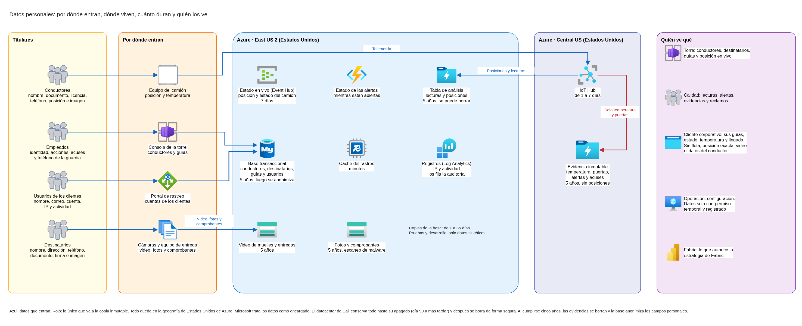
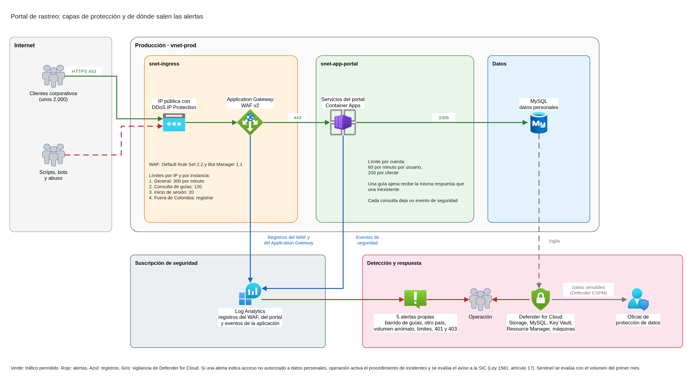

# Datos personales, perímetro público y detección de actividad anómala

Este documento identifica los datos personales de conductores y destinatarios que maneja la plataforma de FríoAndes, dice dónde viven, quién los ve y cuánto tiempo se conservan, y los concilia con la retención contractual de cinco años y con la Ley 1581 de 2012. También define cómo se protege el portal de rastreo frente al abuso, con límites de solicitudes dimensionados para el pico de campaña, y cómo se detecta la actividad anómala. Parte de la red, del firewall, de la telemetría y de la landing zone ya diseñados, y usa sus mismos nombres.

## Contenido

1. Contexto y alcance
2. Datos personales: qué hay, dónde vive y quién lo ve
3. Cumplimiento y retención
4. Perímetro del portal
5. Detección de actividad anómala
6. Operación y costo
7. Supuestos y confirmaciones pendientes de FríoAndes

### Términos usados

| Término | Significado en este documento |
|---|---|
| Titular | La persona a quien se refieren los datos: un conductor, un destinatario, un usuario de un cliente corporativo o un empleado |
| Responsable del tratamiento | Quien decide sobre los datos y para qué se usan (Ley 1581, artículo 3) |
| Encargado del tratamiento | Quien trata los datos por cuenta del responsable, por ejemplo un proveedor de nube (Ley 1581, artículo 3) |
| Dato sensible | Dato que afecta la intimidad o puede generar discriminación, como los datos de salud o los biométricos (Ley 1581, artículo 5) |
| Transmisión | Envío de datos a un encargado, dentro o fuera de Colombia, para que los trate por cuenta del responsable (Decreto 1377 de 2013, artículo 3) |
| Transferencia | Envío de datos a otro responsable, dentro o fuera de Colombia (Decreto 1377 de 2013, artículo 3) |
| Guía | El documento de cada envío: remitente, destinatario, carga y estado |
| Comprobante de entrega | La constancia que firma el destinatario al recibir, con su foto o PDF |

---

## 1. Contexto y alcance

### 1.1 Qué resuelve este documento

Este documento responde dos necesidades de seguridad de FríoAndes:

| Necesidad | Qué implica | Dónde se responde |
|---|---|---|
| Datos personales | Tratamiento de datos personales de conductores y destinatarios. No hay datos de pago con tarjeta. Las evidencias y la trazabilidad de temperatura se conservan cinco años por contrato con los clientes de alimentos | Secciones 2 y 3 |
| Perímetro público | Protección del perímetro público (el portal de rastreo) y detección de actividad anómala | Secciones 4 y 5 |

Las cifras para dimensionar el portal: unos 2.000 clientes corporativos habilitados, un pico ordinario de cerca de 800 solicitudes por minuto y, en campaña, 2.000 solicitudes por minuto durante unas cuatro horas.

La estrategia de Fabric también tiene que definir la residencia de los datos personales de conductores y destinatarios. Ese diseño toma de aquí el inventario y la posición sobre la ubicación de los datos (sección 3).

### 1.2 Quién usa el portal

El portal de rastreo está publicado en internet; la consola de despacho, en cambio, solo se usa desde la red corporativa. Lo usan los unos 2.000 clientes corporativos habilitados: cada uno se identifica y consulta solo sus guías, en una vista acotada.

Los destinatarios son titulares de datos y no tienen acceso al portal, y no hay consultas de guías sin identificarse. Por eso este documento diseña un portal en internet, de uso exclusivo de los clientes corporativos habilitados, donde cada uno ve solo sus guías. No está definido si los 2.000 clientes son empresas o usuarios; la sección 4 lo trata como supuesto.

### 1.3 Qué toma de los otros diseños

| Ya definido | Dónde |
|---|---|
| La plataforma vive en East US 2 y la telemetría usa además Central US. Que los datos queden en Estados Unidos es un supuesto por confirmar | Red, secciones 3.5, 3.7 y 3.8 |
| Torre, portal, ingesta y analítica tienen subredes propias. La torre no tiene ninguna entrada desde internet | Red, sección 5 |
| El portal se publica con Application Gateway WAF v2 (Default Rule Set 2.2, Bot Manager 1.1, modo prevención), con 20 unidades de capacidad reservadas para el pico de campaña. El Application Gateway entrega la IP real del cliente | Firewall, secciones 3.3 y 3.4 |
| Los registros del firewall, del Application Gateway y del WAF van al espacio de Log Analytics de la plataforma | Firewall, sección 6.1 |
| La posición de los camiones queda en una copia de evidencia inmutable por cinco años en Central US. La vista del cliente muestra estado, temperatura y hora estimada de llegada, sin la flota ni la posición exacta del camión | Telemetría, secciones 4.3, 4.4 y 5.5 |
| Suscripciones separadas para seguridad, conectividad, producción, desarrollo y pruebas. Log Analytics vive en la suscripción de seguridad. Desarrollo y pruebas usan datos sintéticos o anonimizados | Landing zone, secciones 3 y 5 |

### 1.4 Qué queda en otros diseños

| Tema | Diseño que lo define |
|---|---|
| Qué eventos de acceso se auditan (datos de clientes, evidencias y lecturas de temperatura) y cuánto tiempo se guardan los registros | Auditoría, retención y facturación interna |
| Roles, MFA, identidades de los clientes en el portal y cifrado con Key Vault | Identidades, accesos y cifrado |
| Cómo opera el equipo las alertas de seguridad y los tableros de operación | Observabilidad |
| Región de Fabric y acceso de calidad, torre y clientes a Fabric | Estrategia de Fabric |

---

## 2. Datos personales: qué hay, dónde vive y quién lo ve

### 2.1 Titulares y datos

Los titulares principales son los conductores y los destinatarios. Sus datos exactos no están documentados, así que los de esta tabla salen de lo que la operación necesita para despachar, entregar y responder reclamos. FríoAndes los confirma contra el inventario real de su base (sección 7).

| Titular | Datos | De dónde salen | Para qué se usan |
|---|---|---|---|
| Conductor | Nombre, documento de identidad, licencia de conducción, teléfono, camión y viajes asignados | Registro del conductor en la plataforma | Asignar rutas y responder por cada viaje |
| Conductor | Posición del camión cada 30 segundos durante la jornada, con la hora | Telemetría del camión | Rastreo, hora estimada de llegada, reclamos de cadena de frío |
| Conductor | Imagen en el video de muelles y de entregas | Cámaras de muelles y de los camiones | Evidencia de cargue y entrega |
| Destinatario | Nombre, dirección de entrega y teléfono | La guía que crea el cliente corporativo | Entregar la carga |
| Destinatario | Documento de identidad y firma de quien recibe | Comprobante de entrega | Constancia de la entrega |
| Destinatario | Imagen en la foto o el video de la entrega | Foto del comprobante y video de entregas | Evidencia de la entrega y de la carga |
| Usuario de un cliente corporativo | Nombre, correo, cuenta del portal, IP y actividad en el portal | Alta del usuario y uso del portal | Dar acceso a sus guías y detectar abuso |
| Empleado de FríoAndes | Identidad corporativa, acciones en la torre y en la plataforma, teléfono de la guardia de calidad, acuses de alertas | Entra ID, registros y la tabla de turnos | Operar, auditar quién hizo qué y avisar de noche |

Los usuarios de los clientes y los empleados también son titulares, y sus datos pasan por los mismos sistemas. El documento los incluye para que el inventario quede completo.

**No hay datos de pago con tarjeta.** La plataforma no procesa pagos con tarjeta, y eso deja fuera de alcance las normas de la industria de tarjetas (PCI DSS).

### 2.2 Datos sensibles: imágenes y firmas

La Ley 1581 define dato personal como cualquier información vinculada o que pueda asociarse a personas determinadas o determinables (artículo 3), y trata los datos biométricos como sensibles (artículo 5). La Superintendencia de Industria y Comercio (SIC) reitera que la biometría implica datos sensibles y exige una autorización previa, expresa, informada y cualificada, que el titular no está obligado a dar.

| Dato | Es dato personal | Cómo lo trata el diseño |
|---|---|---|
| Video de muelles y de entregas donde aparecen conductores, trabajadores o destinatarios | Sí: una persona en la imagen es determinable | Con las protecciones de un dato sensible: acceso restringido a calidad y a quien atiende un reclamo, sin acceso del cliente y sin reconocimiento facial |
| Fotos de entregas y comprobantes con la firma de quien recibe | Sí | Igual que el video, salvo que el cliente pueda ver el comprobante de sus propias entregas, si FríoAndes lo confirma (sección 7) |
| Posición del camión durante la jornada | Sí: se asocia al conductor del viaje | Dato personal no sensible según el artículo 5, pero revela dónde está una persona. Solo la torre ve la posición exacta |

**Ningún componente hace reconocimiento facial ni identifica personas por su imagen.** El apoyo de Fabric al archivo de evidencias que prevé la estrategia de Fabric se limita a marcar fotos ilegibles o con carga visiblemente dañada. Si un uso futuro identificara personas por su rostro, los datos pasarían a ser biométricos y necesitarían la autorización especial del artículo 6.

### 2.3 Dónde vive cada dato

| Componente | Ubicación | Datos personales | Quién accede | Cuánto se conserva |
|---|---|---|---|---|
| Base transaccional (MySQL Flexible) | `snet-data`, East US 2 | Conductores, destinatarios, guías, usuarios de clientes | Torre, portal (solo las guías del cliente), calidad, operación con permisos temporales | Lo que dure la finalidad (sección 3). Copias automáticas de 1 a 35 días, 7 por defecto |
| Caché del rastreo (Azure Managed Redis) | `snet-data-pe`, East US 2 | Respuestas recientes del rastreo, con el destinatario de la guía | Solo los servicios del portal y de la torre | Minutos, con vencimiento automático de cada entrada |
| Archivo de evidencias (Blob) | `snet-archive`, East US 2 | Video, fotos, comprobantes y PDF | Calidad, quien atiende un reclamo, el gateway de Fabric | Cinco años por contrato |
| Evidencia cruda de telemetría | Central US, copia secundaria en East US 2 | Temperatura y puertas de cada camión con su hora, alertas y acuses con la identidad de quien respondió. No guarda posiciones (sección 3.5) | Calidad y quien atiende un reclamo; nadie puede modificarla | Cinco años, inmutable |
| Tabla de análisis de telemetría | East US 2 | Lecturas con guía y cliente, y las posiciones de los camiones | Tableros de calidad y Fabric | Cinco años |
| Event Hub del estado en vivo | `snet-data-pe`, East US 2 | Última posición y estado de cada camión | Torre | Hasta 7 días |
| IoT Hub | Central US | Mensajes de los camiones en tránsito | Stream Analytics | 1 día por defecto, hasta 7 |
| Cuenta de la función notificadora | `snet-data-pe`, East US 2 | Estado de cada alerta y quién la reconoció | La función notificadora | Mientras la alerta está abierta; el registro final va a la evidencia |
| Fabric | Región que fija la estrategia de Fabric | Lo que lee de la base, del archivo y de la telemetría sin copiarlo, y los modelos de los tableros | Torre, calidad y, en la vista insertada, cada cliente sobre sus guías | Lo que define la estrategia de Fabric |
| Registros (Log Analytics) | Suscripción de seguridad, en la región principal | IP y actividad de los usuarios del portal, rutas consultadas, identidad de los empleados | Seguridad y operación | Lo que fija el diseño de auditoría |
| Identidades (Entra ID) | Tenant de FríoAndes | Empleados y, si así lo define el diseño de identidades, usuarios de clientes | Administración de identidades | Mientras la cuenta esté activa |
| Canales de alerta (Teams, correo, SMS) | Microsoft 365 de FríoAndes, Azure Communication Services y el proveedor de SMS | Teléfonos y correos de la guardia. Las alertas llevan solo camión, guía y temperatura | Torre y guardia de calidad | Lo que conserve cada servicio |
| Cali durante la convivencia | Datacenter de Cali | Todo lo anterior en su versión actual: base MySQL 5.7, NFS y registros de Nginx | Lo que permite hoy el datacenter | Hasta que se apague, como máximo el día 90 |

**Pruebas y desarrollo no tienen datos personales reales.** Usan datos sintéticos o anonimizados y sensores simulados, como fijaron la landing zone y el firewall. Por eso no se migra ningún dato de la máquina de pruebas que hoy tiene Cali (MySQL 5.7). No está documentado qué contiene, así que el diseño no depende de eso: al apagar Cali, y después de verificar que la migración llegó completa, se borran de forma segura los discos de todos los servidores que guardaron datos personales (base, archivo NFS, pruebas y registros de Nginx).

### 2.4 Quién ve qué

| Quién | Qué ve | Qué no ve |
|---|---|---|
| Despachador en la torre de control | Conductores, destinatarios y guías, posición en vivo de la flota | El video completo del archivo, salvo que atienda un reclamo |
| Calidad | Lecturas, alertas y acuses, evidencias y comprobantes, posición histórica para reclamos | Datos que no tengan que ver con la cadena de frío o con un reclamo |
| Cliente corporativo | Sus guías: estado, temperatura, hora estimada de llegada, el destinatario que él mismo registró y, si se confirma, el comprobante de su entrega | La flota, la posición exacta del camión, el video, los datos del conductor y las guías de otros clientes |
| Operación y administración | La configuración de los servicios. Los datos solo con un permiso temporal y registrado | Datos de negocio por defecto |
| Analítica en Fabric | Lo que la estrategia de Fabric autorice para cada espacio de trabajo | Lo que no autorice |
| Microsoft, como proveedor de nube | Ningún acceso de rutina: trata los datos por cuenta de FríoAndes (sección 3) | |

La vista del cliente es acotada, su acceso sigue el mínimo privilegio y no incluye la flota completa ni el video. Con ese criterio, el cliente tampoco ve los datos del conductor ni la posición exacta del camión: para seguir su carga le bastan el estado, la temperatura y la hora estimada de llegada. Un camión puede llevar carga de varios clientes, así que su posición revela rutas de otros clientes y dónde está el conductor. La torre solo se usa desde la red corporativa justamente porque muestra la ubicación de la carga. El rol de cada persona y su MFA los define el diseño de identidades.

### 2.5 Dónde quedan geográficamente

| Lugar | Qué datos |
|---|---|
| Estados Unidos, East US 2 | La base, la caché, el archivo de evidencias, la tabla de análisis de telemetría, el Event Hub del estado en vivo, los registros y la copia secundaria de la evidencia de telemetría |
| Estados Unidos, Central US | IoT Hub y la evidencia cruda de telemetría |
| Colombia, datacenter de Cali | Todo, hasta el apagado del día 90 a más tardar |
| Por definir | Fabric (lo decide la estrategia de Fabric), el proveedor de SMS y el tenant de Microsoft 365 |

Con esta arquitectura, los datos personales de conductores y destinatarios salen de Colombia hacia Estados Unidos. La sección 3 explica qué exige la ley para eso.

---

## 3. Cumplimiento y retención

### 3.1 Qué normas aplican

| Norma o compromiso | Aplica | Por qué |
|---|---|---|
| Ley 1581 de 2012 y Decreto 1377 de 2013 (protección de datos personales en Colombia) | Sí | La plataforma trata datos de personas naturales: conductores, destinatarios, usuarios de los clientes y empleados |
| Contrato con los clientes de alimentos | Sí | Obliga a conservar cinco años las evidencias y la trazabilidad de temperatura |
| Normas de la industria de tarjetas (PCI DSS) | No | No hay datos de pago con tarjeta |
| Registro Nacional de Bases de Datos de la SIC | Si FríoAndes tiene más de 100.000 UVT de activos totales | La SIC lo exige solo a las sociedades por encima de ese umbral (Decreto 090 de 2018). El registro declara, entre otras cosas, las transmisiones al exterior |

### 3.2 Quién responde por cada dato

| Datos | Responsable | Encargados | Cómo queda pactado |
|---|---|---|---|
| Conductores, empleados y usuarios de los clientes | FríoAndes | Microsoft (Azure, Microsoft 365, Azure Communication Services) y el proveedor de SMS | Autorización de cada titular y contrato con cada encargado |
| Destinatarios | FríoAndes | Los mismos | El cliente corporativo garantiza en su contrato con FríoAndes que obtuvo la autorización del destinatario para compartir sus datos con la transportadora |

**Por qué FríoAndes es responsable también de los datos de los destinatarios.** La ley llama responsable a quien decide sobre la base de datos o sobre el tratamiento (artículo 3). FríoAndes produce las evidencias de entrega (fotos, comprobantes y video), las conserva cinco años por su propio contrato con los clientes de alimentos y decide para qué se usan: entregar, probar la entrega, responder reclamos, estimar llegadas y apoyar el archivo de evidencias con Fabric. Lo que viene del cliente es el dato inicial del destinatario en la guía, y por eso la cláusula de la tabla.

### 3.3 Los datos en Estados Unidos

Con la arquitectura propuesta, los datos personales salen de Colombia hacia Azure en Estados Unidos. Microsoft no decide sobre esos datos: los trata por cuenta de FríoAndes, según su adenda de protección de datos (DPA). Por eso el envío es una **transmisión** a un encargado, que el Decreto 1377 distingue de la transferencia a otro responsable (artículo 3).

La transmisión queda cubierta por dos vías:

| Vía | Qué dice la norma | Qué hace FríoAndes |
|---|---|---|
| Contrato de transmisión | Una transmisión internacional a un encargado no requiere informar al titular ni pedir su consentimiento si hay un contrato con el alcance del tratamiento, las actividades del encargado y sus obligaciones de seguridad y confidencialidad (Decreto 1377, artículos 24 y 25) | Revisar que la DPA de Microsoft, que acepta al contratar Azure, cubra esos puntos, y firmar un contrato equivalente con el proveedor de SMS |
| País con nivel adecuado | La SIC lista los países con nivel adecuado de protección y Estados Unidos está en la lista. A esos países también se puede transmitir (Circular Única de la SIC, Título V, numeral 3.2) | Conservar la evidencia de las medidas aplicadas, porque la SIC exige demostrarlas aunque el país esté en la lista |

**Los datos no salen de Estados Unidos.** Cada región de Azure pertenece a una geografía que es una frontera fija de residencia de datos. East US 2 y Central US están en la geografía de Estados Unidos, así que la copia geográfica de la evidencia de telemetría queda dentro del país. Microsoft no accede a los datos por defecto: su soporte solo entra a un caso puntual, con acceso temporal y auditado.

**Lo que falta definir fuera de este documento:**

- La región de Fabric, que define la estrategia de Fabric. Tiene que quedar en un país de la lista de la SIC. En la lista que publica la SIC (versión de 2022) están Estados Unidos y México; Brasil y Chile no están.
- La ubicación del proveedor de SMS y la del tenant de Microsoft 365 de FríoAndes.

**Si FríoAndes no acepta Estados Unidos** (pregunta 4 de la sesión de aclaraciones), la alternativa es una región de Azure en otro país de la lista, como México. Eso obliga a revisar la latencia medida desde Cali, la disponibilidad de los servicios y la redundancia de IoT Hub en esa región.

### 3.4 Autorización y aviso

La Ley 1581 pide autorización previa e informada del titular (artículo 9), y el responsable debe conservar la prueba (artículo 17). Ninguna de las excepciones del artículo 10 cubre la operación de FríoAndes.

| Titular | Cuándo se obtiene | Qué cubre |
|---|---|---|
| Conductor | Al vincularlo a FríoAndes | Sus datos de registro, la posición del camión durante la jornada, su imagen en el video de muelles y entregas, y la transmisión a Estados Unidos |
| Destinatario | Su dato llega con la guía, autorizado por el cliente corporativo. Al recibir, el comprobante incluye el aviso de privacidad de FríoAndes | Su firma, su documento y la foto de la entrega |
| Usuario de un cliente corporativo | Al habilitar su cuenta en el portal | Su cuenta y el registro de su actividad, que sirve para detectar abuso (sección 5) |
| Empleado | Al vincularlo | Su identidad, sus acciones en la plataforma y, si está de guardia, su teléfono |

**Lo que la plataforma tiene que guardar.** Una tabla de autorizaciones en la base transaccional, con el titular, la versión del aviso que aceptó, la fecha y el canal. Así FríoAndes puede probar cada autorización cuando el titular o la SIC la pidan. Es un requisito para el equipo de desarrollo.

### 3.5 Los cinco años y los derechos del titular

El Decreto 1377 obliga a borrar los datos cuando se cumple su finalidad, pero también dice que se deben conservar cuando lo exija una obligación legal o contractual (artículo 11). El contrato con los clientes de alimentos es esa obligación para las evidencias y la trazabilidad de temperatura. Por eso esos datos se conservan cinco años aunque el titular pida borrarlos, y se borran al cumplirse.

| Derecho del titular | Plazo de la ley | Cómo lo atiende la plataforma |
|---|---|---|
| Conocer y acceder a sus datos (artículos 8 y 14) | 10 días hábiles, prorrogables 5 | El mapa de la sección 2 dice dónde buscar. Al conductor se lo encuentra por su documento y por sus viajes; al destinatario, por sus guías |
| Actualizar y rectificar (artículos 8 y 15) | 15 días hábiles, prorrogables 8 | Se corrige en la base transaccional. La evidencia inmutable no se modifica: la corrección queda anotada en la base, ligada a la evidencia, para que un reclamo vea las dos. Alterar la evidencia es justo lo que la ley pide impedir (artículo 17) |
| Suprimir sus datos (artículos 8 y 15) | 15 días hábiles, prorrogables 8 | Se borra lo que no hace falta para el contrato, por ejemplo una cuenta del portal o el teléfono de un destinatario después de la entrega. Lo que forma parte de la evidencia se conserva los cinco años y se le explica al titular por qué |
| Reclamo en trámite (artículo 15) | La leyenda se pone en máximo 2 días hábiles | Un campo en la base transaccional marca "reclamo en trámite" en los registros del titular hasta que se resuelva |

**Las posiciones de los camiones quedan fuera de la copia inmutable.** La posición cada 30 segundos es la ubicación del conductor durante su jornada. Si estuviera en la copia inmutable, nadie podría borrarla en cinco años, ni siquiera si la SIC ordenara suprimirla (artículo 8). El contrato con los clientes de alimentos obliga a conservar las evidencias y la trazabilidad de temperatura; la posición no forma parte de esa obligación. Por eso la ruta de IoT Hub hacia la copia inmutable lleva solo los mensajes de temperatura y de puertas: IoT Hub puede filtrar por el tipo de mensaje porque cada mensaje se marca como JSON. Las posiciones quedan en la tabla de análisis, ligadas a la guía y al viaje, también por cinco años para los reclamos. Esa tabla sí se puede corregir y borrar.

**Al cumplirse los cinco años:**

| Dónde | Cómo se borra |
|---|---|
| Archivo de evidencias y evidencia cruda de telemetría | La política de ciclo de vida de cada cuenta borra los archivos al vencer la retención. Antes, la retención inmutable impide borrarlos |
| Tabla de análisis de telemetría | Una tarea programada borra las filas de más de cinco años y limpia los archivos viejos de la tabla Delta |
| Base transaccional | Una tarea programada anonimiza los campos personales de las guías de más de cinco años (nombre, dirección, teléfono, documento del destinatario) y deja los datos de la operación para estadísticas. Los conductores sin viajes dentro de los cinco años se anonimizan igual |
| Copias de la base | Vencen solas en máximo 35 días |
| Fabric | Lee los mismos archivos sin copiarlos, así que el borrado se refleja solo. Lo que la estrategia de Fabric copie debe seguir la misma regla |
| Registros | Los borra la retención que fije el diseño de auditoría |

### 3.6 Lo que FríoAndes tiene que tener listo

La ley pide que el responsable pueda demostrar que cumple. Estas piezas las prepara FríoAndes, y la arquitectura depende de ellas:

| Pieza | Norma |
|---|---|
| Política de tratamiento de datos y aviso de privacidad, con la finalidad de cada dato y la transmisión a Estados Unidos | Decreto 1377, artículos 13 a 15 |
| Manual interno para atender consultas y reclamos en los plazos de la sección 3.5 | Ley 1581, artículo 17 |
| Contratos de transmisión con Microsoft y con el proveedor de SMS | Decreto 1377, artículo 25 |
| Cláusula con los clientes corporativos sobre la autorización de los destinatarios | Sección 3.2 |
| Inscripción o actualización en el Registro Nacional de Bases de Datos, con la transmisión a Estados Unidos, si FríoAndes supera el umbral | Decreto 090 de 2018 |
| Aviso a la SIC cuando haya una violación de seguridad que ponga en riesgo los datos. La detección de la sección 5 es la que dispara ese aviso | Ley 1581, artículo 17 |

---

## 4. Perímetro del portal

### 4.1 Qué protege cada capa

El portal ya tiene, desde el diseño del firewall, la IP pública con DDoS IP Protection, el Application Gateway con WAF v2 en modo prevención, las reglas administradas Default Rule Set 2.2 contra los ataques web comunes y Bot Manager 1.1 contra los bots maliciosos conocidos. Este documento agrega lo que faltaba: frenar el abuso del rastreo.

| Abuso | Ejemplo | Qué lo frena |
|---|---|---|
| Inundación desde una IP | Un script que consulta el portal sin parar | Límite por IP en el WAF (regla 1) |
| Barrido de guías | Probar números de guía en serie para ver cuáles existen | Límite por IP en la consulta de guías (regla 2) y, sobre todo, la autorización de la aplicación: cada cliente solo recibe sus guías |
| Adivinar contraseñas | Muchos intentos de inicio de sesión | Límite en la ruta de inicio de sesión (regla 3) y la protección del servicio de identidades |
| Un usuario legítimo que abusa | Una cuenta válida que descarga el rastreo de forma masiva | Límite por cuenta en la aplicación (sección 4.4) |
| Ataque de red | Inundación de tráfico contra la IP del portal | DDoS IP Protection, ya activa |

### 4.2 Lo que el WAF puede y no puede hacer

El WAF de Application Gateway cuenta las solicitudes por IP del cliente, por país o todas juntas. No conoce la cuenta del usuario. Además, Microsoft advierte dos cosas que el diseño toma en cuenta:

- **Cada instancia lleva su propio contador.** Con dos instancias, las solicitudes de una misma IP se reparten entre ellas, y cada una compara su mitad contra el umbral. El umbral no es un límite exacto del gateway completo.
- **Los umbrales no son exactos.** Sirven para frenar tasas anómalas y mantener el portal disponible. Repartir la capacidad entre clientes con precisión queda fuera de su alcance.

Por eso el diseño tiene dos capas: el WAF frena por IP lo que es claramente anómalo, y la aplicación limita por cuenta, que es lo que el WAF no puede ver.

### 4.3 Reglas de límite del WAF

**El dimensionamiento.** En campaña el portal recibe hasta 2.000 solicitudes por minuto, repartidas entre unos 2.000 clientes. Los usuarios de una misma empresa suelen salir a internet por la misma IP. El diseño supone que ningún cliente genera más del 10 % del pico de campaña, es decir 200 solicitudes por minuto desde su IP (sección 7). Producción tiene al menos dos instancias, y si una cae, la otra recibe todo; por eso el umbral se fija para que esas 200 solicitudes pasen aunque lleguen todas a una sola instancia.

| Regla | Qué cuenta | Umbral por instancia | Cuándo actúa con dos instancias | Acción |
|---|---|---|---|---|
| 1. Límite general por IP | Todas las solicitudes de una IP | 300 por minuto | Cuando una IP supera unas 600 por minuto: el triple del cliente más grande y casi un tercio de todo el pico de campaña | Bloquear |
| 2. Consulta de guías por IP | Las solicitudes a la ruta de consulta de guías | 120 por minuto | Cuando una IP supera unas 240 consultas por minuto, más de cuatro por segundo | Bloquear |
| 3. Inicio de sesión por IP | Las solicitudes a la ruta de inicio de sesión del portal, si el inicio de sesión pasa por el portal | 20 por minuto | Cuando una IP supera unos 40 intentos por minuto | Bloquear |
| 4. Tráfico desde fuera de Colombia | Las solicitudes de IP que no son de Colombia ni de país desconocido (código ZZ) | Sin umbral | Siempre | Registrar, sin bloquear |

**Por qué estas cifras.**

- La regla 1 nunca toca el pico de campaña legítimo: las 2.000 solicitudes por minuto de todos los clientes juntos se reparten entre muchas IP, y la más grande, con 200, queda por debajo de 300 aunque una instancia reciba todo.
- La regla 2 apunta al barrido. Una persona consulta unas pocas guías por minuto; cuatro por segundo sostenidas durante un minuto solo las hace un programa.
- La regla 3 depende del diseño de identidades. Si el inicio de sesión de los clientes lo atiende el servicio de identidades de Microsoft, no pasa por el Application Gateway y la regla no hace falta.
- La regla 4 no bloquea, porque no hay certeza de que todos los clientes estén en Colombia. Registra para la detección (sección 5): una cuenta que de repente consulta desde otro país es una señal.

**Lo que pasa cuando una regla actúa.** El WAF bloquea a esa IP durante el resto del minuto y después la deja pasar hasta el umbral. Un cliente legítimo que excede el límite por un error de su integración se recupera solo al minuto siguiente; un script sostenido queda frenado.

### 4.4 Límite por cuenta en la aplicación

El WAF no distingue a dos usuarios de la misma empresa ni a un usuario legítimo que abusa. Eso lo hace la aplicación, que sí conoce la cuenta. Es un requisito para el equipo de desarrollo:

| Límite | Valor inicial | Respuesta |
|---|---|---|
| Por usuario | 60 solicitudes por minuto | Código 429 con el tiempo de espera |
| Por cliente corporativo (todas sus cuentas) | 200 solicitudes por minuto, el mismo supuesto de la regla 1 | Código 429 con el tiempo de espera |
| Consulta de guías ajenas | Cada consulta de una guía que no es del cliente | Respuesta igual a la de una guía inexistente, y un evento en el registro de la aplicación para la detección (sección 5) |

Responder igual a una guía ajena y a una inexistente evita que el barrido revele qué números existen.

### 4.5 Cómo se ponen en marcha

1. En pruebas, las reglas arrancan con la acción de registrar mientras corre la prueba de carga de campaña (2.000 solicitudes por minuto, con una distribución de IP parecida a la real).
2. Con esos registros se confirma que ninguna IP legítima se acerca a los umbrales y se pasan a bloquear.
3. Producción arranca con las reglas en bloqueo desde el corte. En el primer mes se revisa la tasa por IP más alta de cada día; si un cliente legítimo se acerca al umbral, se ajusta.
4. Los ajustes se hacen fuera de campaña y en la ventana de 22:00 a 04:00, como cualquier cambio de producción.

Las reglas viven en la misma política del WAF como código, junto con las de la tabla de políticas del firewall. Pruebas y desarrollo usan las mismas reglas.

---

## 5. Detección de actividad anómala

### 5.1 Tres fuentes de detección

La parte inferior del diagrama de la sección 4.1 muestra de dónde sale cada alerta.

| Fuente | Qué detecta | Quién define la regla |
|---|---|---|
| Microsoft Defender for Cloud | Comportamientos anómalos sobre los servicios de Azure: accesos inusuales o exfiltración en el almacenamiento, fuerza bruta contra la base, accesos raros al Key Vault, operaciones sospechosas en Azure Resource Manager | Microsoft, con su inteligencia de amenazas y sus modelos. FríoAndes elige qué planes activa |
| Registros del WAF, del Application Gateway y del firewall | Abuso del portal por IP: bloqueos por límite, intentos repetidos, tráfico desde fuera de Colombia | FríoAndes, con alertas de búsqueda en Log Analytics |
| Eventos de la aplicación | Abuso por cuenta: consultas de guías ajenas, volumen anómalo de una cuenta, cambios de país | FríoAndes, con alertas de búsqueda sobre los eventos que emite la aplicación |

Las dos últimas son las que miran el portal desde el negocio. Defender for Cloud no sabe qué es una guía ni a qué cliente pertenece, y el WAF no conoce las cuentas. Por eso la aplicación tiene que registrar sus propios eventos de seguridad.

### 5.2 Planes de Defender for Cloud

Defender for Cloud se activa por suscripción, sobre la estructura de la landing zone:

| Plan | Qué protege | Producción | Conectividad | Seguridad | Pruebas y desarrollo |
|---|---|---|---|---|---|
| Foundational CSPM (sin costo) | Recomendaciones de configuración y puntuación de seguridad | Sí | Sí | Sí | Sí |
| Defender CSPM | Rutas de ataque, descubrimiento de datos sensibles en el almacenamiento y la base, cumplimiento normativo | Sí | No | No | No |
| Defender for Storage | Accesos anómalos y exfiltración en todas las cuentas, datos sensibles en el almacenamiento | Sí | No | Sí (registros) | No |
| Defender para MySQL | Fuerza bruta y accesos anómalos a la base | Sí | No | No | No |
| Defender for Key Vault | Accesos inusuales a secretos y llaves | Sí | No | No | No |
| Defender for Resource Manager | Operaciones sospechosas sobre los recursos (por ejemplo, cambios masivos de permisos) | Sí | Sí | Sí | No |
| Defender for Servers, plan 1 | Las máquinas de administración de `snet-admin` y las de copia del archivo durante la migración | Sí | No | No | No |
| Defender for Containers | Protección de los contenedores en ejecución. Solo aplica con la variante de Kubernetes | Variante AKS | No | No | No |

**Por qué pruebas y desarrollo quedan con el plan sin costo.** No tienen datos personales reales (sección 2.3). Las recomendaciones de configuración siguen activas para que los errores se vean antes de llegar a producción.

**Por qué Defender CSPM solo en producción.** Su descubrimiento de datos sensibles muestrea la base y las cuentas de almacenamiento con los tipos de información de Microsoft Purview, y marca dónde hay datos personales. Eso permite comprobar periódicamente que el mapa de la sección 2 sigue siendo cierto: si aparece un nombre o un documento en una cuenta que no debería tenerlos, se ve. Sus rutas de ataque muestran si algún camino desde internet llega a un almacén con datos sensibles.

**Container Apps.** La protección en ejecución de Defender for Containers cubre solo Kubernetes. Con Container Apps, el escaneo de vulnerabilidades de las imágenes del registro lo hace Defender CSPM. Con la variante de Kubernetes se agrega Defender for Containers.

### 5.3 Escaneo de malware en el almacenamiento

Defender for Storage puede escanear cada archivo que se sube, pero lo cobra por GB. El archivo crece unos 12 TB al mes, casi todo video, y la siembra inicial es de 1,2 PB:

| Qué se sube | Escaneo de malware | Por qué |
|---|---|---|
| Fotos, comprobantes y PDF que llegan desde los equipos de los conductores y de los centros | Sí, con un tope mensual por cuenta | Vienen de dispositivos fuera del control de la plataforma y alguien los abre después |
| Video de muelles y entregas | No | Lo producen las cámaras de FríoAndes. Escanearlo costaría unos USD 1.800 al mes |
| La siembra de 1,2 PB y la copia desde Cali | No, el escaneo queda apagado durante la migración | Escanear 1,2 PB costaría unos USD 180.000 |

Todos los archivos tienen igual el análisis por reputación de hash, que viene incluido y compara cada archivo con malware conocido. Para que el escaneo se aplique solo a las fotos y comprobantes, esos archivos tienen que ir en una cuenta separada del video. El diseño del archivo define esa separación.

### 5.4 Alertas sobre el portal

| Alerta | Condición | Fuente | Frecuencia |
|---|---|---|---|
| Barrido de guías | Una cuenta consulta más de 20 guías ajenas o inexistentes en 10 minutos | Eventos de la aplicación | Cada 5 minutos |
| Cuenta desde otro país | Una cuenta que siempre entra desde Colombia aparece desde otro país | Eventos de la aplicación y regla 4 del WAF | Cada 5 minutos |
| Volumen anómalo de una cuenta | Una cuenta hace más del triple de consultas que su máximo diario de los últimos 30 días | Eventos de la aplicación | Cada 15 minutos |
| Límites del WAF activados | Una misma IP activa las reglas de límite en más de 5 minutos distintos dentro de una hora | Registros del WAF | Cada 5 minutos |
| Intentos de acceso fallidos | Más de 50 respuestas 401 o 403 a una misma IP en 10 minutos | Registros del Application Gateway | Cada 5 minutos |

Estas cinco se suman a las del diseño del firewall: destinos maliciosos, rechazos fuera de lo normal, aumento de bloqueos del WAF, ataques de denegación de servicio y cambios en las reglas. Los umbrales son iniciales y se ajustan con el primer mes de datos, igual que los límites de la sección 4.

**Lo que la aplicación tiene que registrar.** Para estas alertas, cada consulta del portal deja un evento con la cuenta, el cliente, la guía consultada, si era del cliente, el resultado y la IP de origen. Los eventos van al mismo espacio de Log Analytics, y su retención la fija el diseño de auditoría. Es un requisito para el equipo de desarrollo, el mismo que pide el diseño de auditoría para reconstruir quién accedió a datos de clientes.

### 5.5 Microsoft Sentinel

Sentinel es el sistema de Microsoft para correlacionar señales de seguridad de muchas fuentes, con un equipo de seguridad que investiga incidentes. Para FríoAndes, al inicio, no hace falta:

| | Defender for Cloud y alertas de Log Analytics (propuesta) | Sentinel desde el inicio |
|---|---|---|
| Qué cubre | Las alertas de Defender y las cinco alertas propias del portal, más las del firewall | Lo mismo, más correlación entre fuentes, análisis de comportamiento de usuarios y casos de investigación |
| Costo | Las alertas propias, unos pocos dólares al mes | Unos USD 4,76 por GB analizado, sobre todos los registros que se conecten |
| Quién lo opera | El equipo de operación de la plataforma | Un equipo de seguridad que revise incidentes de forma continua |

El volumen de registros se mide en el primer mes, como ya dejó dicho el diseño del firewall. Con ese dato, y si FríoAndes forma un equipo de seguridad, Sentinel se activa sobre el mismo espacio de Log Analytics sin mover nada: las alertas de Defender for Cloud y el registro de actividad de Azure no se cobran en Sentinel, y los primeros 31 días tienen 10 GB diarios sin costo.

### 5.6 Qué pasa cuando hay una alerta

1. La alerta llega al equipo de operación por el canal que define el diseño de observabilidad.
2. Si es abuso del portal, operación bloquea la IP con una regla del WAF o deshabilita la cuenta, y avisa al cliente corporativo dueño de la cuenta.
3. Si hay indicios de que alguien accedió a datos personales sin autorización, se conservan los registros, se activa el procedimiento de incidentes de FríoAndes y se evalúa el aviso a la SIC que exige la Ley 1581 (artículo 17). Si los datos afectados son de clientes de alimentos, el contrato con ellos también puede exigir avisarles.
4. Cada incidente deja su registro para la auditoría.

---

## 6. Operación y costo

### 6.1 Costo mensual de producción

Precios de lista en East US 2, con 730 horas al mes. Solo incluye lo que agrega este documento: el WAF, el Application Gateway y los registros del firewall ya están en el costo del diseño del firewall.

| Componente | Cálculo | USD al mes |
|---|---|---|
| Defender CSPM | 10 recursos facturables (2 máquinas de administración, 5 cuentas de almacenamiento y 3 servidores MySQL) × 5,11 | 51,10 |
| Defender for Storage | 5 cuentas (video del archivo, fotos y comprobantes, evidencia de telemetría, tabla de análisis y cuenta de la función) × 9,78 | 48,91 |
| Escaneo de malware de fotos y comprobantes | Unos 1.138 GB al mes × 0,15, con un tope de 1.200 GB | De unos 171 a 180 |
| Defender para MySQL | Hasta 3 servidores (el principal y las dos réplicas) × 15 | Hasta 45 |
| Defender for Resource Manager | 3 suscripciones (producción, conectividad y seguridad) × 5,04 | 15,11 |
| Defender for Servers, plan 1 | 2 máquinas de administración × 4,91 | 9,81 |
| Defender for Key Vault | 1 bóveda | 0,25 |
| Alertas propias del portal | 4 cada 5 minutos × 1,50 + 1 cada 15 minutos × 0,50 | 6,50 |
| Reglas de límite del WAF | La API de precios no tiene un medidor para ellas | 0 |
| **Total** | | **Unos 350, con el escaneo de malware al tope** |

**Cómo se estimó el escaneo.** En el archivo actual hay 110 TB de fotos, comprobantes y PDF y 1,05 PB de video. Si el crecimiento de 12 TB al mes mantiene esa proporción, las fotos y comprobantes son unos 1.138 GB al mes. El tope mensual de 1.200 GB fija el máximo en USD 180; si se alcanza, Defender avisa al 75 % y al 100 % y el resto del mes queda solo el análisis por reputación de hash.

**Lo que no está en la tabla:**

- Los eventos de seguridad de la aplicación en Log Analytics. Cuestan USD 2,76 por GB, a partir de 5 GB gratuitos al mes, y su volumen depende del uso real del portal. Son los mismos eventos que necesita el diseño de auditoría, así que se cuentan una sola vez, en el costo de la plataforma.
- Las máquinas de copia del archivo durante la migración: cada una suma USD 4,91 de Defender for Servers y 5,11 de Defender CSPM mientras exista.
- El plan de Defender for Containers, que solo aplica con la variante de Kubernetes y se cobra por núcleo de los nodos.
- Pruebas y desarrollo: usan el plan sin costo.

### 6.2 Operación

| Tarea | Frecuencia | Quién |
|---|---|---|
| Revisar las alertas de Defender for Cloud y las del portal | Cuando llegan, por el canal del diseño de observabilidad | Operación |
| Revisar las recomendaciones de Defender for Cloud y la puntuación de seguridad | Semanal | Operación |
| Revisar la IP con más tráfico de cada día frente a los límites del WAF | Diaria el primer mes, después mensual | Operación |
| Ajustar umbrales de límites y alertas | Fuera de campaña y en la ventana de 22:00 a 04:00 | Operación, con un cambio aprobado |
| Contrastar el descubrimiento de datos sensibles de Defender CSPM con el mapa de la sección 2 | Trimestral | El oficial de protección de datos de FríoAndes |
| Atender consultas y reclamos de titulares | En los plazos de la sección 3.5 | El área que FríoAndes designe en su manual interno |
| Revisar la lista de países de la SIC y los contratos con encargados | Anual | Jurídica de FríoAndes |

**En campaña.** Los límites del WAF ya están dimensionados para el pico de 2.000 solicitudes por minuto, así que la campaña no exige cambios. Antes de cada campaña se revisa que ninguna IP legítima del mes anterior se haya acercado a los umbrales.

### 6.3 Decisiones que bajan o evitan gasto

| Decisión | Alternativa descartada | Ahorro |
|---|---|---|
| Escanear solo fotos y comprobantes | Escanear también el video | Unos USD 1.800 al mes |
| Apagar el escaneo durante la migración | Escanear la siembra de 1,2 PB | Unos USD 180.000 una sola vez |
| Defender for Cloud y alertas de Log Analytics al inicio | Microsoft Sentinel desde el primer día | USD 4,76 por cada GB de registros analizado |
| Pruebas y desarrollo con el plan sin costo | Los mismos planes que producción | Los planes de pago de esos ambientes |
| Defender for Servers, plan 1 | Plan 2 para las máquinas de administración | USD 19,39 al mes |

---

## 7. Supuestos y confirmaciones pendientes de FríoAndes

### 7.1 Confirmaciones que necesita el diseño

| Tema | Pregunta para FríoAndes | Qué pasa si la respuesta cambia |
|---|---|---|
| Ubicación de los datos | ¿Se acepta que los datos personales de conductores y destinatarios queden en Estados Unidos (East US 2 y Central US)? ¿Los contratos con los clientes de alimentos dicen algo sobre dónde deben guardarse? | Si no se acepta, la plataforma pasa a una región de otro país de la lista de la SIC, como México, y se revisan latencia, servicios y la redundancia de IoT Hub (sección 3.3) |
| Datos de cada titular | ¿Qué campos guarda hoy la base de conductores, destinatarios y usuarios de los clientes? | El inventario de la sección 2.1 es una deducción. Un dato sensible que no está en la lista cambia sus controles |
| Comprobante de entrega | ¿El cliente corporativo ve el comprobante y las fotos de sus propias entregas? | Si no los ve, sale de su vista y los pide a calidad (sección 2.4) |
| Registro Nacional de Bases de Datos | ¿FríoAndes tiene más de 100.000 UVT de activos totales? | Si los tiene, debe inscribir o actualizar sus bases con la transmisión a Estados Unidos (sección 3.6) |
| Contratos con encargados | ¿La adenda de protección de datos de Microsoft cubre lo que pide el artículo 25 del Decreto 1377? ¿Quién es el proveedor de SMS y dónde trata los datos? | Si falta algo, se firma un contrato de transmisión complementario. Si el proveedor de SMS está fuera de la lista de la SIC, se cambia o se revisa la base legal de esa transmisión |
| Microsoft 365 | ¿Dónde está el tenant de Microsoft 365 de FríoAndes? | Teams y el correo llevan teléfonos y correos de la guardia; su ubicación entra en el registro de transmisiones |
| Cláusula con los clientes | ¿Los contratos con los clientes corporativos incluyen que ellos obtienen la autorización de los destinatarios para compartir sus datos? | Si no la incluyen, se agrega antes de migrar (sección 3.2) |
| Inicio de sesión de los clientes | ¿Los clientes inician sesión en el portal o en el servicio de identidades de Microsoft? Lo define el diseño de identidades | Si es en el portal, aplica la regla 3 del WAF; si no, la protección la da el servicio de identidades (sección 4.3) |
| Clientes fuera de Colombia | ¿Hay clientes corporativos que consulten desde otros países? | Si no los hay, la regla 4 del WAF puede pasar de registrar a limitar (sección 4.3) |
| Incidentes | ¿Los contratos con los clientes de alimentos exigen avisarles de un incidente con datos personales, y en qué plazo? | Se agrega al procedimiento de la sección 5.6 |

### 7.2 Supuestos del diseño

| Supuesto | Por qué se asume |
|---|---|
| Ningún cliente corporativo genera más del 10 % del pico de campaña, unas 200 solicitudes por minuto desde su IP | Define los umbrales del WAF. Se confirma con la prueba de carga y con el primer mes de producción (sección 4.5) |
| Cada usuario del portal hace hasta 60 solicitudes por minuto y cada cliente hasta 200 | Valores iniciales del límite por cuenta en la aplicación. Se ajustan con el uso real |
| Los umbrales de las cinco alertas del portal son iniciales | No hay tráfico real para calibrarlos. Se ajustan con el primer mes de datos |
| Hay 2 máquinas de administración y 5 cuentas de almacenamiento en producción, con las fotos y comprobantes en una cuenta separada del video | Define el costo de Defender. La separación de cuentas la confirma el diseño del archivo |
| Defender cobra cada servidor MySQL por separado: el principal y las dos réplicas | No hay una fuente que lo aclare. Se confirma con la primera factura |
| Las fotos y comprobantes son unos 1.138 GB al mes | Es la proporción actual del archivo (110 TB de fotos frente a 1,05 PB de video) aplicada al crecimiento de 12 TB al mes |
| El volumen de eventos de seguridad de la aplicación se mide en el primer mes | Depende del uso real del portal. Son los mismos eventos que necesita el diseño de auditoría |
| Ningún componente identifica personas por su rostro | Si algún uso lo hiciera, las imágenes pasarían a ser datos biométricos y requerirían la autorización especial del artículo 6 de la Ley 1581 |
| Los costos son precios de lista en East US 2, con 730 horas al mes, sin descuentos | Es la base común del cálculo de costos de la plataforma |
| La plataforma de contenedores es Container Apps con perfiles de carga | Lo mismo que el diseño de red. Con Kubernetes se agrega Defender for Containers (sección 5.2) |
