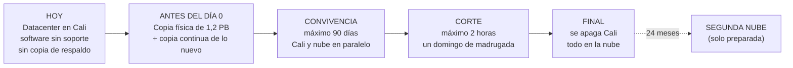
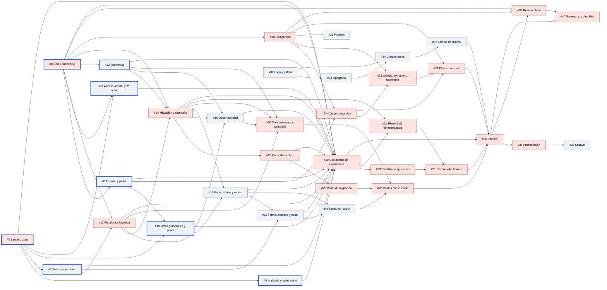

# Guía de lectura del caso FríoAndes

> Esta guía se lee **al lado** de [`enunciado-original.md`](enunciado-original.md). Sigue el mismo orden y
> usa los mismos títulos que el enunciado: se lee un párrafo del original y se busca aquí la sección con el mismo nombre.

## Cómo está organizada

- **Parte I. El enunciado, sección por sección.** Cada sección tiene los mismos apartados:
  - **En pocas palabras**: qué dice el original, resumido.
  - **Lo que hay que entender**: qué está pidiendo de verdad y qué espera ver el profesor.
  - **Los números**: las cifras del caso y las cuentas que salen de ellas. Solo aparece donde hay cifras.
  - **En el tablero**: qué issue de GitHub lo trabaja, quién lo tiene y en qué estado está.
  - **Cuidado con**: trampas, ambigüedades y cosas que conviene preguntar.
- **Parte II. El tablero Kanban**: cómo está armado, qué cubre cada issue, en qué orden se desbloquean, quién tiene qué
  y los problemas detectados.
- **Parte III. Preguntas para la sesión de aclaraciones.**
- **Parte IV. Glosario** de los términos técnicos.

Cuando algo dice **(por confirmar)**, es algo que todavía hay que verificar con una fuente antes de usarlo en un
entregable.

Los issues se nombran como en GitHub (`#8` es el issue número 8 del repo `planning`) y siempre llevan al lado su
nombre corto, por ejemplo "#8 Red y subnetting". El estado del tablero corresponde al **30-sep-2026**.

---

## El caso en una página

**Quién es FríoAndes.** Una empresa que guarda y transporta alimentos refrigerados. Tiene:
- un solo datacenter en Cali, con 14 máquinas virtuales, varias con software que ya no tiene soporte;
- ocho centros regionales que solo tienen red y sensores, sin servidores propios;
- una flota de camiones que transmite por la red celular de un operador.

**Qué quiere hacer.** Llevar su operación a la nube de forma ordenada y segura, y de paso lograr esto:

| Lo que quiere | Dónde lo pide el enunciado | En una frase |
|---|---|---|
| Una plataforma nueva de despacho y rastreo | Reto 5, Parte A | Consola interna para despachadores y portal para clientes, que no se caiga y se recupere rápido |
| Vigilar la temperatura en tiempo real | Reto 5, Parte B | Avisar en menos de 1 minuto si un camión o un cuarto frío se sale de temperatura |
| Migrar sin detener la operación | Reto 5, Parte C | Máximo 90 días con los dos sistemas en paralelo y un único corte de 2 horas un domingo de madrugada |
| Inteligencia artificial para la torre de control | Reto 7 | Tres usos de IA con Microsoft Fabric, sin volver a copiar el archivo de 1,2 PB |
| Una marca propia | Reto 8 | Logo, colores y componentes comunes a la torre de control y al portal |
| Las bases de todo lo anterior | Retos 1, 2, 3, 4 y 6 | Gobierno, seguridad, red, automatización y monitoreo |

**Qué NO hay que hacer:** programar la aplicación ni la lógica de negocio.

**Qué SÍ hay que entregar:** el diseño, el código de infraestructura (que se pueda "planear" con Terraform, sin
crear nada), los costos con sus supuestos, las plantillas de cambio con un ejemplo, el sistema de diseño y la
presentación de 20 minutos.

**Las dos preguntas que el profesor se va a hacer en cada lámina:**
1. ¿Cómo se despliega, cómo se protege, cómo se monitorea y cuánto cuesta?
2. ¿Esto sale de los números del caso o es un diagrama genérico que serviría para cualquier empresa?



---

# Parte I. El enunciado, sección por sección

## Contexto

**En pocas palabras.** FríoAndes tiene un datacenter en Cali que corre seis sistemas, y describe seis problemas.

**Lo que hay que entender.** Los seis problemas son la razón de ser del proyecto. En la sustentación el arquitecto
va a ir uno por uno preguntando "¿y esto cómo lo resuelves?". Conviene tener cada respuesta lista:

| Problema que cuenta la empresa | Por qué pasa | Cómo lo resuelve la propuesta | Issues donde se trabaja |
|---|---|---|---|
| En campaña el despacho se pone lento y el portal se degrada | La capacidad es fija: no se pueden agregar servidores para el pico | La plataforma nueva crece sola cuando sube la demanda (autoescalado) y se dimensiona para la campaña | #12 Plataforma logística, #14 Migración y campaña, #26 Costo mensual y de campaña |
| Publicar un cambio tarda semanas | El despliegue es manual y desarrollo, pruebas y producción comparten servidores | Ambientes separados, infraestructura como código, un pipeline automático y plantillas de cambio | #5 Landing zone, #20 a #24 Código de infraestructura y pipeline, #29 a #31 Plantillas de cambio |
| Un reclamo por ruptura de la cadena de frío se investiga con datos viejos y no hay alerta mientras el camión va en ruta | La temperatura llega en archivos, una vez por hora | Telemetría en tiempo real con alerta en menos de 1 minuto, más aviso temprano con IA | #13 Telemetría, #17 y #18 Fabric |
| El archivo de 1,2 PB crece 12 TB al mes y no tiene respaldo | Todo vive en un único servidor de archivos | Pasa a almacenamiento en la nube con retención de 5 años y niveles de costo según el uso | #15 Copia del archivo, #6 Auditoría y retención, #26 Costos |
| CentOS 7 y MySQL 5.7 ya no tienen soporte; Ubuntu 20.04 lo tiene solo pagando | Software viejo | La migración rehace esas piezas sobre servicios administrados con versiones vigentes | #14 Migración, #12 Plataforma logística |
| No hay un esquema único de identidades, presupuestos ni auditoría | No existe una estructura de gobierno para la nube | Una estructura de gobierno (*landing zone*) preparada para sumar una segunda nube | #5 Landing zone, #6 Auditoría, #11 Segunda nube |

Los seis sistemas, cómo corren hoy y adónde van:

| Sistema | Cómo corre hoy | Quién lo usa | Adónde va en la propuesta |
|---|---|---|---|
| Torre de control de despachos | Contenedor `despacho` + front web | Solo personal interno, desde la red de la empresa | A la plataforma nueva, sin ninguna entrada desde internet |
| Inventario de bodegas | Contenedor `inventario` | Personal interno | A la plataforma nueva |
| Facturación a clientes | Contenedor `facturación corporativa` | Personal interno (no está claro si el cliente ve sus facturas) | A la plataforma nueva |
| Portal de rastreo de guías | Contenedor `rastreo` + Nginx + front web | Clientes, por internet | A la plataforma nueva, publicada detrás de un firewall web |
| Repositorio de evidencias de entrega | Contenedor `evidencias` + servidor FTP/NFS con el video y las fotos | Personal interno (no está claro si el cliente ve sus comprobantes) | A la plataforma nueva + almacenamiento de archivos en la nube |
| Históricos de temperatura | Archivos que los centros envían una vez por hora (40 TB acumulados) | Calidad | Se reemplazan por telemetría en tiempo real; los 40 TB viajan con el resto del archivo |

**Cuidado con.**
- **"Una vez por hora, desde archivos".** Un dato de temperatura llega hoy, como mínimo, con una hora de retraso.
  Por eso no hay alerta mientras el camión va en ruta. Es el contraste más fuerte para vender la telemetría en
  tiempo real.
- **"Sin un respaldo separado".** Los 1,2 PB viven en un solo servidor, así que la copia hacia la nube **es, de
  hecho, el primer respaldo** que va a tener ese archivo. Es un buen argumento para la sustentación.
- **El último problema** habla de "más de un proveedor de nube": anticipa el pedido del Reto 3 de dejar preparada una
  segunda nube.

---

## Visión

**En pocas palabras.** Dejar de agrandar el datacenter y pasar a la nube con gobierno, seguridad, conexión con las
sedes y despliegues automáticos, siguiendo un marco "Well-Architected".

**Lo que hay que entender.**
- **Cuatro movimientos, no tres.** El texto dice "tres movimientos" pero enumera cuatro. El cuarto, la IA con
  Fabric, va "encima" del diseño: es un añadido, no un reemplazo. En la práctica, **la plataforma tiene que funcionar
  aunque Fabric no exista**. Por ejemplo, la alerta de temperatura de menos de 1 minuto no debería depender de Fabric
  (se explica en el Reto 7).
- **Qué es Well-Architected.** Es una guía de buenas prácticas de los proveedores de nube, organizada en cinco
  pilares. Sirve como lista de chequeo: el documento de arquitectura debería mostrar dónde se cumple cada uno.

| Pilar | Qué significa | Dónde lo demuestras | Issues |
|---|---|---|---|
| Excelencia operacional | Operar y cambiar el sistema de forma ordenada y repetible | Código de infraestructura, pipeline, plantillas de cambio, monitoreo | #20 a #24, #29 a #31, #16 |
| Seguridad | Proteger datos, identidades y redes | Permisos, cifrado, redes separadas, firewall, datos personales | #7, #8, #9, #10, #21 |
| Confiabilidad | Aguantar fallas y recuperarse a tiempo | Base de datos de alta disponibilidad, recuperación ante desastres, enlace de respaldo en Cali | #12, #8, #16 |
| Eficiencia de desempeño | Usar los recursos justos para la carga real | Dimensionar con las cifras del caso, la campaña, la velocidad de la alerta | #12, #13, #14 |
| Optimización de costos | No gastar de más | Copia física del archivo, niveles de almacenamiento, Fabric sin duplicar datos, apagar lo que no se usa | #15, #25 a #28 |

**En el tablero.** Ningún issue pide una sección que muestre esta alineación. Está anotado en los problemas del
tablero, en la Parte II.

---

## Qué se evalúa

**En pocas palabras.** Se evalúa el diseño de la plataforma, la estrategia de Fabric y el sistema de diseño, no la
aplicación. Además:
- se elige una nube y se justifica la elección;
- se deja preparada una segunda nube, sin duplicar toda la plataforma;
- todo supuesto queda por escrito.

**Lo que hay que entender.** Esta sección es la rúbrica escondida. Para cada sistema hay que poder contestar cuatro preguntas:

| Pregunta | Qué quiere decir | Dónde se responde |
|---|---|---|
| ¿Cómo se despliega? | Con qué código de infraestructura y qué pipeline, y cómo pasa un cambio de desarrollo a producción | #20 a #24 (Fase 2) |
| ¿Cómo se protege? | Identidades, red, cifrado, firewall web, auditoría | #7, #9, #10, #21 |
| ¿Cómo se monitorea? | Métricas, registros, trazas y objetivos de servicio | #16 |
| ¿Cuánto cuesta? | Migración, mes normal, mes de campaña y Fabric | #25 a #28 (Fase 3) |

Además hay que mostrar que Fabric lee los datos **sin volver a copiar el archivo** (#17, #27) y **cómo se ve la
marca** (#32 a #35).

**La nube ya está elegida.** Los compañeros senior lo dejaron decidido en el briefing
([`briefing-inicial-juniors.md`](../governance-and-decisions/briefing-inicial-juniors.md)):
- **Azure**, con región principal **East US 2** (Virginia, EE.UU.) y **Central US** como región de respaldo;
- **Terraform** para escribir la infraestructura como código;
- **GitHub Actions** para el pipeline.

Sus argumentos son cuatro: Fabric es de Microsoft y comparte el directorio de usuarios con Azure; Azure tiene buenos
servicios para conectar muchas sedes por VPN; tiene un dispositivo físico (Data Box Heavy) para enviar el archivo; y
tiene buenas herramientas de gobierno.

**Cuidado con.**
- **Dos argumentos que hay que confirmar antes de defenderlos:** que Data Box Heavy siga existiendo y **se pueda
  pedir desde Colombia** (por confirmar), y que East US 2 sea de verdad la región con menos latencia desde Cali. El
  issue #8 ya pide medir esto último.
- **"Todo supuesto queda escrito"** se cumple con un registro de supuestos (`docs/cross-cutting/assumptions-log.md`)
  que **todavía no existe** en el repo.

---

## Objetivo

**En pocas palabras.** Diseñar la adopción de la nube en ocho áreas: gobierno, seguridad, red, automatización,
cargas nuevas, migración, monitoreo y costo. Fabric va encima.

**Lo que hay que entender.** Las ocho áreas coinciden casi con los ocho retos, con dos diferencias:
- **El costo** no tiene un reto propio: atraviesa todos.
- **El sistema de diseño** no aparece aquí, pero es el Reto 8 y uno de los criterios de evaluación.

Los dos son obligatorios.

---

## Reto 1 · Gobierno de la plataforma

**En pocas palabras.** Pide cuatro cosas:
1. Separar en suscripciones distintas la seguridad, la red, la producción y los ambientes de prueba.
2. Manejar desde un solo lugar las políticas, las identidades, las etiquetas y los presupuestos.
3. Guardar registros suficientes para saber **quién vio** datos de clientes, evidencias de entrega y lecturas de temperatura.
4. Poder separar lo que cuesta la operación, la telemetría y los ambientes de prueba (la "facturación interna").

**Lo que hay que entender.**
- **Separar y gobernar desde un punto común (pedidos 1 y 2).** En Azure se resuelve con una ***landing zone***: una
  estructura de carpetas llamadas *Management Groups* con suscripciones adentro (por ejemplo: plataforma, producción,
  no-producción). Lo que se configura en una carpeta (reglas, permisos, presupuestos) lo heredan todas las
  suscripciones que cuelgan de ella; ese es el "punto común". Las identidades viven en **Microsoft Entra ID**, el
  directorio de usuarios de Microsoft.
- **Saber quién vio cada dato (pedido 3).** Pide más de lo que parece. Azure registra por defecto quién **modificó**
  un recurso, pero no quién **leyó** un dato. Para eso hay que:
  - activar los registros de acceso de cada servicio (almacenamiento, base de datos, bóveda de secretos, inicios de sesión);
  - sumar la auditoría de la propia aplicación ("quién consultó qué guía");
  - juntar todo en un mismo lugar (Log Analytics).
- **La facturación interna (pedido 4).** Es lo que en FinOps se llama *showback*: mostrarle a cada área lo que cuesta.
  Se hace con **etiquetas obligatorias** en cada recurso (por ejemplo `workload=operacion` o `workload=telemetria`,
  `environment=prod` o `test`) y teniendo los ambientes de prueba en su propia suscripción. Fabric va en una línea aparte.

**Qué hay que entregar.**
- El diagrama de la estructura de suscripciones.
- El esquema de etiquetas y políticas.
- El modelo de presupuestos.
- El diseño de auditoría y retención.
- El modelo de facturación interna.

**En el tablero.** #5 Landing zone y #6 Auditoría, retención y facturación interna. Los dos son de **juandavid175** y
están en *Ready* (listos para empezar).

**Cuidado con.**
- **Cuánto tiempo guardar la auditoría.** El enunciado no lo dice; solo fija 5 años para evidencias y temperatura. Si
  un reclamo puede llegar en cualquier momento de esos 5 años, lo lógico es guardar también 5 años de registros de
  acceso. Es un supuesto que hay que escribir, y tiene costo.
- **Costos compartidos.** La red central, el firewall y el monitoreo no son ni "operación" ni "telemetría". Hace
  falta una regla para repartirlos (por ejemplo, en proporción al uso), escrita como supuesto.
- **Diagrama de ambientes.** La Tarea 1 lo pide (desarrollo, pruebas y producción) y ningún issue lo tiene como
  entregable. El lugar natural es #5.

---

## Reto 2 · Seguridad

**En pocas palabras.** Pide cinco cosas:
1. Que cada persona tenga solo los permisos que necesita, con doble factor de autenticación (MFA) para los
   administradores y para la consola de despacho.
2. Datos cifrados cuando viajan y cuando están guardados, con manejo seguro de llaves y contraseñas.
3. Redes separadas para la torre de control, el portal público, la entrada de datos de los sensores y los datos analíticos.
4. Proteger el portal público y detectar actividad sospechosa.
5. Tratar bien los datos personales de conductores y destinatarios, que se guardan 5 años. No hay datos de tarjetas.

**Lo que hay que entender.**
- **Permisos y MFA.** En Entra ID se usan:
  - **reglas de acceso condicional**, por ejemplo: "la consola de despacho exige MFA y solo abre desde la red de la empresa";
  - **PIM**, que da permisos de administrador solo cuando se piden y por un rato, en vez de tenerlos siempre.
- **Cifrado.** Conexiones cifradas (TLS) en todos lados. Para los datos guardados hay que decidir quién maneja las
  llaves: Azure, o la empresa en **Key Vault**, la bóveda de secretos de Azure. Lo segundo da más control pero es más
  complejo. Lo ideal es que los servicios se identifiquen entre sí con *identidades administradas*, sin contraseñas que guardar.
- **Redes separadas.** Cada una de las cuatro zonas va en su propia subred, y el firewall decide qué puede hablar con
  qué. Esto se refleja en la tabla de subredes y en la tabla de reglas del firewall del Reto 3.
- **Portal.** Un firewall de aplicaciones web (**WAF**) bloquea ataques típicos y limita cuántas solicitudes puede
  hacer cada cliente. Servicios como **Defender for Cloud** detectan comportamientos raros.
- **Datos personales.** Hace falta un inventario: qué dato, de quién es, dónde vive, quién lo ve y cuándo se borra.

> **Decisión tomada (#8 y #9).** Torre, portal, ingesta y analítica tienen subredes propias en cada ambiente. El Azure Firewall controla lo que llega de las sedes y lo que sale a internet; los NSG, lo que pasa entre zonas dentro de un ambiente. El portal se protege con Application Gateway WAF v2 (Default Rule Set 2.2 y Bot Manager 1.1, en modo prevención); los límites por cliente y Defender for Cloud quedan en #10, sobre la misma política. Ver [`red-topologia-subnetting.md`](../architecture/red-topologia-subnetting.md), sección 5.1, y [`red-firewall-y-publicacion.md`](../architecture/red-firewall-y-publicacion.md), secciones 3 y 4.7.


**En el tablero.** #7 Permisos, MFA y cifrado (juandavid175); #10 Datos personales y protección del portal (Melo088);
y #9 Firewall de nube (Melo088; incluye el firewall web del portal).

**Cuidado con.**
- **La ubicación del camión es un dato personal del conductor** cuando se puede saber quién maneja. No es obvio y
  conviene decirlo.
- **Firmas y fotos.** Las firmas de los comprobantes y las fotos de entrega también son datos personales de los destinatarios.
- **Sin tarjetas.** Como no hay datos de tarjetas, la norma de pagos con tarjeta (PCI) no aplica. Hay que decirlo
  explícitamente: suma puntos.
- **East US 2 está en Estados Unidos.** Guardar allí datos personales de colombianos es una "transferencia
  internacional" según la Ley 1581 de 2012, que tiene requisitos propios. Está por confirmar cuáles son y si EE.UU.
  cumple el nivel de protección que exige la Superintendencia de Industria y Comercio.
- **Ambientes de prueba.** Las bases de desarrollo y pruebas **no deberían tener datos personales reales**: se usan
  datos inventados o enmascarados.

---

## Reto 3 · Red híbrida y preparación para una segunda nube

**En pocas palabras.** Describe cómo está la red hoy y pide siete cosas para conectar Cali, los ocho centros y la nube.

**Lo que hay que entender.** Cada dato de cómo está la red hoy tiene una consecuencia de diseño:

| Lo que dice el enunciado | Qué implica para el diseño |
|---|---|
| Un único firewall en Cali concentra todo. El internet es de 400 Mbps compartidos y no hay enlace dedicado a la nube | Cali es un punto único de falla y un cuello de botella. Los 1,2 PB no pueden viajar por ese enlace (ver Reto 5, Parte C) |
| Cada centro llega a Cali por VPN. La torre de control solo se usa desde la red de la empresa | La torre no puede tener ninguna entrada desde internet. Los centros llegan a ella por la VPN |
| Los sensores de los cuartos fríos están en la red de cada centro. **Los camiones transmiten por la red celular del operador de flota**, no por la VPN | Hay **dos caminos de entrada** para la telemetría. Cuartos fríos: por la VPN, de forma privada. Camiones: por internet, con autenticación de cada dispositivo, o a través de la plataforma del operador |
| El portal de rastreo se publica con NAT, Nginx y un firewall web | Se reemplaza por el servicio equivalente de Azure: Front Door o Application Gateway, con WAF |
| Desarrolladores y operadores trabajan algunos días desde fuera | Hace falta acceso de administración remoto que **no** abra la red de despacho |

**Las redes que existen hoy.** Son **23 subredes**: 7 en Cali y 2 en cada uno de los 8 centros. (El issue #8 dice
"17", y está mal.) Siguen este patrón:

```text
Cali:      10.20.0.0/24, 10.20.1.0/24, 10.20.2.0/24, 10.20.3.0/24,
           10.20.4.0/24, 10.20.5.0/24, 10.20.10.0/24
Centro N:  10.3N.0.0/24 (usuarios) y 10.3N.1.0/24 (sensores)
           N = 1 Buenaventura, 2 Bogotá, 3 Medellín, 4 Barranquilla,
               5 Bucaramanga, 6 Pereira, 7 Pasto, 8 Neiva
```

**Elegir las direcciones de la nube.** Las redes de la nube **no pueden repetir** ninguna de esas direcciones: si se
repiten, el tráfico no sabe a dónde ir. Recomendación práctica: tratar como prohibidos los bloques completos
`10.20.x.x` y `10.31.x.x` a `10.38.x.x`, aunque hoy solo se usen algunas subredes, para que las sedes puedan crecer.
Las direcciones de la nube se toman de otro bloque. Un boceto para discutir en #8 (todavía no es decisión de nadie):

```text
10.100.0.0/16  red central de la nube (firewall, VPN, administración, DNS, conexión con Cali)
10.101.0.0/16  producción  (entrada, aplicación, datos, archivo, telemetría, administración, salida a Fabric)
10.102.0.0/16  pruebas     (mismas subredes)
10.103.0.0/16  desarrollo  (mismas subredes)
10.110.0.0/15  reservado para la segunda nube
```

> **Decisión tomada (#8).** Hub en `10.100.0.0/23`; producción, pruebas y desarrollo en `10.101.0.0/21`, `10.102.0.0/21` y `10.103.0.0/21`; segunda nube en `10.110.0.0/15` y región pareja en `10.104.0.0/15`. Rangos más pequeños que el boceto, con reservas para crecer. Ver [`red-topologia-subnetting.md`](../architecture/red-topologia-subnetting.md), sección 4.


**Lo que se pide y cómo se resolvería en Azure.**

| Lo que pide el enunciado | Cómo se resolvería en Azure |
|---|---|
| Conectar el datacenter, los 8 centros y la nube, con **un camino de respaldo al menos para Cali** | Gateway de VPN de Azure con dos túneles (o Virtual WAN), más un **segundo proveedor de internet** en Cali o un enlace dedicado (ExpressRoute) |
| Que el despacho no quede expuesto a internet | Los servicios de despacho tienen solo direcciones privadas (*private endpoints*) |
| Publicar el portal de rastreo de forma controlada | Front Door o Application Gateway, con firewall web |
| Acceso de administración remoto sin abrir la red de despacho | Azure Bastion (consola de administración desde el navegador), permisos temporales con PIM y una VPN personal que solo llega a la red de administración |
| Dejar lista la conexión, el DNS y las identidades para una segunda nube en 24 meses | Un punto central de conexión, un servicio de DNS compartido, Entra ID como directorio único y un **bloque de direcciones reservado** |
| Tabla de subredes de la nube, sin repetir direcciones, con desarrollo, pruebas y producción separados | Como mínimo ocho subredes por ambiente: entrada, aplicación, datos, archivo, telemetría, administración, conexión con Cali y salida a Fabric |
| Un firewall en la nube con su tabla de reglas (origen, destino, puerto, acción, y si la regla es temporal de la migración o permanente), incluido el firewall web del portal | Azure Firewall con su política de reglas, más el WAF |

> **Decisión tomada (#8 y #9).** Conexión con VPN Gateway VpnGw1AZ en un hub propio y un segundo proveedor en Cali; los centros, directo a Azure. Portal con Application Gateway WAF v2, sin Front Door, porque el portal es regional y la zona pública queda dentro de la red de FríoAndes. Firewall de nube Azure Firewall Standard, en paralelo con el WAF, con su tabla en `red/data/firewall-policy.csv`. Ver [`red-topologia-subnetting.md`](../architecture/red-topologia-subnetting.md), sección 2, y [`red-firewall-y-publicacion.md`](../architecture/red-firewall-y-publicacion.md), secciones 2 y 4.


**Qué pasa con el firewall de Cali.** El enunciado pide decir, para cada función del firewall actual, si se queda,
si pasa a la nube y **cuándo se apaga**. Un borrador para el issue #9:

| Función del firewall de hoy | Mientras conviven Cali y la nube | Cuando todo está en la nube | Cuándo se apaga |
|---|---|---|---|
| Enrutar entre las redes | Sigue en Cali; la nube enruta desde su propia red central | Cali enruta solo su red local | Nunca del todo: Cali sigue siendo una sede |
| VPN con los 8 centros | Hay dos opciones: los centros siguen entrando por Cali, o cada centro se conecta **directo a la nube** | Conexión directa a la nube, para no depender de Cali | Centro por centro, durante la convivencia |
| NAT del portal de rastreo | Se mantiene como camino para volver atrás | Desaparece: el portal entra por Front Door o Application Gateway | Cuando vence el plazo para volver atrás después del corte |
| Reglas entre redes | Las de los sistemas que se mudan se copian al firewall de la nube | Esas reglas viven en la nube y las de la sede siguen en Cali | El día 90, las que protegían sistemas ya apagados |
| Firewall web delante de Nginx | Sigue protegiendo el portal en Cali | Lo reemplaza el firewall web de la nube | En el corte, más el plazo para volver atrás |

> **Decisión tomada (#8 y #9).** Los centros se conectan directo a Azure, centro por centro, y la VPN hacia Cali queda de respaldo hasta el cierre del plazo de vuelta atrás. El NAT y el firewall web de Cali dejan de recibir tráfico en el corte y quedan configurados como camino de vuelta atrás hasta que cierra ese plazo, como máximo el día 90. Ver [`red-firewall-y-publicacion.md`](../architecture/red-firewall-y-publicacion.md), sección 5.


**Los números.**
- **Capacidad del enlace.** 400 Mbps son unos 50 megabytes por segundo, o sea **4,32 TB por día usando el enlace
  completo**, que además se comparte con toda la operación.
- **Quién lo usa después.** Cuando el portal se mude a la nube, su tráfico **deja de pasar por Cali** y el enlace se
  alivia. En cambio, los 450 usuarios internos que usen la torre en la nube sí van a pasar por él.

**En el tablero.** #8 Red y subnetting (Melo088; casi todo el tablero espera por él), #9 Firewall de nube y
publicación del portal (Melo088) y #11 Acceso remoto y segunda nube (juandavid175).

**Cuidado con.**
- **Respaldo de verdad.** Dos túneles sobre el mismo proveedor de internet no son un camino de respaldo: si ese
  proveedor se cae, se caen los dos. Hace falta otro proveedor físico o un enlace dedicado. Eso cuesta y es un supuesto.
- **Dependencia de Cali.** Si los centros llegan a la nube *pasando por* Cali y Cali se cae, los ocho centros se quedan
  sin torre de control. Es un buen argumento para conectar cada centro directo a la nube.
- **Administrar no es despachar.** Un desarrollador que trabaja desde casa necesita administrar servidores, no usar la
  torre de control.
- **Direcciones de la segunda nube.** Conviene reservarlas ya, en la misma tabla. Si no, en 24 meses no habrá dónde ponerlas.
- **La latencia se puede medir de verdad.** Icesi está en Cali, así que la "prueba de latencia real desde Cali" que
  pide #8 se puede hacer midiendo el tiempo de respuesta hacia cada región candidata.

---

## Reto 4 · Automatización y DevOps

**En pocas palabras.** Pide seis cosas:
1. Código de infraestructura para la red, la seguridad y un ambiente de aplicación, escrito como un módulo
   reutilizable. No hace falta repetirlo para las 8 sedes.
2. Un pipeline que despliegue la infraestructura y los contenedores de la aplicación.
3. Ambientes de desarrollo, pruebas y producción, con una forma controlada de pasar cambios de uno a otro.
4. Que las contraseñas y llaves no queden escritas en el pipeline.
5. Una forma de hacer cambios que respete el horario de la operación.
6. Dos plantillas de cambio, una para la aplicación y otra para la infraestructura, **entregadas con un ejemplo
   completo**. Cada una dice qué cambia, cuándo, qué impacto tiene, quién aprueba, cómo se avisa a despacho y a
   calidad, y cómo se vuelve atrás. Las notas de versión salen de ellas.

**La regla del horario.** No se toca producción entre las **04:00 y las 22:00**, ni **durante una campaña**, salvo
que haya un incidente. Queda una ventana de **6 horas cada noche** (de 22:00 a 04:00), y solo fuera de campaña.

**Lo que hay que entender.**
- **"El código debe poder planearse".** Significa que el comando `terraform plan`, que muestra qué se crearía sin
  crearlo, corre sin errores. **No hace falta crear recursos ni pagar nada.**
- **Cómo debería funcionar el pipeline.**
  - Se conecta a Azure con **OIDC**: GitHub y Azure confían entre sí sin guardar contraseñas.
  - Cada ambiente es un *Environment* de GitHub, y el de producción exige que una persona apruebe.
  - Los cambios pasan siempre de desarrollo a pruebas y de pruebas a producción, sin saltos.
  - Una regla bloquea los despliegues a producción en horario de despacho o en campaña, salvo excepción por incidente.
- **Volver atrás rápido.** Dentro de una ventana corta conviene desplegar la versión nueva al lado de la vieja y luego
  cambiar el tráfico (técnicas llamadas *blue/green* o *canary*).

**En el tablero.**
- Fase 2: #20 Estructura del repo y módulo de red, #21 Módulo de seguridad, #22 Módulo de cómputo o de telemetría,
  #23 Pipeline y #24 Evidencia de un `plan` sin errores.
- Fase 4: #29 Plantilla de aplicación, #30 Plantilla de infraestructura (con el corte del domingo como ejemplo) y
  #31 Revisión del horario.

Todos están en *Backlog* y sin asignar.

**Cuidado con.**
- **De noche no hay silencio.** Los cuartos fríos y los camiones se vigilan las 24 horas, y de noche las alertas le
  llegan a calidad. Un cambio nocturno en la telemetría afecta al turno de calidad; por eso la plantilla exige avisar
  a calidad, no solo a despacho.
- **Zona horaria.** Las tareas programadas de GitHub usan hora UTC y Colombia está en UTC−5 todo el año. La ventana de
  22:00 a 04:00, hora Colombia, es de **03:00 a 09:00 UTC**.
- **Las fechas de campaña no están en el enunciado.** Semana Santa cambia cada año, y "mitad" y "fin de año" son
  vagos. Hay que suponer un calendario y escribirlo.
- **El logo va en las notas de versión** (lo pide el Reto 8), así que las plantillas dependen del sistema de diseño. El
  tablero no tiene esa dependencia.
- **El repositorio `frioandes-platform/iac`**, donde va el código, todavía no existe.

---

## Reto 5 · Parte A. Plataforma de operación logística

**En pocas palabras.** La plataforma nueva tiene:
- dos pantallas: la consola de los despachadores y una vista limitada para que cada cliente vea sus guías;
- cuatro servicios: guías, inventario, asignación de muelle y ruta, y facturación;
- una base de datos que no se caiga y un caché para que el rastreo responda rápido;
- inicio de sesión fuerte en la consola y protección del portal;
- capacidad de recuperarse: **RPO de 15 minutos** (como máximo se pierden 15 minutos de datos) y **RTO de 4 horas**
  (como máximo 4 horas para volver a operar).

**Los números.**

| Dato | Valor | Qué significa |
|---|---|---|
| Usuarios internos | 450 | — |
| Clientes en el portal | unos 2.000 | — |
| Pico normal del portal | 800 solicitudes por minuto | **13,3 por segundo** |
| Pico en campaña | 2.000 solicitudes por minuto durante unas 4 horas | **33,3 por segundo**, 2,5 veces el pico normal |
| Solicitudes en curso al mismo tiempo, en el pico | — | Si cada una tarda 0,3 segundos (supuesto): 33,3 × 0,3 ≈ **10 a la vez** (ley de Little) |

**Lo que hay que entender.**
- **La carga es chica.** Lo que manda el dimensionamiento no es la potencia sino que **no se caiga**: al menos dos
  copias de cada servicio, en centros de datos distintos de la región, que crezcan solas en campaña y cuesten lo menos
  posible.
- **Mostrar la cuenta.** El enunciado dice que las cifras son "para dimensionar, no para copiar un tamaño de máquina":
  quieren ver la cuenta, como la de arriba, y no "elegí una máquina grande porque sí".

**Cómo se cumplen el RPO y el RTO (boceto).**

| Qué falla | Qué pasa | Datos perdidos | Tiempo para volver |
|---|---|---|---|
| Se cae un centro de datos de la región | La base tiene una copia sincronizada en otro centro de datos de la misma región y pasa a usarla sola | Prácticamente nada | Minutos |
| Alguien borra o corrompe datos | Se restaura la base al momento anterior al error | Hasta 15 minutos (por confirmar con qué frecuencia guarda Azure los registros de cambios) | Menos de 4 horas |
| Se cae la región completa | Se activa una copia de la base que vive en Central US y se despliega allí la aplicación con el **mismo código de infraestructura** | Lo que no alcanzó a copiarse (minutos) | Menos de 4 horas, si el procedimiento está ensayado |

**En el tablero.** #12 Plataforma logística: en *Backlog*, **sin dueño**, con otros issues esperándolo y en la ruta crítica.

**Cuidado con.**
- **Versión de MySQL.** La 5.7 ya no tiene soporte, y **la 8.0 dejó de tener soporte de la comunidad en abril de
  2026**. Lo más probable es apuntar a la **8.4** (por confirmar qué ofrece Azure). Pasar de 5.7 a 8.x puede obligar a
  ajustar la aplicación, y ese ajuste se pide y se justifica.
- **Caché.** Microsoft anunció el retiro de Azure Cache for Redis en favor de Azure Managed Redis (por confirmar las
  fechas). El issue #12 nombra el servicio viejo.
- **La vista limitada del cliente.** Cada cliente ve solo sus guías, y la misma regla aparece en tres lugares más: la
  telemetría (vista reducida del cliente), Fabric (el cliente no ve la flota ni el video) y el sistema de diseño (cómo
  se presenta al cliente). **Los cuatro lugares tienen que decir lo mismo.**
- **Inicio de sesión de los clientes.** Hay que elegir el mecanismo: Entra External ID o invitados B2B.

---

## Reto 5 · Parte B. Telemetría de cadena de frío

**En pocas palabras.** Pide:
- recibir datos de temperatura, apertura de puertas y posición de los camiones;
- procesarlos rápido para alertar;
- guardar el historial para reclamos y reportes;
- tableros para calidad y una vista reducida para el cliente.

La alerta va a la torre de control de 04:00 a 22:00 y, de noche, al turno de guardia de calidad.

**Los números.**

| Fuente | Cantidad | Frecuencia | Mensajes por segundo | Mensajes por día |
|---|---|---|---|---|
| Temperatura de camiones | 120 | 1 cada 60 s | 2,0 | 129.600 (jornada de 18 h) |
| Posición de camiones | 120 | 1 cada 30 s | 4,0 | 259.200 (jornada de 18 h) |
| Cuartos fríos (8 centros × 4) | 32 | 1 cada 30 s | 1,07 | 92.160 (24 h) |
| Apertura de puertas | ? | cuando ocurre | ? | no está en el enunciado; hay que suponerlo |
| **Total normal** | | | **≈ 7,1** | **≈ 481.000** (≈ 14,4 millones al mes) |
| **Total en campaña** (180 camiones) | | | **≈ 10,1** | **≈ 675.000** (≈ 20,3 millones al mes) |

Si cada mensaje pesa 1 KB (supuesto), son unos 0,5 GB por día, unos 15 GB al mes y **menos de 1 TB en 5 años**.

**Lo que hay que entender.**
- **El volumen es muy bajo.** Los servicios de Azure para recibir datos aguantan miles de mensajes por segundo con la
  configuración mínima (por confirmar los límites exactos). Lo difícil **no es la cantidad**, sino cuatro cosas:
  1. **Que la alerta llegue en menos de 1 minuto.** Ver «Cuidado con».
  2. **Los dos caminos de entrada**: cuartos fríos por la VPN; camiones por internet desde la red celular.
  3. **Mandar la alerta a quien corresponde según la hora**: a la torre de día y a calidad de noche.
  4. **Detectar un "sensor caído".** No se detecta por un dato, sino por la *falta* de datos. Si dejan de llegar, por
     ejemplo, tres lecturas seguidas, se dispara "sensor sin señal". Ese estado también tiene su color en el sistema de diseño.
- **Dónde guardar el historial.** Hay varias opciones: Azure Data Explorer, Eventhouse dentro de Fabric, o archivos en
  el almacenamiento. Esta decisión choca con el Reto 7, donde se explica.

**En el tablero.** #13 Telemetría, de Melo088, en *Ready*.

> **Decisión tomada (#13).** Los dos caminos llegan a un IoT Hub S1 de 2 unidades en Central US, la región pareja, porque East US 2 no tiene redundancia entre zonas para IoT Hub. Cada dispositivo se da de alta con DPS y certificados X.509. La alerta la evalúa Stream Analytics en East US 2. Las alertas pasan por un event hub a una función (Flex Consumption) que avisa a la torre de 04:00 a 22:00 y a la guardia de calidad de noche, y escala a los 5 y 15 minutos. Ver [`carga-b-telemetria.md`](../architecture/carga-b-telemetria.md), secciones 2 y 3.

**Cuidado con.**
- **La trampa del muestreo.** El camión mide la temperatura cada **60 segundos**. Hay dos lecturas posibles de
  "menos de un minuto desde el evento":
  - si el evento es el momento en que la temperatura *real* pasa el límite, esperar la próxima medición ya puede
    gastar el minuto entero, y sería imposible cumplir;
  - si el evento es el momento en que *llega la medición*, queda un minuto entero para procesar.

  **Es una pregunta clave para la sesión de aclaraciones.** En los cuartos fríos, que miden cada 30 s, hay más margen.

  > **Decisión tomada (#13).** El minuto se cuenta desde la hora de la lectura del sensor hasta que la alerta se ve, con un presupuesto de 40 s. Se confirma con la pregunta 2 de la sesión. Ver [`carga-b-telemetria.md`](../architecture/carga-b-telemetria.md), sección 3.1.
- **40 TB de históricos frente a menos de 1 TB en 5 años.** Algo no cuadra: los archivos de hoy deben ser muy pesados
  o traer más información. Conviene preguntarlo.
- **Sin señal celular.** El camión debería guardar las mediciones y enviarlas cuando recupere la señal. El enunciado
  dice "en condiciones normales de red", así que el plazo de 1 minuto solo aplica cuando hay señal.
- **No pagar dos almacenes.** Si la telemetría guarda su historial en un servicio y Fabric en otro, se paga dos veces.
  Hay que decidir cuál guarda los datos y cuál solo los lee.

> **Decisión tomada (#13).** Guarda el lago de datos de Azure y Fabric solo lee. Hay una copia de evidencia inmutable por cinco años en Central US, que escribe IoT Hub, y una tabla Delta para análisis en East US 2, que Fabric lee con un acceso directo de OneLake, sin copiar. Data Explorer se descartó por costo: más de USD 321 al mes solo de recargo. Ver [`carga-b-telemetria.md`](../architecture/carga-b-telemetria.md), sección 4.

---

## Reto 5 · Parte C. Migración del núcleo que hoy está en el datacenter

**En pocas palabras.** Pide cinco cosas:
1. Mudar las aplicaciones y sus datos con **máximo 90 días** de los dos sistemas funcionando a la vez. Al final se apaga Cali.
2. Decidir qué se muda tal como está y qué se rehace, "para no pagar los dos diseños".
3. Un corte de **máximo 2 horas** para cambiar la base de datos y el tráfico. El archivo de 1,2 PB **no** entra en el
   corte: se copia antes, y en el corte solo se pasa lo que cambió desde entonces.
4. Estimar cuánto cuesta el proyecto y cuánto cuesta cada mes una vez en la nube.
5. Para la campaña, tres reglas distintas:
   - **40 % más de capacidad, solo en la capa de aplicación**;
   - el portal se calcula directamente con 2.000 solicitudes por minuto;
   - la telemetría se calcula con 180 camiones.

**Lo que hay que entender: qué se muda tal cual y qué se rehace (boceto).** Hay cinco estrategias típicas de migración:
- mudar tal cual (*rehost*);
- mudar cambiando de plataforma (*replatform*);
- reemplazar por un servicio de la nube;
- reconstruir;
- retirar.

| Pieza de hoy | Qué se hace | Por qué |
|---|---|---|
| Los 5 contenedores (despacho, inventario, facturación, rastreo, evidencias) | Se mudan tal cual a un servicio de contenedores administrado | Ya están en contenedores: mudarlos es barato. Solo hay que ajustar la configuración |
| 2 servidores con Nginx | Se reemplazan por Front Door o Application Gateway | Un servicio de Azure hace lo mismo y trae el firewall web |
| 2 servidores del front web | Se mudan como contenedor o como sitio estático | Es contenido casi estático |
| Base MySQL 5.7 de producción | Pasa a MySQL administrado por Azure (versión 8.x). Los datos se copian de forma continua desde antes del corte | Así, en el corte solo hay que terminar de copiar lo último y cambiar la dirección |
| Bases de desarrollo y pruebas | Se crean de cero, con datos inventados | No se mudan datos personales a los ambientes de prueba |
| Redis 5 (caché) | Se reemplaza por un caché administrado | Es un caché: no hay datos que mudar, se vuelve a llenar solo |

> **Decisión tomada (#9).** Los dos servidores Nginx se reemplazan por Application Gateway WAF v2; Front Door queda como alternativa si se necesita conmutación automática entre regiones. Ver [`red-firewall-y-publicacion.md`](../architecture/red-firewall-y-publicacion.md), sección 2.3.

| Servidor FTP/NFS con 1,2 PB | Copia física con dispositivos (ver abajo), más copia continua de lo nuevo | El enlace no da abasto |
| La forma en que el contenedor `evidencias` lee los archivos | Durante la convivencia se usa un almacenamiento compatible con NFS para **no tocar la aplicación**. Después se rehace para leer directo del almacenamiento de la nube | Es el ejemplo perfecto de "mudar tal cual y después rehacer" |
| Carga de temperatura por archivos cada hora | Se retira; la reemplaza la telemetría en tiempo real | Los 40 TB viajan con el archivo |
| Zabbix (monitoreo actual) | Se apaga el día 90; lo reemplaza Azure Monitor | Ver Reto 6 |
| VMware (3 clústeres, 6 servidores físicos) | Se apaga | Es el objetivo del proyecto |

**Los números.**

| Cálculo | Resultado |
|---|---|
| Copiar 1,2 PB por el internet de 400 Mbps, usándolo completo | 9,6×10¹⁵ bits ÷ 400×10⁶ bits/s = 24 millones de segundos ≈ **278 días (9 meses)** |
| Lo mismo usando la mitad del enlace (el resto lo necesita la operación) | **≈ 556 días (≈ 18 meses)**: **no es viable por red** |
| Ancho de banda necesario solo para seguir el crecimiento de 12 TB al mes | **≈ 37 Mbps de forma continua** |
| Copiar por red lo que se acumula en 6 semanas (~17 TB) usando 200 Mbps | **≈ 8 días**: sí es viable |
| Dispositivos necesarios para 1,2 PB | Data Box Heavy (unos 770 TB útiles): **2**. Data Box nuevo de 525 TB: **3**. Data Box de 120 TB: **10**. Data Box clásico (80 TB): **15**. Todo **por confirmar**: qué modelos siguen vigentes y si **se pueden pedir desde Colombia** |
| Cantidad de archivos pequeños | 110 TB, casi todos de menos de 2 MB. Si promedian 1 MB son **≈ 110 millones de archivos**, lo que hace más lenta la copia y suma costo por operación |

**La idea clave.** Si después de la copia con dispositivos queda corriendo una **copia continua** de lo nuevo (unos
37 Mbps en promedio), el domingo del corte casi no queda nada por copiar. **La diferencia se va cerrando todos los
días, no en el corte.** Las 2 horas del corte quedan solo para la base de datos y para redirigir el tráfico.

**Línea de tiempo (boceto).**

```text
8 semanas antes:  pedir los dispositivos, copiar, enviarlos y cargarlos en Azure. Empieza la copia continua.
Día 0:            empieza la convivencia. La plataforma nueva ya está desplegada y la base de Cali se copia a la nube.
Día ~30:          ensayo del corte un domingo, sin mover el tráfico real.
Día ~45:          CORTE, un domingo de 01:00 a 03:00. Queda tiempo hasta las 04:00 para volver atrás.
Días 46 a 89:     estabilización. Cali queda de respaldo y Zabbix sigue vigilando lo que hay en Cali.
Día 90 o antes:   se apagan los sistemas de Cali, Zabbix y las reglas temporales del firewall.
```

**En el tablero.** #14 Migración y campaña y #15 Copia del archivo de 1,2 PB, los dos **sin dueño** y en la ruta crítica.
Los costos están en #25 Costo de la migración y #26 Costo mensual y de campaña.

**Cuidado con.**
- **Las tres reglas de campaña no se mezclan.** El 40 % extra se aplica **solo** a la capa de aplicación. El portal se
  calcula directo con 2.000 solicitudes por minuto y la telemetría con 180 camiones. El issue #14 lo exige así.
- **Los 90 días y las campañas.** En campaña no se pueden hacer cambios, así que si la convivencia se cruza con una
  campaña quedan menos noches útiles. Hoy es fin de septiembre y se viene la campaña de fin de año. Hay que suponer
  una fecha de inicio.
- **Volver atrás después del corte es difícil.** Cuando la nube empieza a recibir datos nuevos, volver a Cali exigiría
  copiar esos datos hacia atrás, de MySQL 8.x a 5.7, y eso en general **no funciona** (por confirmar). En la práctica,
  solo se puede volver atrás limpiamente **durante el corte**, antes de que la nube reciba escrituras. La plantilla de
  infraestructura (#30) tiene que decirlo con honestidad.
- **Los nombres no coinciden.** El issue #14 habla de "torre, inventario, facturación, portal, evidencias" y el
  enunciado llama a los contenedores "despacho, inventario, facturación corporativa, rastreo, evidencias". Conviene
  usar los del enunciado.

---

## Detalle técnico del datacenter de origen

**En pocas palabras.** El inventario de lo que hay hoy en Cali y las condiciones del negocio que limitan el diseño.

**Lo que hay hoy: 14 máquinas virtuales en 3 clústeres de 2 servidores físicos cada uno.**

| Clúster | Máquinas | Qué corre | Ambiente | ¿Tiene soporte? | Qué pasa con ella |
|---|---|---|---|---|---|
| Datos | 1 | MySQL 5.7 en CentOS 7 | Producción | **No** (MySQL 5.7 desde oct-2023; CentOS 7 desde jun-2024) | Pasa a MySQL administrado 8.x |
| Datos | 1 | MySQL 5.7 en CentOS 7 | Desarrollo | No | Se crea de cero |
| Datos | 1 | MySQL 5.7 en CentOS 7 | Pruebas | No | Se crea de cero |
| Datos | 1 | Redis 5 en CentOS 7 | Compartido | No | Caché administrado |
| Aplicación | 4 | Docker en Ubuntu 20.04 (2 de producción, 1 de desarrollo, 1 de pruebas) | **Mezclados** | Solo pagando soporte extendido | Contenedores administrados, separados por ambiente |
| Aplicación | 2 | Nginx en Ubuntu 22.04 | Producción | Sí, hasta ~2027 | Front Door o Application Gateway |
| Aplicación | 2 | Front web en Ubuntu 22.04 | Producción | Sí, hasta ~2027 | Contenedor o sitio estático |
| Transversal | 1 | FTP + NFS con los 1,2 PB, en CentOS 7 | Producción | No | Almacenamiento de archivos de Azure |
| Transversal | 1 | Zabbix en Ubuntu 20.04 | Operación | Solo pagando | Azure Monitor (se apaga el día 90) |

**Cuánto se perdería hoy si falla la base.** El único respaldo es una copia diaria a la 01:00 **guardada en el mismo
clúster**. Si la base falla a las 00:59 se pierden casi 24 horas de datos, y si se pierde el clúster se pierde también
el respaldo. El propio enunciado lo reconoce: hoy no se cumplen los 15 minutos.

**Las condiciones del negocio y qué implican.**

| Condición | Qué implica |
|---|---|
| El despacho opera de 04:00 a 22:00, y el corte puede durar hasta 2 horas la madrugada de un domingo | El corte cabe, por ejemplo, de 01:00 a 03:00, y deja una hora para volver atrás |
| No perder más de 15 minutos de datos y volver a operar en menos de 4 horas | Ver la tabla de recuperación del Reto 5, Parte A |
| El equipo de desarrollo puede adaptar la aplicación, pero solo se pide y se justifica: no se programa | Hay que armar una **lista de ajustes pedidos** (ver debajo de esta tabla) |
| Habrá una sesión de aclaraciones de 30 minutos y el profesor hace de cliente | Hay que llevar preguntas ordenadas por importancia (ver la Parte III). **No hay un issue para prepararla** |

Los ajustes que habría que pedirle al equipo de desarrollo:
- que la aplicación no guarde estado en el servidor;
- que lea la configuración y los secretos desde afuera;
- que tenga un chequeo de salud;
- que emita métricas y trazas;
- que funcione con MySQL 8.x;
- que lea los archivos del almacenamiento de la nube en vez de NFS;
- que la consola use el inicio de sesión de Entra ID;
- que el portal filtre por cliente.

---

## Reto 6 · Observabilidad

**En pocas palabras.** Pide seis cosas:
1. Ver la salud de servidores, contenedores, bases, almacenamiento y **enlaces hacia Cali y los centros**.
2. Integrar las alertas de seguridad con la operación.
3. Métricas, registros y trazas de **despacho, rastreo y telemetría**.
4. **Dos objetivos de servicio**, cada uno con su forma de medirlo: que el portal esté disponible y que la alerta de
   temperatura llegue a tiempo.
5. **Tableros de operación y de costo.**
6. Un plan para dejar Zabbix: qué sigue vigilando durante la migración y qué se apaga al final.

**Lo que hay que entender.**
- **Herramientas.** Cada pedido tiene una herramienta de Azure:
  - Azure Monitor, Log Analytics y Application Insights: la salud, las métricas y las trazas.
  - Las métricas del gateway de VPN: los enlaces.
  - Defender for Cloud y Sentinel: la seguridad.
  - Cost Management: los tableros de costo.
- **Qué es un objetivo de servicio (SLO).** Es una meta medible, como "el portal responde bien el 99,9 % de las veces".
  Se mide con un **indicador** (SLI) y deja un **margen de error** permitido. Propuesta para discutir:

| Objetivo | Cómo se mide | Meta | Margen de error |
|---|---|---|---|
| Portal disponible | Porcentaje de solicitudes que no terminan en error del servidor, medido en la entrada del portal, en 30 días | 99,9 % | 43,2 minutos al mes |
| Alerta a tiempo | Porcentaje de excursiones de temperatura cuya alerta se ve en menos de 60 s | 99 % al mes | 1 de cada 100 alertas puede llegar tarde |

- **Medir si la alerta llega a tiempo.** Hay que registrar la hora en cada paso: medición, llegada y alerta mostrada.
  Mejor todavía es tener un **sensor de prueba** que simule una excursión cada cierto tiempo, lo que además le da
  confianza al turno de noche.
- **Zabbix durante la convivencia.** Sigue vigilando lo que queda en Cali (servidores, firewall, VPN, archivo) mientras
  Azure Monitor vigila la nube. Antes de apagarlo el día 90 hay que confirmar que todo lo que Zabbix vigilaba ya está
  cubierto en la nube o dejó de existir.

**En el tablero.** #16 Observabilidad: en *Backlog*, sin asignar.

**Cuidado con.**
- **Tableros de costo.** El issue #16 no los menciona, aunque el enunciado los pide.
- **El costo de los registros.** Se cobran por cantidad y por tiempo guardado, así que es un punto de costos
  importante.

---

## Reto 7 · Inteligencia artificial de la torre de control, sobre Microsoft Fabric

**En pocas palabras.** Fabric es la plataforma de datos y analítica de Microsoft. El enunciado pide usarla para tres cosas:

| Uso | Para quién |
|---|---|
| **Aviso temprano** de que una temperatura se va a salir de rango o de que un sensor dejó de transmitir, también en el turno de noche | Torre de control y turno de calidad |
| **Hora estimada de llegada** de cada camión, a partir de su posición y del historial de rutas | Torre de control |
| **Revisión de evidencias**: marcar fotos ilegibles o que muestren carga dañada. El video (1,05 PB) no se analiza entero: hay que decir qué muestra se analiza | Calidad y archivo |

La estrategia también tiene que explicar seis cosas:
1. Qué espacios de trabajo y qué capacidad de Fabric habrá, y quién los administra.
2. Cómo llegan a Fabric los datos de la operación, la telemetría y el archivo **sin hacer una segunda copia de 1,2
   PB**. Si se copia una parte, cuál, por qué y cuánto cuesta.
3. En qué región está Fabric y dónde quedan los datos personales.
4. Qué ve la torre, qué ve calidad y qué ve el cliente, con lo mínimo necesario. **El cliente no ve la flota completa
   ni el video.**
5. Cómo se monitorea y cómo se **apaga o se achica la capacidad cuando no hay campaña**.
6. Cuánto cuesta Fabric **aparte** del resto, en un mes normal y en uno de campaña.

Además, si algún uso no conviene en la primera versión, se justifica por qué. Y **la decisión de despacho sigue
siendo de una persona en la torre**: la IA sugiere, no decide.

**Lo que hay que entender.**
- **Los datos de la operación** (el enunciado los llama "libro operativo") son la base de guías, despachos e
  inventario. Hay que definir cómo llegan a Fabric. Está por confirmar qué opciones ofrece Fabric para MySQL.
- **La telemetría** puede entrar directo a los componentes de tiempo real de Fabric.

  > **Decisión tomada (#13).** La alerta no pasa por Fabric, para no depender de que una capacidad esté encendida de noche. Fabric lee la tabla de análisis del lago, y los tableros usan un resumen de 5 minutos para quedar bajo los topes de Direct Lake. Ver [`carga-b-telemetria.md`](../architecture/carga-b-telemetria.md), secciones 3.2 y 5.3.
- **El archivo** se lee con **shortcuts de OneLake**: accesos directos que apuntan a donde ya están los archivos, sin copiarlos.
- **"No se pide entrenar un modelo propio".** Hay que usar capacidades que ya vienen hechas: funciones de detección de
  anomalías, reglas de alerta, servicios de visión para las fotos. Todo por confirmar.

**Los números.** Fabric cobra por **unidades de capacidad (CU)** por hora. En East US 2 el precio de lista es
**USD 0,18 por CU-hora** (consultado el 30-sep-2026 en la API pública de precios de Azure). Encendida todo el mes (730 horas):

| Tamaño | CU | USD al mes |
|---|---|---|
| F2 | 2 | 262,80 |
| F8 | 8 | 1.051,20 |
| F16 | 16 | 2.102,40 |
| F32 | 32 | 4.204,80 |
| F64 | 64 | 8.409,60 |

A eso se suma el almacenamiento. Mientras la capacidad está pausada no se cobra (por confirmar el detalle).

**En el tablero.** #17 Fabric: espacios de trabajo, datos sin duplicar y región; #18 Fabric: accesos, usos de IA,
monitoreo y costo; y #27 Costo de Fabric aparte. Todos **sin asignar**.

**Cuidado con.** Aquí están las tensiones más finas del caso:
- **De noche no se puede apagar.** El aviso temprano incluye el turno de noche, así que si depende de Fabric, Fabric
  no se puede pausar de noche. Lo coherente es:
  - que **la alerta de menos de 1 minuto viva en la plataforma** (Reto 5, Parte B);
  - que Fabric sume el aviso *predictivo* con una capacidad chica siempre encendida, que **crece en campaña**;
  - que lo que se apague sean los trabajos pesados, como revisar el lote de fotos.
- **2.000 clientes mirando tableros.** La forma de licenciar los reportes de Power BI cambia mucho el costo. Hay tres
  opciones: una licencia por usuario, una capacidad F64 o mayor (donde los lectores no necesitan licencia, por
  confirmar), o reportes embebidos en el portal. Es uno de los costos más grandes del caso.
- **Los shortcuts no pueden leer archivos guardados en el nivel más barato de almacenamiento (Archive)** (por
  confirmar). Si el video está ahí, queda fuera de Fabric por diseño, que es justo lo que se pide. Lo que se vaya a
  analizar tiene que estar en un nivel "en línea".
- **Qué muestra entra.** Una propuesta: analizar el 100 % de las **fotos nuevas** de cada día y, del video, solo los
  clips de entregas con **reclamo abierto**, más una muestra pequeña y documentada.
- **Región y datos personales.** Si Fabric está en East US 2, los datos personales salen de Colombia (ver Reto 2).

---

## Reto 8 · Sistema de diseño

**En pocas palabras.** FríoAndes no tiene manual de marca, y hay que crear uno para que la torre de control y el
portal se reconozcan como la misma empresa. Como mínimo:
1. Logo, isotipo (el símbolo solo) y versiones en una tinta y en negativo. Se usa en la torre, el portal y las notas de versión.
2. Paleta: color principal, secundarios, grises y **cuatro estados**: normal, advertencia, temperatura fuera de rango
   y sensor sin señal.
3. Tipografía para pantallas y documentos, con jerarquía de títulos, texto y **números**.
4. Espaciado, grilla y redondeo de esquinas.
5. Cinco componentes (botón, campo, alerta, tarjeta de guía y distintivo de temperatura), cada uno en tres estados:
   normal, seleccionado y deshabilitado.
6. Reglas de uso: qué se puede cambiar y qué no, contraste suficiente para el **turno de noche**, y cómo se muestra al
   cliente **sin mostrar la flota completa**.

La entrega es una lámina o un documento donde cada decisión **se ve aplicada**.

**Lo que hay que entender.**
- **Los cuatro estados no se pueden distinguir solo por color.** Hacen falta también un ícono y un texto, para personas con daltonismo.
- **Contraste de noche.** La norma de accesibilidad WCAG, en su nivel AA, pide una relación de 4,5 a 1 en texto
  normal. El issue #34 pide AA.
- **Números.** Para temperaturas y horas de llegada conviene una fuente con **números de ancho fijo**, así las columnas
  no "bailan" cuando cambian los valores.
- **"Se ve aplicada, no solo nombrada".** Hay que mostrar maquetas de la torre y del portal hechas con el sistema.

**En el tablero.** #32 Logo y paleta, #33 Tipografía y espaciado, #34 Componentes y reglas, y #35 Lámina final. Todos
sin asignar. **#32 no depende de nada** y se puede empezar ya.

**Cuidado con.**
- **Un Markdown no muestra nada aplicado.** La lámina final (#35) se pide como archivo `.md`, así que le hacen falta
  imágenes o maquetas.
- **Logo y notas de versión.** Las plantillas de notas de versión llevan el logo, pero en el tablero no esperan al
  issue del logo.
- **"El cliente no ve la flota".** Esta regla tiene que coincidir con lo que dicen la plataforma, la telemetría y Fabric.

---

## Tareas, Criterios, Entrega y Alcance

**En pocas palabras.** Estas cuatro secciones del final dicen lo mismo desde tres ángulos: qué hacer (Tareas), cómo
se califica (Criterios) y qué se entrega (Entrega). Esta tabla las une:

| Tarea | Qué se entrega | Criterios de evaluación que la califican | Fase del tablero |
|---|---|---|---|
| 1. Arquitectura: los ocho retos, con diagramas, tabla de subredes y tabla del firewall | Diagramas (PDF o archivo editable) | 1 (coherencia), 2 (viabilidad con las cifras del caso), 4 (seguridad), 6 (Fabric) | Fase 1: #5 a #19 |
| 2. Infraestructura como código: red, seguridad y un componente, que se pueda "planear" | Repositorio Git con el código | 3 (el código coincide con el dibujo), 4 (seguridad) | Fase 2: #20 a #24 |
| 3. Costos: migración (con la copia del archivo), mes normal y campaña; Fabric aparte | Documento de costos con supuestos | 5 (costo), 2 (viabilidad) | Fase 3: #25 a #28 |
| 4. Cambio: dos plantillas con su ejemplo | Plantillas con ejemplo completo | 3 (aprobar, avisar y volver atrás), 1 (coherencia) | Fase 4: #29 a #31 |
| 5. Sustentación: informe breve y presentación de 20 minutos | Presentación | 8 (claridad frente a un arquitecto) | Fase 6: #36 a #38 |
| Sistema de diseño (incluido en la Tarea 1) | Sistema de diseño | 7 (diseño aplicado) | Fase 5: #32 a #35 |
| Revisión final de supuestos y coherencia | — | 1 y 3 | Fase 7: #39 y #40 |

**Lo que hay que entender.**
- **Seis entregas, cinco tareas.** La lista de *Entrega* tiene seis cosas y la de *Tareas* cinco: el sistema de diseño
  solo aparece dentro de la Tarea 1, y el **informe** está en la Tarea 5 pero no en *Entrega*. Lo más seguro es entregar todo.
- **El criterio 5 pide al menos tres decisiones que bajen o eviten gasto.** Hay candidatas claras:
  - copiar el archivo con dispositivos en vez de por red;
  - usar shortcuts en Fabric en vez de copiar el archivo;
  - apagar o achicar Fabric fuera de campaña;
  - guardar en niveles baratos de almacenamiento lo que casi no se consulta;
  - apagar los ambientes de prueba de noche;
  - comprometer uso a largo plazo para obtener descuento.

  Cada una hay que cuantificarla en el documento de costos (#28).
- **El criterio 3 ("lo entregado en código coincide con lo dibujado") es literal.** El evaluador va a comparar las
  direcciones IP y las reglas del firewall del diagrama con el código de Terraform. Lo revisan #21 y #39.
- **La audiencia es un arquitecto cloud**: tono técnico, no comercial. No se escribe código de negocio.

---

# Parte II. El tablero Kanban

## Cómo está armado

| Qué | Cómo está al 30-sep-2026 |
|---|---|
| Organización | `frioandes-platform`, con 4 personas: **Juanmadiaz45** (escribió los issues y el briefing; rol senior), **juandavid175**, **Melo088** y **tomoewinds** |
| Repositorios | `planning` (README y briefing). `iac` todavía no existe |
| Tablero | "Kanban Board", con 36 issues (#5 a #40). Vistas: *Backlog*, *Priority board*, *Team items*, *Roadmap* y *My items* |
| Columnas de estado | Backlog → Ready → In progress → In review → Done |
| Campos propios | **Fase** (0 a 7), **Entregable** y **Prioridad**. El tamaño, la estimación y las fechas están vacíos |
| Hitos (milestones) | De "Fase 1 – Diseño de arquitectura" a "Fase 7 – Revisión transversal y cierre", sin fechas |
| Etiquetas | La fase; el entregable; `bloqueante` (otras tareas esperan a esta); `ruta-critica` (si se atrasa, se atrasa la entrega) |
| Cómo está escrito cada issue | Historia de usuario, contexto, qué construir, **archivo exacto a entregar**, datos del caso, criterios de aceptación y dependencias |
| Fase 0 | Son las decisiones del briefing (Azure, Terraform, etc.). No tiene issues |
| Avance | **8 en Ready** (#5 a #11 y #13), 28 en Backlog; ninguno empezado ni terminado |

**Decisiones ya tomadas en el briefing.**
- Azure, con East US 2 como región principal y Central US de respaldo.
- Terraform y GitHub Actions.
- Documentos en español; código, commits y ramas en inglés.
- Carpetas de `docs/` con nombres en inglés.
- Registro de supuestos en `docs/cross-cutting/assumptions-log.md`.
- Preguntas para la sesión en `docs/cross-cutting/sesion-aclaraciones-preguntas.md`.

**Por qué ves códigos como "F1-05" dentro de los issues.** Los issues se refieren unos a otros con un código de fase y
número en vez del número de GitHub. Esta tabla los traduce (F1-04 se deduce porque es el único código que falta):

| Código | Issue | Código | Issue | Código | Issue |
|---|---|---|---|---|---|
| F1-01 | #5 Landing zone | F1-11 | #15 Copia del archivo | F3-04 | #28 Costos consolidado |
| F1-02 | #6 Auditoría y facturación | F1-12 | #16 Observabilidad | F4-01 | #29 Plantilla de aplicación |
| F1-03 | #7 Permisos y cifrado | F1-13 | #17 Fabric: datos y región | F4-02 | #30 Plantilla de infraestructura |
| F1-04 | #10 Datos personales y portal | F1-14 | #18 Fabric: accesos y costo | F4-03 | #31 Revisión del horario |
| F1-05 | #8 Red y subnetting | F1-15 | #19 Documento de arquitectura | F5-01 a F5-04 | #32 a #35 Diseño |
| F1-06 | #9 Firewall y portal | F2-01 a F2-05 | #20 a #24 Código de infraestructura y pipeline | F6-01 a F6-03 | #36 a #38 Sustentación |
| F1-07 | #11 Acceso remoto y segunda nube | F3-01 | #25 Costo de migración | F7-01 | #39 Revisión final |
| F1-08 | #12 Plataforma logística | F3-02 | #26 Costo mensual y campaña | F7-02 | #40 Supuestos y checklist |
| F1-09 | #13 Telemetría | F3-03 | #27 Costo de Fabric | | |
| F1-10 | #14 Migración y campaña | | | | |

## Qué pide el enunciado y qué issue lo resuelve

✅ lo cubre un issue · 🟡 lo cubre a medias · ❌ ningún issue lo cubre

| Qué pide el enunciado | Dónde lo pide | Issue(s) | Archivo que se entrega | ¿Cubierto? |
|---|---|---|---|---|
| Separar seguridad, red, producción y pruebas en suscripciones | Reto 1 | #5 | `docs/architecture/gobierno-landing-zone.md` | ✅ |
| Políticas, identidades, etiquetas y presupuestos desde un punto común | Reto 1 | #5 | ídem | ✅ |
| Auditoría para saber quién vio datos de clientes, evidencias y temperaturas | Reto 1 | #6 | `docs/architecture/gobierno-auditoria-facturacion.md` | ✅ |
| Facturación interna: operación, telemetría y pruebas | Reto 1 | #6, #28 | ídem | ✅ |
| Permisos mínimos y MFA | Reto 2 | #7 | `docs/architecture/seguridad-iam-cifrado.md` | ✅ |
| Cifrado, llaves y secretos | Reto 2 | #7, #23 | ídem | ✅ |
| Redes separadas para torre, portal, telemetría y analítica | Reto 2 | #8, #9 | `red-topologia-subnetting.md`, `red-firewall-y-publicacion.md` | 🟡 se deduce, pero ningún criterio lo exige |
| Proteger el portal y detectar actividad sospechosa | Reto 2 | #9, #10 | `seguridad-datos-personales-perimetro.md` | ✅ |
| Datos personales y retención de 5 años | Reto 2 | #10, #6 | ídem | ✅ (falta la transferencia a EE.UU.) |
| Conectar Cali, centros y nube, con camino de respaldo para Cali | Reto 3 | #8 | `red-topologia-subnetting.md` | ✅ |
| Despacho fuera de internet | Reto 3 | #8, #9 | — | 🟡 se deduce |
| Publicar el portal de forma controlada | Reto 3 | #9 | `red-firewall-y-publicacion.md` | ✅ |
| Acceso de administración remoto | Reto 3 | #11 | `red-acceso-remoto-segunda-nube.md` | ✅ |
| Preparar la segunda nube | Reto 3 | #11 | ídem | ✅ |
| Tabla de subredes sin repetir direcciones | Reto 3 | #8, #39 | `red-topologia-subnetting.md` | ✅ (cuenta mal las subredes) |
| Firewall de nube con tabla de reglas y firewall web | Reto 3 | #9, #21 | `red-firewall-y-publicacion.md` | ✅ |
| Código de infraestructura reutilizable | Reto 4 | #20, #21, #22 | repo `iac`: módulos de red, seguridad y cómputo o telemetría | ✅ |
| Pipeline para infraestructura y contenedores | Reto 4 | #23 | `iac/.github/workflows/` | ✅ |
| Ambientes con promoción controlada | Reto 4 | #23, #20 | `environments/dev`, `test`, `prod` | ✅ (sin diagrama de ambientes) |
| Secretos fuera del pipeline | Reto 4 | #23 | — | ✅ |
| Cambios que respetan el horario | Reto 4 | #23, #31 | `docs/change/verificacion-ventana-cambio.md` | ✅ |
| Dos plantillas de cambio con ejemplo | Reto 4 | #29, #30 | `docs/change/plantilla-…` y `ejemplo-…` | ✅ |
| Plataforma nueva con alta disponibilidad, RPO y RTO | Reto 5, Parte A | #12 | `docs/architecture/carga-a-plataforma-logistica.md` | ✅ (**sin dueño**) |
| Telemetría con alerta en menos de 1 minuto, según el horario | Reto 5, Parte B | #13 | `docs/architecture/carga-b-telemetria.md` | ✅ |
| Plan de migración: 90 días, corte de 2 horas | Reto 5, Parte C | #14 | `docs/architecture/carga-c-migracion-y-campana.md` | ✅ (**sin dueño**) |
| Copia previa del archivo de 1,2 PB | Reto 5, Parte C | #15 | `docs/architecture/carga-c-siembra-1-2pb.md` | ✅ (da por hecho Data Box Heavy) |
| Costo de la migración y costo mensual | Reto 5, Parte C | #25, #26 | `docs/costs/costo-migracion.md`, `costo-mes-estable-y-campana.md` | ✅ |
| Las tres reglas de campaña | Reto 5, Parte C | #14, #26 | ídem | ✅ |
| Salud, seguridad, métricas, trazas y dos objetivos de servicio | Reto 6 | #16 | `docs/architecture/observabilidad-slo-zabbix.md` | ✅ |
| **Tableros de operación y de costo** | Reto 6 | — | — | ❌ |
| Dejar Zabbix | Reto 6 | #16 | ídem | ✅ |
| Los tres usos de IA | Reto 7 | #18 | `docs/architecture/fabric-acceso-casos-uso-costo.md` | ✅ |
| Espacios de trabajo, datos sin duplicar y región | Reto 7 | #17 | `docs/architecture/fabric-workspaces-ingesta-region.md` | ✅ |
| Accesos y apagado fuera de campaña | Reto 7 | #18 | ídem que #18 | ✅ |
| Costo de Fabric aparte | Reto 7 | #27 | `docs/costs/costo-fabric.md` | ✅ |
| Sistema de diseño completo | Reto 8 | #32 a #35 | `docs/design/…` | ✅ (falta que se vea aplicado) |
| Documento de arquitectura que recorre todo | Tarea 1 | #19 | `docs/architecture/arquitectura-frioandes.md` | ✅ |
| Documento de costos con tres decisiones de ahorro | Tarea 3 y criterio 5 | #28 | `docs/costs/costos-frioandes.md` | ✅ |
| Informe, presentación y ensayo | Tarea 5 | #36, #37, #38 | `docs/presentation/…` | ✅ |
| Todo supuesto por escrito | Qué se evalúa | #40 (al final) | `docs/cross-cutting/assumptions-log.md` | 🟡 se arma muy tarde |
| Preparar la sesión de aclaraciones | Detalle técnico | — | `sesion-aclaraciones-preguntas.md` (lo menciona el briefing) | ❌ |
| Alinear con los cinco pilares Well-Architected | Visión | — | — | ❌ |
| Que el código coincida con el dibujo | Criterio 3 | #21, #39 | `docs/iac/verificacion-iac-vs-firewall.md`, `docs/cross-cutting/revision-final-…` | ✅ |

> **Decisión tomada (#8 y #9).** "Redes separadas para torre, portal, telemetría y analítica" y "Despacho fuera de internet" ya tienen archivo: [`red-topologia-subnetting.md`](../architecture/red-topologia-subnetting.md) (secciones 5.1 y 5.2) y [`red-firewall-y-publicacion.md`](../architecture/red-firewall-y-publicacion.md) (secciones 3.1 y 4.7). "Proteger el portal" se reparte: #9 hace la capacidad y el WAF; #10, los límites por cliente y Defender for Cloud. La tabla del firewall para #21 está en `red/data/firewall-policy.csv`, con su verificador.


## En qué orden se desbloquean los issues

El diagrama sale de la sección "Dependencias" de cada issue. Una flecha de A a B quiere decir que **B espera a A**. En
rojo están los issues con la etiqueta `ruta-critica`; con borde azul grueso, los que ya tienen responsable.



**El camino más largo.** Si se atrasa cualquiera de estos issues, se atrasa la entrega:

```text
#5 Landing zone  o  #8 Red y subnetting
  → #7 Permisos, #12 Plataforma logística, #13 Telemetría
  → #14 Migración y campaña
  → #17 Fabric: datos y región   (también espera a #10, que a su vez espera a #9)
  → #18 Fabric: accesos y costo
  → #19 Documento de arquitectura   (espera a TODOS los issues de la fase 1)
  → #29 y #30 Plantillas de cambio
  → #31 Revisión del horario
  → #36 Informe
  → #37 Presentación y #39 Revisión final
  → #40 Supuestos y checklist
```

**Qué significa para el equipo.**
- **#19 es un embudo.** Espera a los 14 issues de la fase 1, y las plantillas de cambio y la sustentación esperan a #19.
  Cualquier atraso en la fase 1 llega directo a la presentación.
- **#12 Plataforma logística y #14 Migración están en el camino más largo, otros issues los esperan y no tienen dueño.**
  Es el mayor riesgo del tablero hoy.
- **Hay dos frentes que se pueden empezar ya**, porque no esperan a nadie: el sistema de diseño (desde #32) y el formato
  de las plantillas de cambio (sin el ejemplo).

## Issues asignados y por dónde empezar

Hoy hay 8 issues con responsable, todos en *Ready*. Para cada persona, el orden sugerido pone primero lo que más
trabajo desbloquea.

| Responsable | Issue | Qué se entrega | Quiénes lo esperan | Orden sugerido | Dónde ayuda esta guía |
|---|---|---|---|---|---|
| juandavid175 | **#5 Landing zone** | Diagrama de la estructura de suscripciones (al menos seguridad, red, producción y no-producción), esquema de etiquetas, al menos 3 políticas y cómo esto resuelve que hoy todo esté mezclado | #6, #7, #10, #11 y #19 | **Primero**: otros lo esperan y está en la ruta crítica | Reto 1 |
| juandavid175 | **#7 Permisos, MFA y cifrado** | Matriz de al menos 5 roles, MFA para administradores y para la consola de despacho, y cifrado de base de datos, caché, archivo y telemetría con Key Vault | #12, #18 y #19 | **Segundo**: lo espera #12, que está en el camino más largo | Reto 2 |
| juandavid175 | **#6 Auditoría, retención y facturación interna** | Los tres tipos de acceso que se auditan, una retención coherente con los 5 años y las tres líneas de costo, con Fabric aparte | #19 | **Tercero** | Reto 1 |
| juandavid175 | **#11 Acceso remoto y segunda nube** | Cómo se administra desde fuera sin abrir la red de despacho; el punto de conexión, el DNS y las identidades para la segunda nube; y qué no se duplica | #19 | **Cuarto** | Reto 3 |
| Melo088 | **#8 Red y subnetting** | Diagrama de la red híbrida, tabla de subredes por ambiente, verificación de que ninguna dirección choca **con las 23 subredes** de hoy y prueba de latencia desde Cali | #9, #11, #12, #13, #14, #20 y #39 (indirectamente, casi todo el tablero) | **Primero**: casi todo el equipo depende de él | Reto 3: las 23 subredes y el boceto de direcciones |
| Melo088 | **#13 Telemetría** | Los dos caminos de entrada, el volumen de mensajes, la alerta en menos de 1 minuto, a quién se avisa según la hora y dónde se guarda el historial | #14, #16 y #26 | **Segundo**: lo espera #14, que está en el camino más largo | Reto 5, Parte B: las cuentas y la trampa del muestreo |
| Melo088 | **#9 Firewall de nube y portal** | Tabla de reglas (temporales o permanentes), qué pasa con cada función del firewall de Cali y cómo se publica el portal para 2.000 solicitudes por minuto | #10 y #21 | **Tercero** | Reto 3: qué pasa con el firewall de Cali |
| Melo088 | **#10 Datos personales y portal** | Inventario de datos personales, alcance (sin tarjetas), límite de solicitudes por cliente para 2.000 por minuto y detección de actividad sospechosa | #17 | **Cuarto**: espera a #9 y a #5 | Reto 2: la transferencia de datos personales a EE.UU. |

**Sin responsable todavía: los otros 28 issues.** Los más urgentes de asignar:
- **#12 Plataforma logística** y **#14 Migración y campaña**: están en el camino más largo y otros issues los esperan.
- Después, **#15 Copia del archivo**, **#16 Observabilidad** y **#17 Fabric: datos y región**.

El sistema de diseño (#32) no espera a nadie y lo puede tomar quien tenga capacidad libre.

## Problemas detectados en el tablero

Puntos del tablero que conviene corregir o decidir en equipo.

| Problema | Dónde | Sugerencia |
|---|---|---|
| **El issue #8 cuenta mal las subredes.** Dice "17 subredes on-premises", pero la tabla del enunciado tiene **23** (7 de Cali y 16 de los centros) | #8 (contexto y criterio de aceptación) | Corregir a 23. También afecta a #39 |
| **Se da por hecho que se usará Data Box Heavy.** No está confirmado que siga vigente ni que se pueda pedir desde Colombia | #15, #25 y el briefing | Cambiar el criterio a "dimensionar el medio físico elegido" y confirmarlo |
| **Nadie pide los tableros de operación y de costo**, que el Reto 6 exige | #16 | Agregar ese criterio a #16 (o a #6 el de costo) |
| **No hay issue para preparar la sesión de aclaraciones** (30 minutos con el profesor), aunque el briefing menciona el archivo de preguntas | — | Crear un issue con fecha anterior a la sesión |
| **No hay diagrama de ambientes**, que la Tarea 1 pide | #5, #19 | Agregar ese criterio a #5 |
| **Falta la sección de los pilares Well-Architected**, que exige la Visión | #19 | Agregarla al documento de arquitectura |
| **El sistema de diseño se entrega como `.md`**, pero el enunciado pide que cada decisión se vea aplicada | #35 | Incluir imágenes o maquetas |
| **Las plantillas de cambio llevan el logo**, pero no esperan al issue del logo | #29, #30 | Agregar la dependencia con #32 |
| **El registro de supuestos se arma al final**, aunque se necesita durante todo el proyecto | #40 y el briefing | Crear `assumptions-log.md` ya y llenarlo desde cada issue |
| **El repo `iac` no existe** y ningún issue dice quién lo crea | #20 | Asignárselo a un administrador de la organización antes de la fase 2 |
| **#12 Plataforma logística y #14 Migración no tienen dueño**, y tomoewinds no tiene ningún issue | Tablero | Asignarlos pronto |
| **Los nombres de los componentes no coinciden.** #14 dice "torre, inventario, facturación, portal, evidencias" y el enunciado, "despacho, inventario, facturación corporativa, rastreo, evidencias" | #14 | Usar los nombres del enunciado |
| **#12 propone servicios posiblemente desactualizados.** Nombra Azure Cache for Redis (con retiro anunciado, por confirmar) y no dice qué versión de MySQL usar (la 8.0 ya no tiene soporte de la comunidad) | #12 | Definir la versión de MySQL y el servicio de caché |
| **Hay dos lugares para guardar los datos analíticos.** #13 propone "Data Explorer o Synapse" y #17 propone Fabric | #13, #17 | Decidir cuál guarda y cuál solo lee |
| **#29 espera más de lo necesario.** Espera al documento de arquitectura completo, pero el formato de la plantilla no lo necesita: solo el ejemplo | #29 | Separar la plantilla del ejemplo para adelantar trabajo |
| **#39 cita el issue equivocado.** Habla del "`terraform plan` de F2-01" (#20), pero la evidencia del plan es F2-05 (#24) | #39 | Detalle de redacción |
| **Faltan tamaños, estimaciones y fechas**, y por eso la vista *Roadmap* aparece vacía | Tablero | Completarlos cuando se sepa la fecha de la sustentación |

> **Decisión tomada (#13).** Sobre los dos lugares para guardar los datos analíticos: guarda el lago de datos de Azure y Fabric solo lee, con un acceso directo de OneLake. Synapse Data Explorer ya no existe (Microsoft lo retiró el 7 de octubre de 2025) y Data Explorer se descartó por costo. Ver [`carga-b-telemetria.md`](../architecture/carga-b-telemetria.md), sección 4.2.

---

# Parte III. Preguntas para la sesión de aclaraciones

La sesión dura 30 minutos. Las preguntas están ordenadas por cuánto cambia el diseño según la respuesta; las cinco
primeras son imprescindibles.

| # | Pregunta | Por qué importa | Issues que cambian |
|---|---|---|---|
| 1 | ¿Los 1,2 PB incluyen datos de **más de 5 años**? Con 12 TB al mes, 5 años son 720 TB. ¿Se puede borrar o mandar a archivo frío lo que pasa de los 5 años? ¿El video también se guarda 5 años? | Cambia cuánto hay que copiar y cuánto cuesta guardarlo | #15 Copia del archivo, #25 y #26 Costos |
| 2 | En la alerta de menos de 1 minuto, **¿"desde el evento" es desde que llega la medición o desde que la temperatura real pasa el límite?** Midiendo cada 60 s, lo segundo es imposible | Define si el objetivo se puede cumplir | #13 Telemetría, #16 Observabilidad |
| 3 | ¿Los dispositivos de los camiones **envían directo a nuestra nube**, o la **plataforma del operador de flota** nos reenvía los datos? | Cambia el camino de entrada, cómo se identifican los dispositivos y la seguridad | #13 Telemetría, #9 Firewall |
| 4 | ¿Se acepta que los **datos personales queden en EE.UU.** (East US 2)? ¿Los contratos con los clientes de alimentos dicen algo sobre dónde deben guardarse? | Ley 1581 y región de Fabric | #10 Datos personales, #17 Fabric, #8 Red |
| 5 | ¿Cuáles son las **fechas de las campañas** y cuándo quieren empezar la migración? | En campaña no se pueden hacer cambios, lo que acorta los 90 días | #14 Migración, #23 Pipeline, #31 Horario |
| 6 | ¿Hay presupuesto para un **segundo proveedor de internet** o un enlace dedicado en Cali? | El camino de respaldo de Cali | #8 Red, #26 Costos |
| 7 | ¿Qué ve el cliente además de sus guías: **comprobantes y fotos** de su entrega? ¿Sus facturas? | Qué incluye el portal y la vista del cliente | #12 Plataforma, #18 Fabric, #34 Componentes |
| 8 | ¿Qué contienen los **40 TB de históricos** de temperatura, si la telemetría nueva no llega a 1 TB en 5 años? | Formato, migración y costo | #13 Telemetría, #15 Copia del archivo |
| 9 | ¿Los centros tienen un **equipo local** que recoja los datos de los sensores? ¿Cómo y cada cuánto se reportan las **aperturas de puerta**? | La entrada de datos de los cuartos fríos | #13 Telemetría |
| 10 | ¿FríoAndes ya tiene **Microsoft 365 o Entra ID**? | Identidades y Fabric | #5 Landing zone, #7 Permisos, #17 Fabric |
| 11 | ¿Durante cuánto tiempo después del corte debe ser posible **volver a Cali**? | El plan para volver atrás de la plantilla de infraestructura | #14 Migración, #30 Plantilla de infraestructura |
| 12 | ¿En qué moneda se presentan los costos? ¿Hay un tope de presupuesto mensual? | Documento de costos | #25 a #28 Costos |

---

# Parte IV. Glosario

| Término | Qué es, en este caso |
|---|---|
| **Landing zone** | La estructura base de la nube (organización de suscripciones, reglas, red, identidades) sobre la que se monta todo lo demás |
| **Management Group** | Una "carpeta" de suscripciones en Azure. Lo que se configura en ella (reglas, permisos, presupuestos) lo heredan todas las suscripciones que contiene |
| **Suscripción** | Una cuenta de Azure donde se crean recursos y a la que se le factura. Se usan varias para separar producción, pruebas, red, etc. |
| **Azure Policy** | Reglas que Azure hace cumplir, por ejemplo "todo recurso debe tener la etiqueta `environment`" |
| **Entra ID** | El directorio de usuarios e identidades de Microsoft (antes Azure Active Directory) |
| **MFA** | Autenticación con doble factor: contraseña más un código o una aprobación en el celular |
| **Acceso condicional** | Reglas de inicio de sesión de Entra ID, por ejemplo "exigir MFA" o "solo desde la red de la empresa" |
| **PIM** | Permisos de administrador que se piden cuando se necesitan y vencen solos |
| **Key Vault** | La bóveda de Azure para guardar llaves, contraseñas y certificados |
| **Red central (hub) y redes de carga (spokes)** | Topología con una red central que concentra la conexión y la seguridad, y redes de cada sistema colgadas de ella. Virtual WAN es la versión administrada por Azure |
| **VPN sitio a sitio / VPN personal** | Túnel cifrado entre dos sedes (Cali y la nube) / desde el computador de una persona hacia la nube |
| **ExpressRoute** | Enlace privado y dedicado hacia Azure, que no pasa por internet |
| **Private endpoint** | Dirección privada para un servicio de Azure, que así deja de estar expuesto a internet |
| **NAT** | Traducción de direcciones: hoy permite publicar el portal, que está en una red privada, hacia internet |
| **Firewall de próxima generación (NGFW)** | El firewall que tiene hoy Cali: enruta, maneja las VPN y aplica reglas entre redes |
| **WAF** | Firewall de aplicaciones web: bloquea ataques típicos contra sitios web y limita la cantidad de solicitudes |
| **Front Door / Application Gateway** | Las "puertas de entrada" web de Azure (la primera global, la segunda regional), ambas con WAF |
| **Azure Bastion** | Servicio para administrar servidores desde el navegador, sin exponerlos a internet |
| **RPO / RTO** | Cuántos datos se pueden perder como máximo (aquí 15 minutos) / cuánto se tarda como máximo en volver a operar (aquí 4 horas) |
| **Alta disponibilidad** | Tener copias en distintos centros de datos para que, si uno falla, el sistema siga funcionando |
| **SLO / SLI / margen de error** | Meta de servicio / el indicador que se mide / cuánto incumplimiento se tolera |
| **Infraestructura como código (IaC)** | Describir servidores, redes y reglas en archivos de código en vez de crearlos a mano |
| **Terraform: `plan` y `apply`** | `plan` muestra qué se crearía o cambiaría sin hacerlo; `apply` lo ejecuta |
| **Pipeline (CI/CD)** | Proceso automático que prueba y despliega cada cambio |
| **OIDC (en el pipeline)** | Mecanismo para que GitHub se conecte a Azure sin guardar contraseñas |
| **GitHub Environment** | Un ambiente (desarrollo, pruebas, producción) con sus propias reglas, como exigir aprobación |
| **Blue/green, canary** | Formas de desplegar una versión nueva al lado de la vieja para poder volver atrás rápido |
| **Rehost, replatform, reemplazar, reconstruir, retirar** | Las estrategias para migrar cada pieza: mudar tal cual, mudar cambiando de plataforma, cambiarla por un servicio de la nube, rehacerla o apagarla |
| **Data Box** | Dispositivo físico que Azure envía para cargarle datos y devolverlo por mensajería, en vez de copiarlos por internet |
| **AzCopy sync** | Herramienta para copiar por red solo lo que cambió |
| **Niveles de almacenamiento (Hot, Cool, Cold, Archive)** | Del más caro de guardar y barato de leer (Hot) al más barato de guardar y caro y lento de leer (Archive) |
| **Lifecycle management** | Reglas que mueven archivos a un nivel más barato o los borran según su edad |
| **Almacenamiento inmutable** | Archivos que nadie puede modificar ni borrar durante un tiempo fijo. Sirve para la evidencia contractual |
| **Event Hubs / IoT Hub** | Servicios de Azure para recibir grandes cantidades de mensajes / mensajes de dispositivos, cada uno con su identidad |
| **Stream Analytics** | Servicio que procesa mensajes a medida que llegan; sirve para la alerta de menos de 1 minuto |
| **Azure Data Explorer / Eventhouse** | Bases de datos para series de tiempo, como el historial de temperaturas. La primera es de Azure y la segunda es parte de Fabric |
| **Microsoft Fabric** | La plataforma de datos, analítica e IA de Microsoft |
| **Capacidad de Fabric (F2, F64…, CU)** | La "potencia" que se paga en Fabric. Se mide en unidades de capacidad (CU) y se puede pausar o cambiar de tamaño |
| **OneLake / shortcut** | El almacenamiento de Fabric / un acceso directo a datos que están en otro lado, sin copiarlos |
| **Mirroring** | Copia casi en tiempo real de una base de datos hacia Fabric |
| **Activator** | Componente de Fabric que dispara acciones (un mensaje en Teams, un correo) cuando un dato cumple una condición |
| **Seguridad por filas (RLS)** | Regla que hace que cada cliente vea solo sus propias filas, es decir, sus guías |
| **Power BI** | La herramienta de reportes y tableros de Microsoft, integrada a Fabric |
| **FinOps** | La práctica de administrar el costo de la nube: medirlo, optimizarlo y controlarlo |
| **Showback / chargeback** | Mostrarle a cada área lo que cuesta / cobrárselo internamente. Es la "facturación interna" del Reto 1 |
| **FOCUS** | Formato estándar y abierto para los datos de facturación de nube |
| **Well-Architected** | Marco de buenas prácticas con cinco pilares: excelencia operacional, seguridad, confiabilidad, desempeño y costos |
